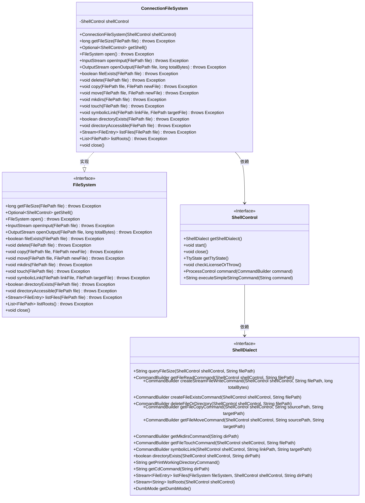

# 基础信息

|      |      |
|------|------|
| 名称 | ConnectionFileSystem |
| 编码语言 | .java |
| 代码路径 | xpipe/app/src/main/java/io/xpipe/app/ext/ConnectionFileSystem.java |
| 包名 | io.xpipe.app.ext |
| 依赖项 | ['io.xpipe.app.issue.ErrorEvent', 'io.xpipe.app.util.DocumentationLink', 'io.xpipe.core.process.CommandBuilder', 'io.xpipe.core.process.ShellControl', 'io.xpipe.core.store.FileEntry', 'io.xpipe.core.store.FilePath', 'io.xpipe.core.store.FileSystem', 'com.fasterxml.jackson.annotation.JsonIgnore', 'lombok.Getter', 'java.io.InputStream', 'java.io.OutputStream', 'java.time.Duration', 'java.util.List', 'java.util.Optional', 'java.util.stream.Stream'] |
| 概述说明 | 基于ShellControl实现的文件系统操作类，提供文件读写、增删改查等功能。 |

# 说明

ConnectionFileSystem类实现了FileSystem接口，通过ShellControl执行文件系统操作。构造函数接收ShellControl实例。主要功能包括获取文件大小、检查文件存在性、删除、复制、移动文件、创建目录、创建符号链接等。open方法启动ShellControl并检查支持性，若不支持则抛出异常。其他方法如openInput、openOutput分别处理文件读写。close方法关闭ShellControl并忽略异常。所有操作均依赖ShellControl及其ShellDialect实现具体命令执行。

# 类列表 Class Summary

| 名称   | 类型  | 说明 |
|-------|------|-------------|
| ConnectionFileSystem | class | ConnectionFileSystem通过ShellControl实现远程文件操作，包括读写、删除、移动等。 |

## 类 ConnectionFileSystem

|      |      |
|------|------|
| 访问范围 | @Getter;public |
| 类型 | class |
| 名称 | ConnectionFileSystem |
| 说明 | ConnectionFileSystem通过ShellControl实现远程文件操作，包括读写、删除、移动等。 |

### UML类图

这段代码展示了一个实现FileSystem接口的ConnectionFileSystem类，它通过ShellControl和ShellDialect与远程Shell交互来完成文件系统操作。ConnectionFileSystem提供了完整的文件系统功能，包括文件读写、目录操作、权限检查等，所有操作都委托给底层的ShellDialect实现。类图清晰地展示了这些组件之间的关系和依赖。

### 内部方法调用关系图

```mermaid
graph TD
    A["类ConnectionFileSystem"]
    B["属性: ShellControl shellControl"]
    C["构造方法: ConnectionFileSystem(ShellControl)"]
    D["方法: long getFileSize(FilePath)"]
    E["方法: Optional<ShellControl> getShell()"]
    F["方法: FileSystem open()"]
    G["方法: InputStream openInput(FilePath)"]
    H["方法: OutputStream openOutput(FilePath, long)"]
    I["方法: boolean fileExists(FilePath)"]
    J["方法: void delete(FilePath)"]
    K["方法: void copy(FilePath, FilePath)"]
    L["方法: void move(FilePath, FilePath)"]
    M["方法: void mkdirs(FilePath)"]
    N["方法: void touch(FilePath)"]
    O["方法: void symbolicLink(FilePath, FilePath)"]
    P["方法: boolean directoryExists(FilePath)"]
    Q["方法: void directoryAccessible(FilePath)"]
    R["方法: Stream<FileEntry> listFiles(FilePath)"]
    S["方法: List<FilePath> listRoots()"]
    T["方法: void close()"]

    A --> B
    A --> C
    A --> D
    A --> E
    A --> F
    A --> G
    A --> H
    A --> I
    A --> J
    A --> K
    A --> L
    A --> M
    A --> N
    A --> O
    A --> P
    A --> Q
    A --> R
    A --> S
    A --> T
```

该流程图展示了ConnectionFileSystem类的完整结构，包含1个核心属性shellControl和17个关键方法。所有方法均通过shellControl与底层ShellDialect交互实现文件系统操作，包括文件读写、目录管理、路径操作等核心功能。特别注意open()方法包含复杂的PTY状态检测和许可证校验逻辑，close()方法实现了异常安全处理机制。类结构体现了清晰的职责划分，所有文件操作最终委托给ShellDialect实现。

### 字段列表 Field List

| 名称  | 类型  | 说明 |
|-------|-------|------|
| shellControl | ShellControl | 忽略ShellControl的JSON序列化 |

### 方法列表 Method List

| 名称  | 类型  | 说明 |
|-------|-------|------|
| listRoots | List<FilePath> | 重写listRoots方法，调用shellControl获取根路径列表并转换为FilePath对象列表。 |
| fileExists | boolean | 检查文件是否存在，通过Shell命令执行并返回结果。 |
| mkdirs | void | Java方法：通过shell命令递归创建目录。 |
| touch | void | 覆盖方法touch，用shell命令创建文件，异常时抛出。 |
| copy | void | Java方法：使用Shell命令复制文件，异常时抛出。 |
| delete | void | 覆盖方法delete，删除指定文件路径，异常时抛出。 |
| symbolicLink | void | 创建符号链接方法：传入链接文件和目标文件路径，执行链接操作并检查结果。 |
| directoryExists | boolean | 重写方法检查目录是否存在，调用shellControl执行验证。 |
| openOutput | OutputStream | 重写方法，通过shell命令创建文件写入流并设置超时。 |
| getShell | Optional<ShellControl> | 重写getShell方法，返回Optional包装的shellControl实例。 |
| move | void | 重写move方法，使用shell命令移动文件并处理异常。 |
| openInput | InputStream | 重写方法，通过shell命令读取文件并返回输入流。 |
| open | FileSystem | 覆盖open方法，检查Shell交互支持、TTY状态及许可证，返回当前实例。 |
| getFileSize | long | 重写方法，通过Shell查询文件大小并返回长整型结果。 |
| directoryAccessible | void | 检查目录可访问性，切换目录后返回原路径。 |
| listFiles | Stream<FileEntry> | 重写方法，通过Shell方言列出指定路径的文件条目。 |
| close | void | 重写close方法，捕获异常并静默处理。 |

