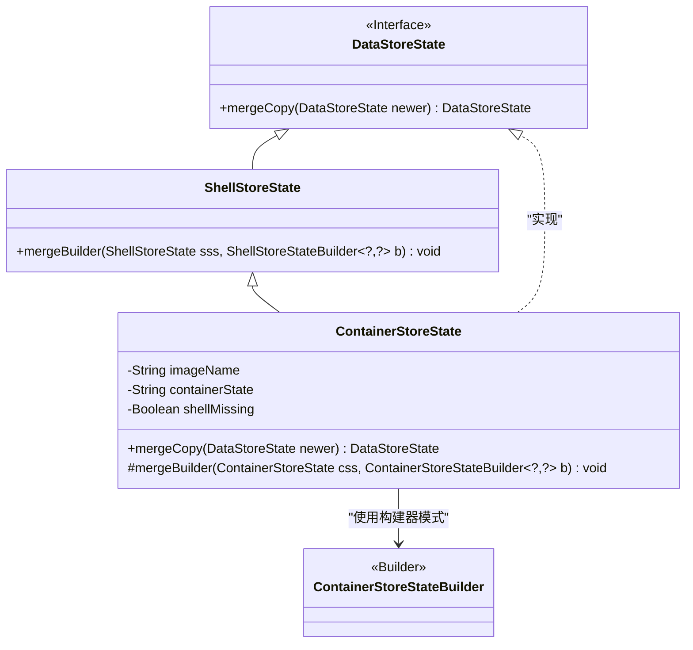
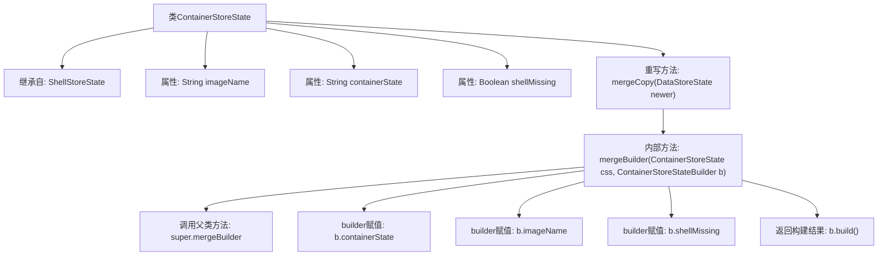

# 基础信息

|      |      |
|------|------|
| 名称 | ContainerStoreState |
| 编码语言 | .java |
| 代码路径 | xpipe/app/src/main/java/io/xpipe/app/ext/ContainerStoreState.java |
| 包名 | io.xpipe.app.ext |
| 依赖项 | ['io.xpipe.core.process.ShellStoreState', 'io.xpipe.core.store.DataStoreState', 'lombok.AccessLevel', 'lombok.EqualsAndHashCode', 'lombok.Getter', 'lombok.experimental.FieldDefaults', 'lombok.experimental.SuperBuilder', 'lombok.extern.jackson.Jacksonized'] |
| 概述说明 | Java类ContainerStoreState继承ShellStoreState，包含imageName、containerState、shellMissing字段，支持合并更新。 |

# 说明

该代码定义了一个名为ContainerStoreState的Java类，继承自ShellStoreState。类使用了Lombok注解自动生成私有final字段、getter方法、equals/hashCode方法，并支持构建器模式。类包含三个字段：imageName（字符串）、containerState（字符串）、shellMissing（布尔值）。重写了mergeCopy方法用于合并新旧状态，通过mergeBuilder方法比较新旧值并选择更新。所有字段在合并时都遵循useNewer逻辑。类被@Jacksonized注解标记，支持Jackson反序列化。

# 类列表 Class Summary

| 名称   | 类型  | 说明 |
|-------|------|-------------|
| ContainerStoreState | class | Java类ContainerStoreState继承ShellStoreState，包含imageName、containerState、shellMissing字段，提供合并更新方法。 |

## 类 ContainerStoreState

|      |      |
|------|------|
| 访问范围 | @FieldDefaults(makeFinal = true, level = AccessLevel.PRIVATE);@Getter;@EqualsAndHashCode(callSuper = true);@SuperBuilder(toBuilder = true);@Jacksonized;public |
| 类型 | class |
| 名称 | ContainerStoreState |
| 说明 | Java类ContainerStoreState继承ShellStoreState，包含imageName、containerState、shellMissing字段，提供合并更新方法。 |

### UML类图

类图描述：
该图展示了一个容器存储状态类的继承关系和依赖关系。ContainerStoreState继承自ShellStoreState，并实现了DataStoreState接口，核心功能是通过构建器模式实现状态合并。类中包含三个私有字段(imageName/containerState/shellMissing)，通过protected方法mergeBuilder实现字段级合并逻辑，并重写了接口的mergeCopy方法。构建器类ContainerStoreStateBuilder被主类依赖用于对象构建，整个设计体现了模板方法模式和构建器模式的结合应用。

### 内部方法调用关系图

该流程图展示了ContainerStoreState类的结构，这是一个使用Lombok注解增强的Java类，继承自ShellStoreState。核心逻辑体现在mergeCopy方法中，该方法通过Builder模式合并新旧状态：首先将newer对象转型，创建当前对象的builder，调用mergeBuilder方法进行属性级合并（包括调用父类合并逻辑），最终构建新状态。mergeBuilder方法通过useNewer策略决定保留哪个版本的值，体现了状态合并的优先级控制。

### 字段列表 Field List

| 名称  | 类型  | 说明 |
|-------|-------|------|
| shellMissing | Boolean | 布尔变量shellMissing |
| imageName | String | 字符串变量imageName |
| containerState | String | 容器状态变量。 |

### 方法列表 Method List

| 名称  | 类型  | 说明 |
|-------|-------|------|
| mergeCopy | DataStoreState | 合并两个数据存储状态，返回新状态。 |
| mergeBuilder | void | 合并容器状态构建器，更新容器状态、镜像名和shell缺失状态。 |

