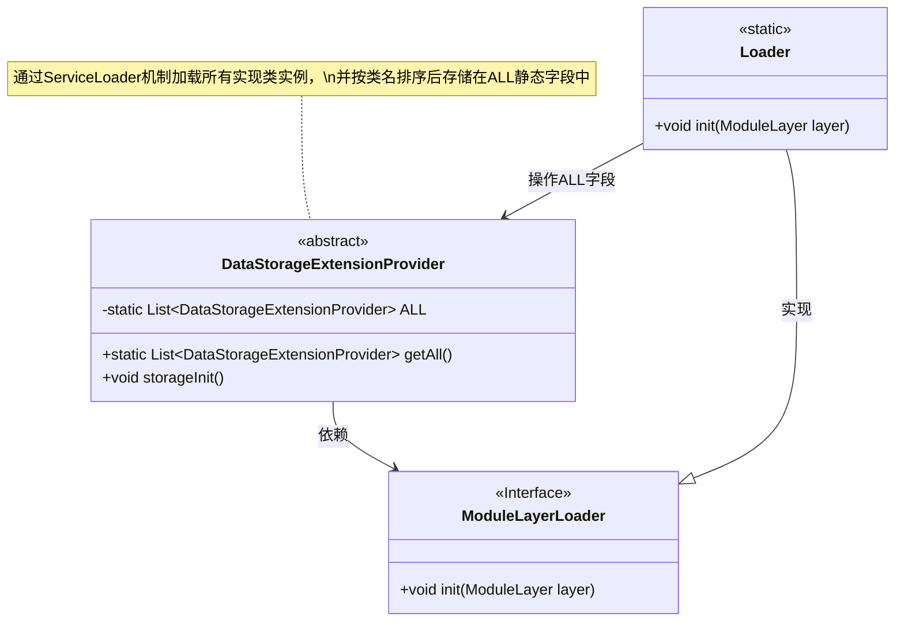
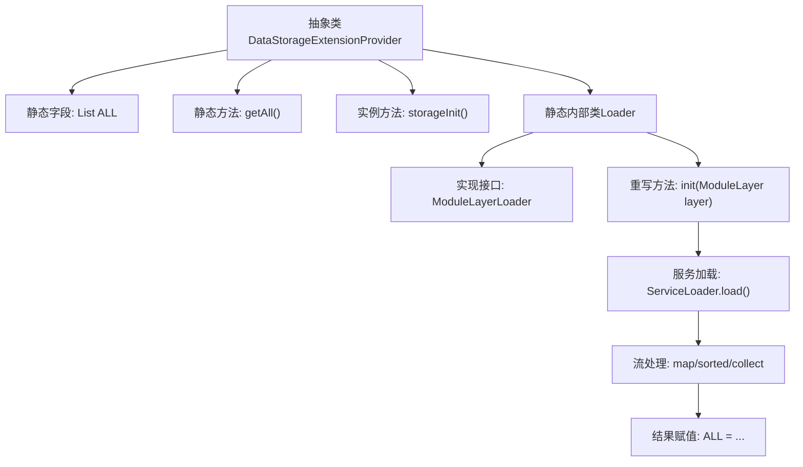

# 基础信息

|      |      |
|------|------|
| 名称 | DataStorageExtensionProvider |
| 编码语言 | .java |
| 代码路径 | xpipe/app/src/main/java/io/xpipe/app/ext/DataStorageExtensionProvider.java |
| 包名 | io.xpipe.app.ext |
| 依赖项 | ['io.xpipe.core.util.ModuleLayerLoader', 'java.util.Comparator', 'java.util.List', 'java.util.ServiceLoader', 'java.util.stream.Collectors'] |
| 概述说明 | 抽象类提供数据存储扩展，静态方法获取所有实例，Loader初始化模块层并加载服务。 |

# 说明

该代码定义了一个抽象类DataStorageExtensionProvider，用于管理数据存储扩展提供者。类中包含一个静态列表ALL存储所有提供者实例，并提供getAll方法获取列表。storageInit方法为空实现，供子类扩展。内部类Loader实现了ModuleLayerLoader接口，通过ServiceLoader动态加载模块层中的DataStorageExtensionProvider实现类，按类名排序后初始化ALL列表。整个设计支持模块化系统的扩展机制。

# 类列表 Class Summary

| 名称   | 类型  | 说明 |
|-------|------|-------------|
| DataStorageExtensionProvider | class | 抽象类提供数据存储扩展，静态方法获取所有实例，Loader初始化模块层并加载排序服务实例。 |

## 类 DataStorageExtensionProvider

|      |      |
|------|------|
| 访问范围 | public abstract |
| 类型 | class |
| 名称 | DataStorageExtensionProvider |
| 说明 | 抽象类提供数据存储扩展，静态方法获取所有实例，Loader初始化模块层并加载排序服务实例。 |

### UML类图

这段代码描述了一个抽象类`DataStorageExtensionProvider`及其静态内部类`Loader`的结构。主要功能是通过Java模块层的`ServiceLoader`机制动态加载所有实现该抽象类的服务提供者，并按类名排序后存储在静态列表`ALL`中。`Loader`类实现了`ModuleLayerLoader`接口，负责初始化模块层并加载服务实例。该设计实现了可扩展的存储服务发现机制，支持通过模块系统动态注册和排序服务提供者。

### 内部方法调用关系图

该流程图展示了DataStorageExtensionProvider类的核心结构和初始化流程。抽象类包含静态字段ALL和三个主要成员：获取ALL的静态方法、空实现的实例方法、以及关键的Loader静态内部类。Loader类通过ServiceLoader机制动态加载所有DataStorageExtensionProvider实现，经过流式处理（类名排序）后初始化ALL字段。整个过程体现了Java模块化服务加载的典型模式，其中init方法是初始化链的核心枢纽。

### 字段列表 Field List

| 名称  | 类型  | 说明 |
|-------|-------|------|
| ALL | List<DataStorageExtensionProvider> | 私有静态数据存储扩展提供者列表ALL |

### 方法列表 Method List

| 名称  | 类型  | 说明 |
|-------|-------|------|
| storageInit | void | 初始化存储方法 |
| getAll | List<DataStorageExtensionProvider> | 获取所有数据存储扩展提供者的静态列表。 |

