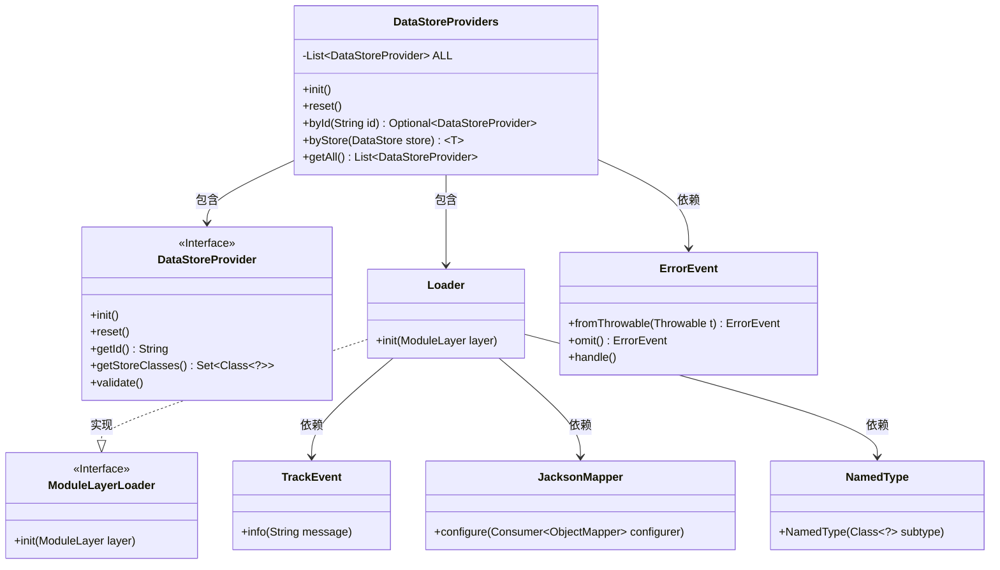
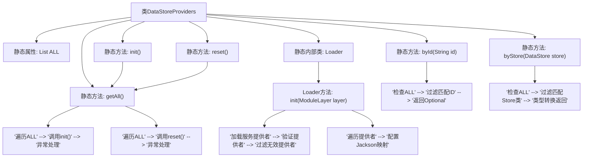

# 基础信息

|      |      |
|------|------|
| 名称 | DataStoreProviders |
| 编码语言 | .java |
| 代码路径 | xpipe/app/src/main/java/io/xpipe/app/ext/DataStoreProviders.java |
| 包名 | io.xpipe.app.ext |
| 依赖项 | ['io.xpipe.app.issue.ErrorEvent', 'io.xpipe.app.issue.TrackEvent', 'io.xpipe.core.store.DataStore', 'io.xpipe.core.util.JacksonMapper', 'io.xpipe.core.util.ModuleLayerLoader', 'com.fasterxml.jackson.databind.jsontype.NamedType', 'java.util.List', 'java.util.Optional', 'java.util.ServiceLoader', 'java.util.stream.Collectors'] |
| 概述说明 | 数据存储提供者管理类，包含初始化、重置、查询功能，支持模块加载与验证。 |

# 说明

DataStoreProviders类管理数据存储提供者的初始化和操作。包含静态方法init和reset分别初始化和重置所有提供者。byId通过ID查找提供者，byStore通过存储类查找。getAll返回所有提供者列表。内部类Loader使用ModuleLayerLoader接口初始化模块层，加载并验证服务提供者，配置Jackson映射器注册存储类。异常处理通过ErrorEvent记录错误。

# 类列表 Class Summary

| 名称   | 类型  | 说明 |
|-------|------|-------------|
| DataStoreProviders | class | DataStoreProviders类管理数据存储提供者，提供初始化、重置、按ID或存储类查找功能，并通过Loader加载验证提供者。 |

## 类 DataStoreProviders

|      |      |
|------|------|
| 访问范围 | public |
| 类型 | class |
| 名称 | DataStoreProviders |
| 说明 | DataStoreProviders类管理数据存储提供者，提供初始化、重置、按ID或存储类查找功能，并通过Loader加载验证提供者。 |

### UML类图

类图描述：该图展示了DataStoreProviders类及其相关组件的关系。DataStoreProviders是核心类，管理DataStoreProvider接口的实例集合，提供初始化、重置和查询功能。Loader内部类实现了ModuleLayerLoader接口，负责加载和验证DataStoreProvider实现。ErrorEvent、TrackEvent、JacksonMapper和NamedType是辅助类，分别用于错误处理、日志记录、JSON配置和类型注册。

### 内部方法调用关系图

该流程图展示了DataStoreProviders类的完整结构，重点描述了静态方法间的调用关系和Loader内部类的初始化流程。核心流程包括：1)通过ServiceLoader动态加载服务提供者并验证；2)初始化/重置时遍历处理所有提供者；3)通过ID或Store类型查询提供者时的过滤逻辑；4)Loader初始化时对Jackson映射的自动配置。异常处理贯穿所有关键操作，体现了健壮的设计。

### 字段列表 Field List

| 名称  | 类型  | 说明 |
|-------|-------|------|
| ALL | List<DataStoreProvider> | 私有静态数据存储提供者列表ALL |

### 方法列表 Method List

| 名称  | 类型  | 说明 |
|-------|-------|------|
| init | void | 初始化所有数据存储提供者，捕获并处理异常。 |
| byStore | T | 通过数据存储查找对应提供者，未初始化或未知类时抛出异常。 |
| byId | Optional<DataStoreProvider> | 静态方法byId通过ID查找DataStoreProvider，未初始化抛异常。 |
| reset | void | 静态方法reset遍历所有数据存储提供者并调用其reset方法，异常时记录错误。 |
| getAll | List<DataStoreProvider> | 获取所有数据存储提供者的静态列表。 |

