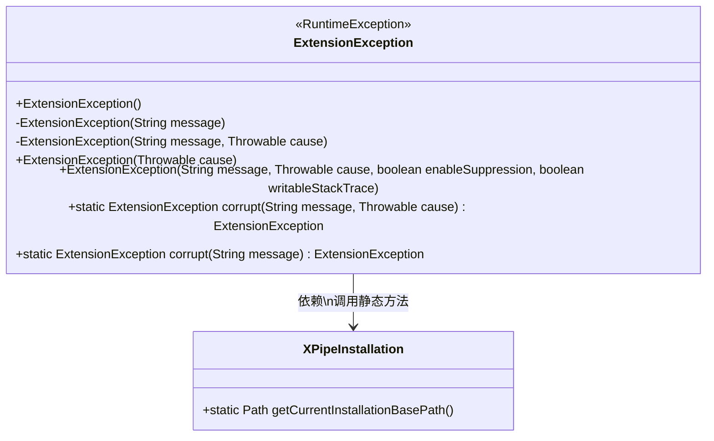
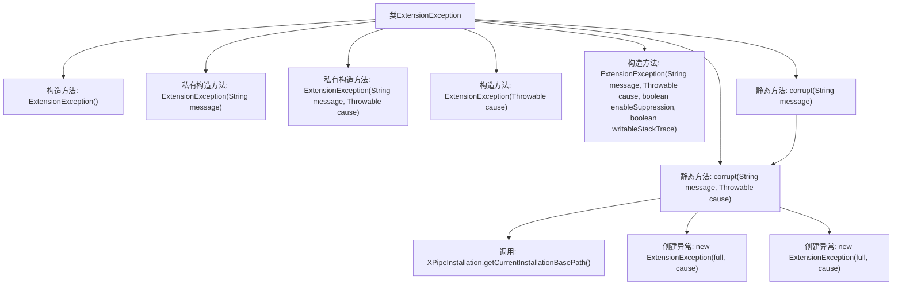

# 基础信息

|      |      |
|------|------|
| 名称 | ExtensionException |
| 编码语言 | .java |
| 代码路径 | xpipe/app/src/main/java/io/xpipe/app/ext/ExtensionException.java |
| 包名 | io.xpipe.app.ext |
| 依赖项 | ['io.xpipe.core.util.XPipeInstallation'] |
| 概述说明 | 自定义异常类，处理XPipe安装数据损坏问题。 |

# 说明

这段内容定义了一个名为ExtensionException的Java异常类，继承自RuntimeException。该类提供了多个构造函数，包括默认构造、带消息构造、带原因构造以及带完整参数构造。特别提供了两个静态工厂方法corrupt，用于创建包含安装数据损坏提示信息的异常实例。当调用corrupt方法时，会尝试获取当前XPipe安装路径并生成详细错误信息，若获取失败则返回简化提示。所有构造函数都调用父类对应构造方法，保持异常处理的标准行为。

# 类列表 Class Summary

| 名称   | 类型  | 说明 |
|-------|------|-------------|
| ExtensionException | class | 自定义异常类，处理XPipe安装数据损坏问题。 |

## 类 ExtensionException

|      |      |
|------|------|
| 访问范围 | public |
| 类型 | class |
| 名称 | ExtensionException |
| 说明 | 自定义异常类，处理XPipe安装数据损坏问题。 |

### UML类图

这段类图展示了ExtensionException类继承自RuntimeException，包含多个构造方法和两个静态工厂方法corrupt()。该类通过XPipeInstallation获取安装路径信息来构建详细的错误消息，主要用于处理XPipe安装数据损坏时的异常情况。私有构造方法限制直接实例化，推荐使用corrupt()工厂方法创建异常实例。类设计体现了异常处理的封装性和上下文信息丰富化的特点。

### 内部方法调用关系图

这段代码定义了一个继承自RuntimeException的自定义异常类ExtensionException，提供了多种构造方法和两个静态工厂方法corrupt()。流程图展示了类结构关系，重点描述了corrupt()方法的内部逻辑：尝试获取安装路径信息来构建详细错误消息，若失败则返回简化版错误消息。所有构造方法最终都指向父类RuntimeException的初始化逻辑。

### 字段列表 Field List

| 名称  | 类型  | 说明 |
|-------|-------|------|

### 方法列表 Method List

| 名称  | 类型  | 说明 |
|-------|-------|------|
| corrupt | ExtensionException | 创建异常方法，检查XPipe安装数据是否损坏，包含错误信息和位置。 |
| corrupt | ExtensionException | 静态方法corrupt创建带消息的ExtensionException异常，可选原因参数。 |

