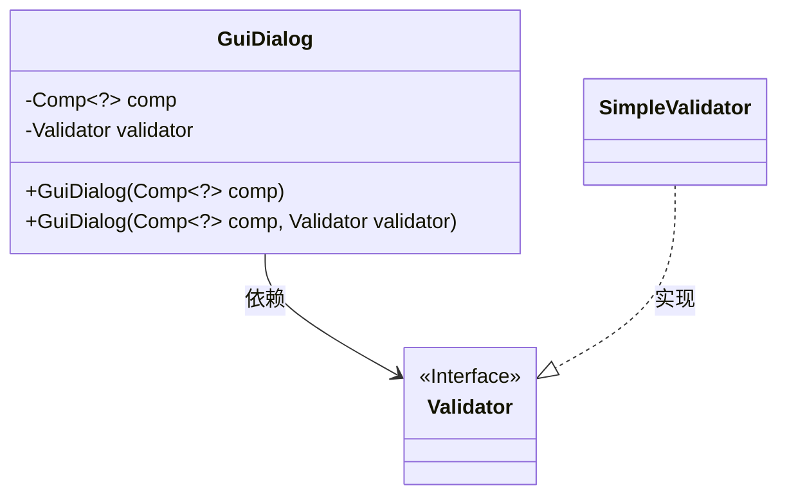
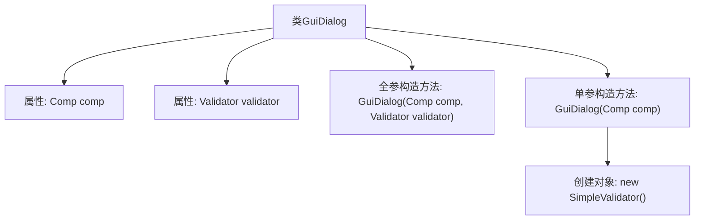

# 基础信息

|      |      |
|------|------|
| 名称 | GuiDialog |
| 编码语言 | .java |
| 代码路径 | xpipe/app/src/main/java/io/xpipe/app/ext/GuiDialog.java |
| 包名 | io.xpipe.app.ext |
| 依赖项 | ['io.xpipe.app.comp.Comp', 'io.xpipe.app.util.SimpleValidator', 'io.xpipe.app.util.Validator', 'lombok.AllArgsConstructor', 'lombok.Value'] |
| 概述说明 | GUI对话框类，含组件和验证器，支持全参和单参构造。 |

# 说明

这是一个名为GuiDialog的Java类，使用Lombok的@AllArgsConstructor注解生成全参构造函数。类包含两个字段：comp（泛型Comp类型）和validator（Validator类型）。同时定义了一个单参构造函数，接收comp参数并初始化validator为SimpleValidator实例。该类用于构建带验证功能的GUI对话框组件。

# 类列表 Class Summary

| 名称   | 类型  | 说明 |
|-------|------|-------------|
| GuiDialog | class | GUI对话框类，含组件和验证器，支持全参和单参构造。 |

## 类 GuiDialog

|      |      |
|------|------|
| 访问范围 | @Value;@AllArgsConstructor;public |
| 类型 | class |
| 名称 | GuiDialog |
| 说明 | GUI对话框类，含组件和验证器，支持全参和单参构造。 |

### UML类图

这段类图描述了`GuiDialog`类的结构及其与验证器组件的关系。`GuiDialog`包含一个泛型组件`Comp<?>`和一个`Validator`接口类型的验证器，提供两个构造方法：一个仅接收组件并默认使用`SimpleValidator`，另一个允许自定义验证器。`Validator`是接口，`SimpleValidator`是其实现类，体现了依赖注入和接口隔离的设计原则。

### 内部方法调用关系图

这段代码定义了一个名为GuiDialog的类，包含两个属性：一个泛型组件comp和一个验证器validator。类提供了两个构造方法：一个全参构造方法同时初始化两个属性，另一个单参构造方法只接收组件参数并自动创建默认的SimpleValidator验证器实例。流程图清晰地展示了类结构与构造方法之间的调用关系，特别是单参构造方法内部会创建验证器对象的细节。

### 字段列表 Field List

| 名称  | 类型  | 说明 |
|-------|-------|------|
| validator | Validator | 声明验证器对象validator |
| comp | Comp<?> | 声明组件变量comp |

### 方法列表 Method List

| 名称  | 类型  | 说明 |
|-------|-------|------|

