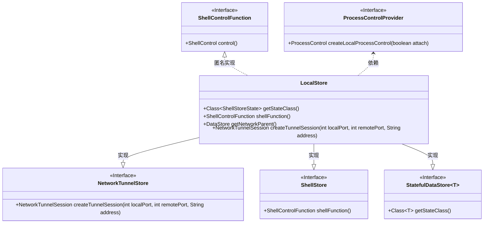
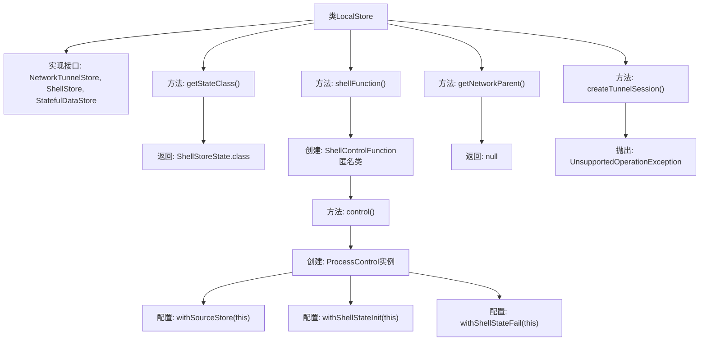

# 基础信息

|      |      |
|------|------|
| 名称 | LocalStore |
| 编码语言 | .java |
| 代码路径 | xpipe/app/src/main/java/io/xpipe/app/ext/LocalStore.java |
| 包名 | io.xpipe.app.ext |
| 依赖项 | ['io.xpipe.core.process.ShellControl', 'io.xpipe.core.process.ShellStoreState', 'io.xpipe.core.store.DataStore', 'io.xpipe.core.store.NetworkTunnelSession', 'io.xpipe.core.store.NetworkTunnelStore', 'io.xpipe.core.store.StatefulDataStore', 'com.fasterxml.jackson.annotation.JsonTypeName', 'lombok.Value'] |
| 概述说明 | 本地存储类实现网络隧道和Shell存储接口，支持Shell控制功能。 |

# 说明

这是一个名为LocalStore的Java类，实现了NetworkTunnelStore、ShellStore和StatefulDataStore接口。它被标注为JsonTypeName("local")并使用@Value注解。类中定义了获取状态类的方法，返回ShellStoreState.class。提供了shellFunction方法，返回一个ShellControlFunction实例，该实例创建本地进程控制并设置相关属性。getNetworkParent方法返回null，表示没有网络父存储。createTunnelSession方法抛出UnsupportedOperationException异常，表示不支持创建隧道会话。

# 类列表 Class Summary

| 名称   | 类型  | 说明 |
|-------|------|-------------|
| LocalStore | class | LocalStore类实现本地存储与Shell控制功能，不支持网络隧道。 |

## 类 LocalStore

|      |      |
|------|------|
| 访问范围 | @JsonTypeName("local");@Value;public |
| 类型 | class |
| 名称 | LocalStore |
| 说明 | LocalStore类实现本地存储与Shell控制功能，不支持网络隧道。 |

### UML类图

该类图展示了LocalStore类实现了NetworkTunnelStore、ShellStore和StatefulDataStore三个接口，其中StatefulDataStore使用了泛型ShellStoreState。LocalStore通过匿名内部类实现了ShellControlFunction接口，并依赖ProcessControlProvider接口创建本地进程控制。类图清晰地呈现了接口继承关系和关键方法，包括shell控制、网络隧道会话创建和状态管理等功能。

### 内部方法调用关系图

这段代码定义了一个名为LocalStore的类，实现了NetworkTunnelStore、ShellStore和StatefulDataStore三个接口。主要功能包括：通过getStateClass()返回状态类类型，通过shellFunction()创建并配置ShellControlFunction实例（包含ProcessControl的创建和初始化），getNetworkParent()返回null表示无网络父存储，createTunnelSession()直接抛出未支持操作异常。类使用@JsonTypeName和@Value注解，表明这是一个JSON可序列化的不可变类。

### 字段列表 Field List

| 名称  | 类型  | 说明 |
|-------|-------|------|

### 方法列表 Method List

| 名称  | 类型  | 说明 |
|-------|-------|------|
| getStateClass | Class<ShellStoreState> | 重写方法返回ShellStoreState类类型。 |
| getNetworkParent | DataStore | 重写方法返回空网络父数据存储 |
| createTunnelSession | NetworkTunnelSession | 重写方法抛出未支持操作异常 |
| shellFunction | ShellControlFunction | 重写shellFunction方法，返回包含本地进程控制的ShellControlFunction实例。 |

