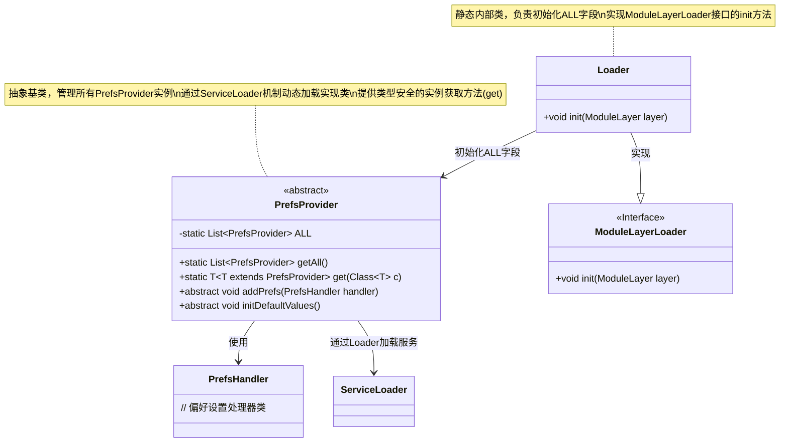
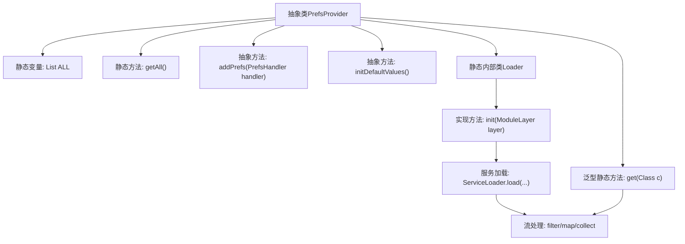

# 基础信息

|      |      |
|------|------|
| 名称 | PrefsProvider |
| 编码语言 | .java |
| 代码路径 | xpipe/app/src/main/java/io/xpipe/app/ext/PrefsProvider.java |
| 包名 | io.xpipe.app.ext |
| 依赖项 | ['io.xpipe.core.util.ModuleLayerLoader', 'java.util.List', 'java.util.ServiceLoader', 'java.util.stream.Collectors'] |
| 概述说明 | 抽象类PrefsProvider管理偏好设置，提供获取所有实例和按类查找功能，支持初始化和模块加载。 |

# 说明

这是一个抽象类PrefsProvider的设计描述，用于管理偏好设置提供者。类中包含一个静态列表ALL存储所有提供者实例，提供两个静态方法：getAll()返回所有实例，get()通过类类型获取特定实例。抽象方法addPrefs()和initDefaultValues()需由子类实现。内部类Loader实现ModuleLayerLoader接口，在初始化时通过ServiceLoader加载所有PrefsProvider实现并存入ALL列表。整个设计支持模块化系统的偏好设置管理。

# 类列表 Class Summary

| 名称   | 类型  | 说明 |
|-------|------|-------------|
| PrefsProvider | class | 抽象类PrefsProvider管理预置配置，提供获取所有实例或指定类实例的方法，支持初始化和模块加载。 |

## 类 PrefsProvider

|      |      |
|------|------|
| 访问范围 | public abstract |
| 类型 | class |
| 名称 | PrefsProvider |
| 说明 | 抽象类PrefsProvider管理预置配置，提供获取所有实例或指定类实例的方法，支持初始化和模块加载。 |

### UML类图

这段代码描述了一个偏好设置提供者系统，核心是抽象类PrefsProvider及其静态内部类Loader。PrefsProvider通过ServiceLoader机制动态加载所有实现类到静态ALL集合中，提供类型安全的get()方法获取特定子类实例。Loader实现了ModuleLayerLoader接口，在模块层初始化时加载服务实现。系统支持添加偏好处理器和初始化默认值，体现了扩展性和模块化设计思想。

### 内部方法调用关系图

这段代码展示了一个抽象类PrefsProvider的设计，包含服务提供者模式的实现。核心是通过静态内部类Loader使用Java模块层的ServiceLoader机制动态加载所有PrefsProvider实现类，并存储在静态变量ALL中。类提供两种获取方式：getAll()返回全部实例，泛型方法get()按类型筛选。抽象方法addPrefs和initDefaultValues需由子类实现，体现了模板方法模式。流程图清晰呈现了类结构、服务加载流程和关键方法调用链。

### 字段列表 Field List

| 名称  | 类型  | 说明 |
|-------|-------|------|
| ALL | List<PrefsProvider> | 私有静态预置提供者列表ALL |

### 方法列表 Method List

| 名称  | 类型  | 说明 |
|-------|-------|------|
| getAll | List<PrefsProvider> | 获取所有预置配置项的静态方法。 |
| addPrefs | void | 抽象方法：添加偏好设置处理器。 |
| initDefaultValues | void | 抽象方法，初始化默认值。 |
| get | T | 获取指定类别的PrefsProvider实例，若无则抛出异常。 |

