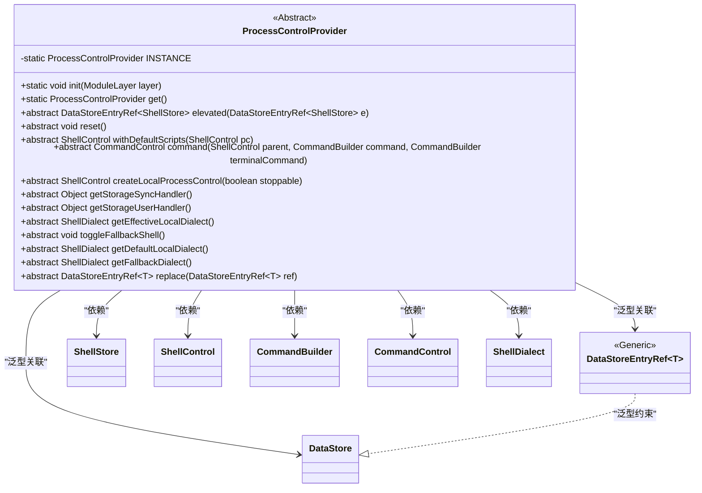
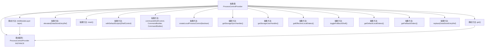

# 基础信息

|      |      |
|------|------|
| 名称 | ProcessControlProvider |
| 编码语言 | .java |
| 代码路径 | xpipe/app/src/main/java/io/xpipe/app/ext/ProcessControlProvider.java |
| 包名 | io.xpipe.app.ext |
| 依赖项 | ['io.xpipe.app.storage.DataStoreEntryRef', 'io.xpipe.core.process', 'io.xpipe.core.store.DataStore', 'java.util.ServiceLoader'] |
| 概述说明 | 抽象类提供进程控制功能，包括初始化、重置、命令执行、本地进程创建及存储处理等。 |

# 说明

这是一个抽象类ProcessControlProvider，用于提供进程控制功能。它采用单例模式，通过init方法初始化实例，get方法获取实例。主要功能包括：提升权限操作、重置控制、管理默认脚本、创建本地进程控制、获取存储同步/用户处理器、管理Shell方言切换等。抽象方法涵盖进程控制、命令执行、存储引用替换等核心操作，支持可停止的本地进程创建和多种Shell方言管理。

# 类列表 Class Summary

| 名称   | 类型  | 说明 |
|-------|------|-------------|
| ProcessControlProvider | class | 抽象类提供进程控制功能，包括初始化、重置、命令执行、存储处理及Shell方言管理。 |

## 类 ProcessControlProvider

|      |      |
|------|------|
| 访问范围 | public abstract |
| 类型 | class |
| 名称 | ProcessControlProvider |
| 说明 | 抽象类提供进程控制功能，包括初始化、重置、命令执行、存储处理及Shell方言管理。 |

### UML类图

这段类图描述了一个抽象的`ProcessControlProvider`类，它通过静态方法提供单例实例管理，并定义了12个抽象方法用于进程控制、命令执行和存储操作。该类与多个泛型类（如`DataStoreEntryRef`）和实体类（如`ShellControl`）存在依赖关系，核心功能包括创建本地进程控制、命令执行、存储操作和Shell方言管理。通过`ServiceLoader`机制实现运行时初始化，体现了Java模块化系统的动态服务加载特性。

### 内部方法调用关系图

该流程图展示了ProcessControlProvider抽象类的完整结构，包含1个静态属性、2个静态方法和12个抽象方法。核心是通过ServiceLoader实现单例初始化（init方法），其他方法主要分为三类：流程控制（如createLocalProcessControl）、命令处理（如command）和数据存储操作（如replace）。所有抽象方法需由子类实现，静态方法用于全局实例管理。

### 字段列表 Field List

| 名称  | 类型  | 说明 |
|-------|-------|------|
| INSTANCE | ProcessControlProvider | 私有静态实例变量INSTANCE，类型为ProcessControlProvider。 |

### 方法列表 Method List

| 名称  | 类型  | 说明 |
|-------|-------|------|
| createLocalProcessControl | ShellControl | 创建可停止的本地进程控制对象。 |
| reset | void | 抽象方法reset，无参数无返回值。 |
| getFallbackDialect | ShellDialect | 获取备用Shell方言的抽象方法。 |
| command | CommandControl | 抽象方法：通过父Shell和命令构建器生成控制命令。 |
| withDefaultScripts | ShellControl | 抽象方法：带默认脚本的ShellControl。 |
| init | void | 静态方法初始化模块层，加载服务实例或抛出异常。 |
| getDefaultLocalDialect | ShellDialect | 获取默认本地Shell方言的抽象方法。 |
| getEffectiveLocalDialect | ShellDialect | 获取有效的本地Shell方言。 |
| getStorageSyncHandler | Object | 获取同步存储处理器的抽象方法。 |
| get | ProcessControlProvider | 获取ProcessControlProvider的单例实例。 |
| elevated | DataStoreEntryRef<ShellStore> | 抽象方法：返回ShellStore类型的高权限引用。 |
| toggleFallbackShell | void | 抽象方法：切换备用Shell |
| getStorageUserHandler | Object | 获取存储用户处理器的抽象方法。 |
| replace | DataStoreEntryRef<T> | 替换数据存储引用并返回新引用。 |

