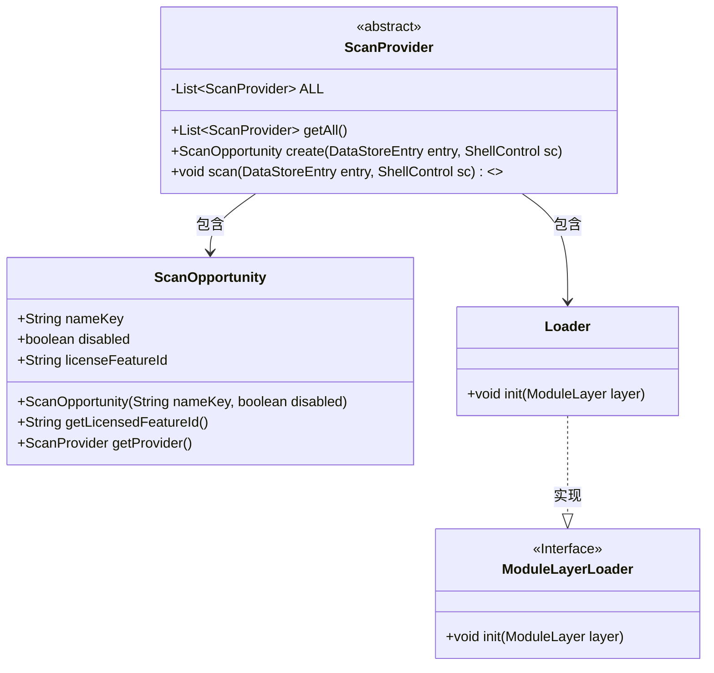
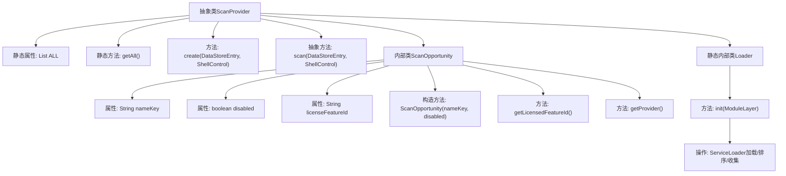

# 基础信息

|      |      |
|------|------|
| 名称 | ScanProvider |
| 编码语言 | .java |
| 代码路径 | xpipe/app/src/main/java/io/xpipe/app/ext/ScanProvider.java |
| 包名 | io.xpipe.app.ext |
| 依赖项 | ['io.xpipe.app.storage.DataStoreEntry', 'io.xpipe.core.process.ShellControl', 'io.xpipe.core.util.ModuleLayerLoader', 'lombok.AllArgsConstructor', 'lombok.Value', 'java.util.Comparator', 'java.util.List', 'java.util.ServiceLoader', 'java.util.stream.Collectors'] |
| 概述说明 | 抽象类ScanProvider提供扫描功能，包含创建扫描机会和抽象扫描方法，内部类ScanOpportunity存储扫描信息，Loader初始化所有扫描提供者。 |

# 说明

ScanProvider是一个抽象类，提供扫描功能的基础框架。它包含静态方法getAll()返回所有扫描提供者的列表，以及抽象方法scan()用于执行扫描操作。内部类ScanOpportunity封装扫描机会信息，包含名称键、禁用状态和许可证特征ID等属性，并提供构造方法和访问方法。静态内部类Loader实现ModuleLayerLoader接口，初始化时通过ServiceLoader加载所有ScanProvider实例并按类名排序存储。整个设计支持模块化加载和扩展扫描功能。

# 类列表 Class Summary

| 名称   | 类型  | 说明 |
|-------|------|-------------|
| ScanProvider | class | 抽象类ScanProvider提供扫描功能，包含静态列表ALL、创建扫描机会方法及抽象扫描方法，内部类ScanOpportunity存储扫描信息，Loader初始化模块层加载器。 |

## 类 ScanProvider

|      |      |
|------|------|
| 访问范围 | public abstract |
| 类型 | class |
| 名称 | ScanProvider |
| 说明 | 抽象类ScanProvider提供扫描功能，包含静态列表ALL、创建扫描机会方法及抽象扫描方法，内部类ScanOpportunity存储扫描信息，Loader初始化模块层加载器。 |

### UML类图

这段代码展示了一个扫描提供者系统的核心结构。抽象类ScanProvider作为基类，包含静态方法管理所有提供者实例，并定义了创建扫描机会和扫描操作的抽象方法。内部类ScanOpportunity封装扫描机会的元数据，静态内部类Loader实现了ModuleLayerLoader接口，负责初始化扫描提供者列表。整个设计采用服务加载机制，支持模块化扩展。

### 内部方法调用关系图

该流程图展示了ScanProvider类的完整结构，包含静态属性ALL和核心方法，以及内部类ScanOpportunity的字段构造。Loader初始化模块层时通过ServiceLoader动态加载实现类，并按类名排序收集。抽象方法scan()需子类实现，create()默认返回null，ScanOpportunity封装扫描配置信息并提供获取所属Provider的能力。整个设计支持可扩展的插件式扫描架构。

### 字段列表 Field List

| 名称  | 类型  | 说明 |
|-------|-------|------|
| ALL | List<ScanProvider> | 私有静态扫描提供者列表ALL |

### 方法列表 Method List

| 名称  | 类型  | 说明 |
|-------|-------|------|
| getAll | List<ScanProvider> | 获取所有扫描提供者的静态方法。 |
| create | ScanOpportunity | 创建方法，返回空，可能抛出异常。 |
| scan | void | 扫描数据存储条目，可能抛出异常。 |

