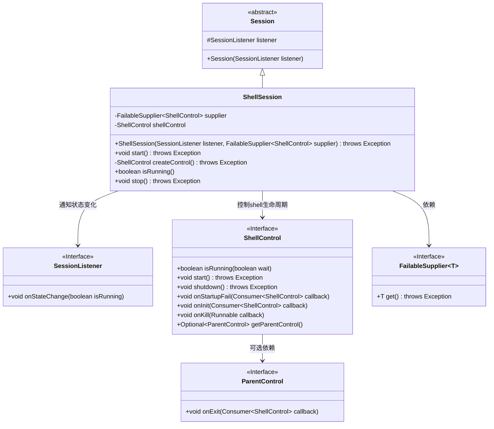
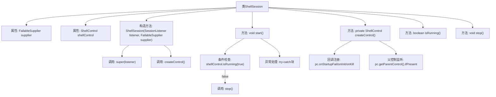

# 基础信息

|      |      |
|------|------|
| 名称 | ShellSession |
| 编码语言 | .java |
| 代码路径 | xpipe/app/src/main/java/io/xpipe/app/ext/ShellSession.java |
| 包名 | io.xpipe.app.ext |
| 依赖项 | ['io.xpipe.core.process.ShellControl', 'io.xpipe.core.store.Session', 'io.xpipe.core.store.SessionListener', 'io.xpipe.core.util.FailableSupplier', 'lombok.Getter'] |
| 概述说明 | ShellSession类管理ShellControl生命周期，处理启动、停止及状态变更通知。 |

# 说明

ShellSession类继承自Session，用于管理ShellControl的生命周期。构造函数接收SessionListener和FailableSupplier<ShellControl>，初始化时通过createControl方法创建ShellControl实例。start方法确保ShellControl运行，若已运行则直接返回，否则先停止再启动，异常处理中会尝试停止并合并异常。createControl方法设置ShellControl的各种状态回调，包括启动失败、初始化和终止时通知监听器，同时监听父控件的退出事件。isRunning方法检查ShellControl是否运行，stop方法用于关闭ShellControl。

# 类列表 Class Summary

| 名称   | 类型  | 说明 |
|-------|------|-------------|
| ShellSession | class | ShellSession类扩展Session，管理ShellControl生命周期，提供启动、停止和状态监听功能。 |

## 类 ShellSession

|      |      |
|------|------|
| 访问范围 | @Getter;public |
| 类型 | class |
| 名称 | ShellSession |
| 说明 | ShellSession类扩展Session，管理ShellControl生命周期，提供启动、停止和状态监听功能。 |

### UML类图

该类图展示了ShellSession继承自抽象类Session，通过ShellControl接口管理shell进程生命周期，并使用FailableSupplier动态创建控制实例。关键交互包括：1) 通过SessionListener回调通知状态变化；2) 利用ShellControl的各类钩子函数（onInit/onKill等）监听进程事件；3) 可选通过ParentControl监听父进程退出。整体设计采用依赖注入和观察者模式，具有完善的错误处理和资源清理机制。

### 内部方法调用关系图

流程图描述了ShellSession类的核心结构和控制流程。该类通过supplier动态创建ShellControl实例，并在createControl()方法中注册多个状态回调监听。start()方法实现了带异常处理的启动逻辑，包含运行状态检查和失败时的资源清理。整个流程展现了Shell会话的生命周期管理，包括初始化、状态监控、错误处理和资源释放等关键环节，体现了健壮的控制反转和事件驱动设计模式。

### 字段列表 Field List

| 名称  | 类型  | 说明 |
|-------|-------|------|
| supplier | FailableSupplier<ShellControl> | 私有不可变ShellControl供应商实例 |
| shellControl | ShellControl | 私有ShellControl实例shellControl。 |

### 方法列表 Method List

| 名称  | 类型  | 说明 |
|-------|-------|------|
| isRunning | boolean | 检查shell控制是否在运行。 |
| start | void | 检查运行状态，未运行则停止后启动，异常时停止并抛出。 |
| createControl | ShellControl | 创建ShellControl实例，设置启动、初始化和终止时的状态监听，包括父进程退出监听。 |
| stop | void | 停止shell控制服务 |

