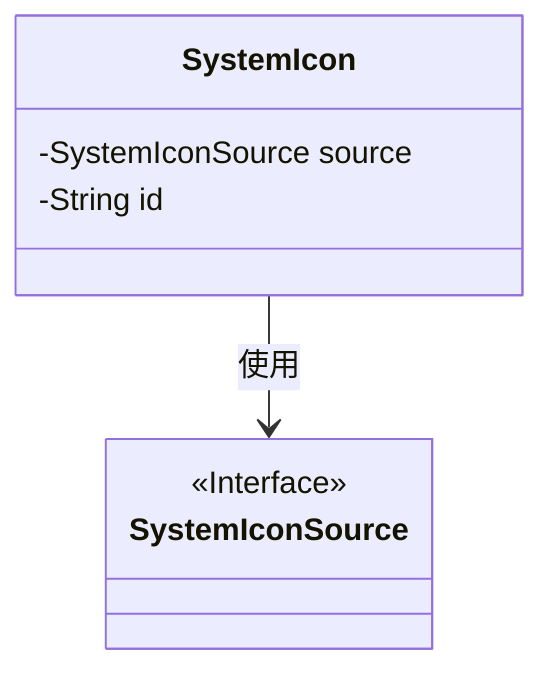
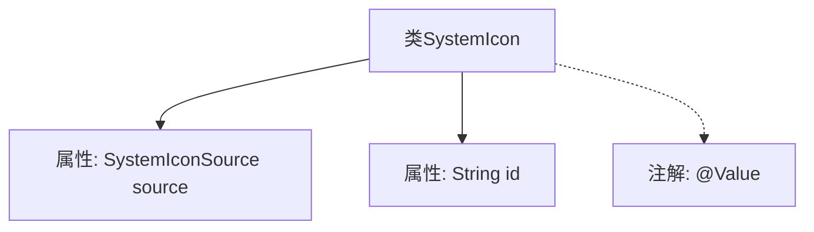

# 基础信息

|      |      |
|------|------|
| 名称 | SystemIcon |
| 编码语言 | .java |
| 代码路径 | xpipe/app/src/main/java/io/xpipe/app/icon/SystemIcon.java |
| 包名 | io.xpipe.app.icon |
| 依赖项 | ['lombok.Value'] |
| 概述说明 | 系统图标类，包含来源和ID属性。 |

# 说明

SystemIcon是一个公开类，包含两个成员变量：source和id。source的类型为SystemIconSource，id的类型为String。该类使用了@Value注解。

# 类列表 Class Summary

| 名称   | 类型  | 说明 |
|-------|------|-------------|
| SystemIcon | class | 系统图标类，包含来源和ID属性。 |

## 类 SystemIcon

|      |      |
|------|------|
| 访问范围 | @Value;public |
| 类型 | class |
| 名称 | SystemIcon |
| 说明 | 系统图标类，包含来源和ID属性。 |

### UML类图

这段代码定义了一个简单的`SystemIcon`类，包含两个私有字段：`source`和`id`。其中`source`字段的类型是`SystemIconSource`接口，表明该类依赖于该接口。类图清晰地展示了`SystemIcon`与`SystemIconSource`之间的依赖关系，`SystemIconSource`被标记为接口类型。整个结构简洁明了，体现了基本的面向对象设计原则。

### 内部方法调用关系图

这段代码定义了一个名为SystemIcon的类，该类包含两个属性：SystemIconSource类型的source和String类型的id，并使用了@Value注解。流程图清晰地展示了类与属性之间的从属关系，以及注解与类的关联。SystemIcon类可能用于表示系统图标的相关信息，其中source属性可能指向图标来源，id属性用于唯一标识图标。

### 字段列表 Field List

| 名称  | 类型  | 说明 |
|-------|-------|------|
| source | SystemIconSource | 系统图标来源变量声明 |
| id | String | 字符串标识符 |

### 方法列表 Method List

| 名称  | 类型  | 说明 |
|-------|-------|------|

