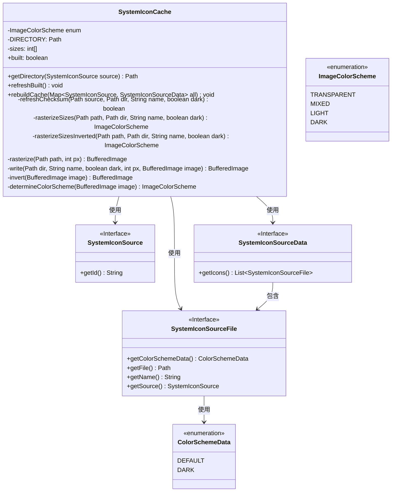
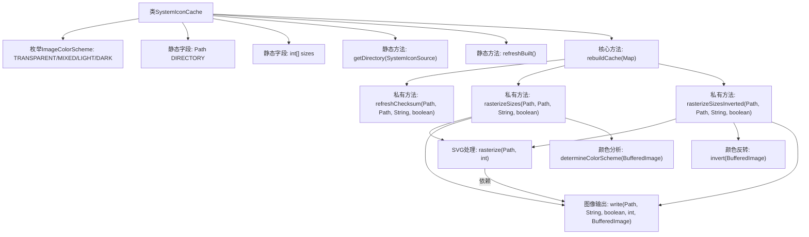

# 基础信息

|      |      |
|------|------|
| 名称 | SystemIconCache |
| 编码语言 | .java |
| 代码路径 | xpipe/app/src/main/java/io/xpipe/app/icon/SystemIconCache.java |
| 包名 | io.xpipe.app.icon |
| 依赖项 | ['io.xpipe.app.core.AppProperties', 'io.xpipe.app.issue.ErrorEvent', 'io.xpipe.app.issue.TrackEvent', 'com.github.weisj.jsvg.SVGDocument', 'com.github.weisj.jsvg.SVGRenderingHints', 'com.github.weisj.jsvg.attributes.ViewBox', 'com.github.weisj.jsvg.parser.SVGLoader', 'lombok.Getter', 'java.awt', 'java.awt.image.BufferedImage', 'java.io.IOException', 'java.net.URL', 'java.nio.file', 'java.security.MessageDigest', 'java.util.Arrays', 'java.util.Map', 'javax.imageio.ImageIO'] |
| 概述说明 | 系统图标缓存类，支持多尺寸、颜色方案及MD5校验。 |

# 说明

SystemIconCache类是一个用于管理系统图标缓存的工具类。它包含枚举类型ImageColorScheme定义四种颜色方案。类中定义了缓存目录路径和四种图标尺寸。主要功能包括获取目录路径、刷新构建状态、重建缓存等。重建缓存时会处理图标文件，检查MD5校验和，栅格化SVG图标到不同尺寸，并根据颜色方案生成对应图像。还支持图像反色处理和颜色方案检测。整个过程包含错误处理和日志记录。

# 类列表 Class Summary

| 名称   | 类型  | 说明 |
|-------|------|-------------|
| SystemIconCache | class | 系统图标缓存类，管理SVG转PNG及颜色方案处理。 |

## 类 SystemIconCache

|      |      |
|------|------|
| 访问范围 | public |
| 类型 | class |
| 名称 | SystemIconCache |
| 说明 | 系统图标缓存类，管理SVG转PNG及颜色方案处理。 |

### UML类图

这段代码描述了一个系统图标缓存管理类SystemIconCache，它负责将SVG格式的系统图标按不同尺寸和颜色方案(rasterize)转换为PNG格式并缓存。核心功能包括：通过MD5校验文件变更、支持透明/混合/亮色/暗色四种颜色方案检测、自动生成暗色反转图标、多尺寸(16/24/40/80px)输出。该类与三个接口(SystemIconSource/Data/File)协作获取源数据，使用枚举管理颜色方案，通过图像处理实现图标转换和优化。

### 内部方法调用关系图

该流程图展示了SystemIconCache类的完整结构和工作流程。类核心功能是通过rebuildCache方法重建图标缓存，涉及多个关键步骤：首先检查文件MD5校验(refreshChecksum)，然后根据颜色方案(rasterizeSizes/determineColorScheme)进行不同尺寸的SVG光栅化处理(rasterize)，必要时执行颜色反转(invert)，最后输出PNG文件(write)。整个流程包含异常处理和颜色模式分析，支持透明/浅色/深色/混合四种颜色方案，实现了图标缓存的高效管理和多尺寸适配。

### 字段列表 Field List

| 名称  | 类型  | 说明 |
|-------|-------|------|
| DIRECTORY =            AppProperties.get().getDataDir().resolve("cache").resolve("icons").resolve("raster") | Path | 私有静态路径指向缓存图标栅格目录。 |
| sizes = new int[] {16, 24, 40, 80} | int[] | 定义静态整型数组sizes，包含16、24、40、80四个元素。 |
| built = false | boolean | 私有静态布尔变量built初始为false。 |

### 方法列表 Method List

| 名称  | 类型  | 说明 |
|-------|-------|------|
| getDirectory | Path | 静态方法获取目录路径，基于输入源ID解析目标路径并返回。 |
| rasterizeSizes | ImageColorScheme | 方法rasterizeSizes处理图像光栅化，按尺寸生成并保存图像，返回颜色方案，出错返回null。 |
| refreshBuilt | void | 检查目录是否存在，若存在则遍历文件判断是否有常规文件。 |
| rasterizeSizesInverted | ImageColorScheme | 方法将图像按尺寸栅格化并反色处理，异常时返回空或抛出IO异常。 |
| rebuildCache | void | 重建系统图标缓存，处理图标颜色方案和校验，异常时记录错误。 |
| refreshChecksum | boolean | 方法刷新MD5校验和，比较并更新文件。 |
| rasterize | BufferedImage | 将SVG文件转换为指定大小的BufferedImage，支持抗锯齿和软裁剪。 |
| write | BufferedImage | 私有方法将图像写入指定路径，支持暗色模式和自定义尺寸，返回原图。 |
| invert | BufferedImage | 私有方法反转图像颜色，返回新图像。 |
| determineColorScheme | ImageColorScheme | 方法判断图像颜色方案：透明、暗色、亮色或混合。 |

