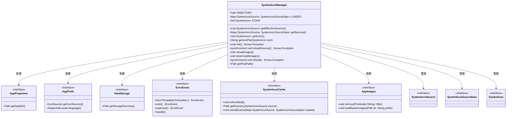

# 基础信息

|      |      |
|------|------|
| 名称 | SystemIconManager |
| 编码语言 | .java |
| 代码路径 | xpipe/app/src/main/java/io/xpipe/app/icon/SystemIconManager.java |
| 包名 | io.xpipe.app.icon |
| 依赖项 | ['io.xpipe.app.core.AppProperties', 'io.xpipe.app.issue.ErrorEvent', 'io.xpipe.app.prefs.AppPrefs', 'io.xpipe.app.prefs.SupportedLocale', 'io.xpipe.app.resources.AppImages', 'io.xpipe.app.storage.DataStorage', 'io.xpipe.core.util.ValidationException', 'java.nio.file.Files', 'java.nio.file.Path', 'java.util'] |
| 概述说明 | 系统图标管理器类，管理图标源、缓存及加载，支持自定义和GitHub镜像源。 |

# 说明

SystemIconManager类管理图标资源，包含静态方法处理图标源和缓存。主要功能包括获取有效图标源列表，支持自定义目录和Git仓库源，针对中文用户提供镜像地址。维护已加载源数据和图标集合，提供图标文件路径生成。初始化时加载源数据并刷新缓存，支持重新加载源和图像，清理无效图像。图标缓存路径通过getPoolPath方法获取。

# 类列表 Class Summary

| 名称   | 类型  | 说明 |
|-------|------|-------------|
| SystemIconManager | class | 系统图标管理类，处理图标源加载、缓存及刷新，支持自定义和镜像源。 |

## 类 SystemIconManager

|      |      |
|------|------|
| 访问范围 | public |
| 类型 | class |
| 名称 | SystemIconManager |
| 说明 | 系统图标管理类，处理图标源加载、缓存及刷新，支持自定义和镜像源。 |

### UML类图

该代码实现了一个系统图标管理器，主要功能包括：管理多个图标源（本地目录/Git仓库）、加载图标数据、缓存处理和图像刷新。通过静态Map和Set维护已加载的图标源和图标集合，提供同步的重新加载机制，并处理中国用户的GitHub镜像回退。核心依赖AppProperties、AppPrefs等配置类，以及SystemIconCache缓存系统和AppImages图像加载系统。

### 内部方法调用关系图

```mermaid
graph TD
    A["类SystemIconManager"]
    B["静态常量: Path DIRECTORY"]
    C["静态变量: Map<SystemIconSource, SystemIconSourceData> LOADED"]
    D["静态变量: Set<SystemIcon> ICONS"]
    E["方法: List<SystemIconSource> getEffectiveSources()"]
    F["方法: Map<SystemIconSource, SystemIconSourceData> getSources()"]
    G["方法: Set<SystemIcon> getIcons()"]
    H["方法: String getIconFile(SystemIcon icon)"]
    I["方法: void init()"]
    J["方法: synchronized void reloadSources()"]
    K["方法: void reloadImages()"]
    L["方法: void clearInvalidImages()"]
    M["方法: synchronized void reload()"]
    N["方法: Path getPoolPath()"]

    A --> B
    A --> C
    A --> D
    A --> E
    A --> F
    A --> G
    A --> H
    A --> I
    A --> J
    A --> K
    A --> L
    A --> M
    A --> N

    E --> E1["获取偏好设置"]
    E --> E2["添加默认目录源"]
    E --> E3["添加Git仓库源"]
    E --> E4["验证并添加用户偏好源"]
    E --> E5["返回有效源列表"]

    J --> J1["创建目录"]
    J --> J2["清空LOADED"]
    J --> J3["加载有效源数据"]
    J --> J4["清空ICONS"]
    J --> J5["填充ICONS集合"]

    M --> M1["创建目录"]
    M --> M2["刷新所有源"]
    M --> M3["重新加载源数据"]
    M --> M4["重建缓存"]
    M --> M5["刷新构建"]
    M --> M6["重载图像"]
```

这段代码实现了一个系统图标管理器，主要功能包括管理多个图标源（本地目录和Git仓库）、缓存图标数据、提供图标访问接口。流程图展示了类结构和核心方法调用关系，其中getEffectiveSources()方法负责整合默认源和用户配置源，reloadSources()和reload()方法实现了数据加载和刷新机制。特别处理了中文用户的GitHub镜像问题，并通过同步方法保证线程安全。整个系统通过静态变量维护状态，支持图标的集中管理和高效访问。

### 字段列表 Field List

| 名称  | 类型  | 说明 |
|-------|-------|------|
| DIRECTORY =            AppProperties.get().getDataDir().resolve("cache").resolve("icons").resolve("pool") | Path | 私有静态路径指向缓存图标池目录。 |
| LOADED = new HashMap<>() | Map<SystemIconSource, SystemIconSourceData> | 私有静态映射表，存储系统图标源数据。 |
| ICONS = new HashSet<>() | Set<SystemIcon> | 私有静态常量ICONS，类型为HashSet存储SystemIcon对象。 |

### 方法列表 Method List

| 名称  | 类型  | 说明 |
|-------|-------|------|
| getSources | Map<SystemIconSource, SystemIconSourceData> | 获取已加载的系统图标源数据映射。 |
| getIcons | Set<SystemIcon> | 获取系统图标集合的方法。 |
| init | void | 静态方法init()：重载资源、刷新系统图标缓存并重载图片。 |
| getEffectiveSources | List<SystemIconSource> | 获取有效图标源列表，含自定义目录和Git仓库（中文用户使用镜像），并合并用户偏好设置。 |
| getIconFile | String | 静态方法返回图标文件路径，格式为"icons/源ID/图标ID.svg"。 |
| reloadSources | void | 静态同步方法重载资源，清空并重新加载图标数据。 |
| reloadImages | void | 私有方法reloadImages()：清空icons/前缀图片，重新加载指定源目录的图标，异常时处理错误。 |
| clearInvalidImages | void | 清理无效图片：移除icons/开头的图片，加载有效源的栅格图片，异常时处理错误。 |
| reload | void | 同步方法reload()创建目录、刷新源、重建图标缓存并重载图片。 |
| getPoolPath | Path | 获取缓存池路径：数据目录/cache/icons/pool |

