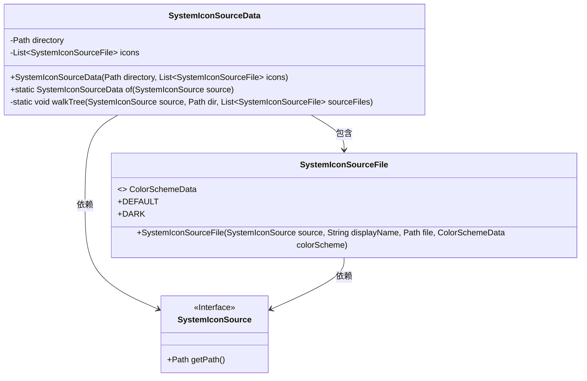
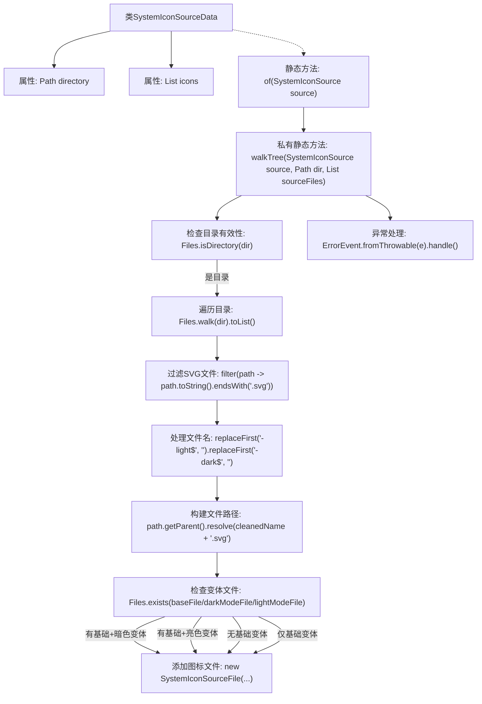

# 基础信息

|      |      |
|------|------|
| 名称 | SystemIconSourceData |
| 编码语言 | .java |
| 代码路径 | xpipe/app/src/main/java/io/xpipe/app/icon/SystemIconSourceData.java |
| 包名 | io.xpipe.app.icon |
| 依赖项 | ['io.xpipe.app.issue.ErrorEvent', 'lombok.Value', 'org.apache.commons.io.FilenameUtils', 'java.nio.file.Files', 'java.nio.file.Path', 'java.util.ArrayList', 'java.util.List', 'java.util.Locale'] |
| 概述说明 | 系统图标源数据处理类，遍历目录收集SVG图标，支持深浅色模式变体。 |

# 说明

SystemIconSourceData类用于处理系统图标源数据，包含目录路径和图标列表。通过walkTree方法遍历目录，筛选SVG文件，并根据文件名后缀（-light/-dark）识别不同颜色方案。支持默认、暗色和亮色模式图标的处理逻辑，自动匹配对应颜色方案并构建图标列表。异常处理通过ErrorEvent捕获并处理错误。

# 类列表 Class Summary

| 名称   | 类型  | 说明 |
|-------|------|-------------|
| SystemIconSourceData | class | 系统图标源数据处理类，遍历目录收集SVG图标，支持深浅色模式。 |

## 类 SystemIconSourceData

|      |      |
|------|------|
| 访问范围 | @Value;public |
| 类型 | class |
| 名称 | SystemIconSourceData |
| 说明 | 系统图标源数据处理类，遍历目录收集SVG图标，支持深浅色模式。 |

### UML类图

这段代码描述了一个图标资源管理系统，核心类SystemIconSourceData负责遍历指定目录下的SVG图标文件，处理不同颜色模式（默认/暗色）的变体。SystemIconSource接口提供路径获取功能，SystemIconSourceFile类封装单个图标文件及其颜色方案信息。walkTree方法实现了递归扫描目录、过滤SVG文件、处理文件名后缀以及匹配颜色模式变体的复杂逻辑，最终生成包含所有有效图标的列表。

### 内部方法调用关系图

该流程图展示了SystemIconSourceData类处理SVG图标文件的完整流程。从入口方法of()开始，通过walkTree()方法递归扫描目录，过滤出SVG文件并进行文件名标准化处理，然后根据不同的颜色模式变体（基础/暗色/亮色）组合情况创建对应的SystemIconSourceFile对象。整个过程包含目录验证、文件遍历、名称处理、路径构建和异常处理等关键步骤，最终生成包含所有有效图标文件的列表。

### 字段列表 Field List

| 名称  | 类型  | 说明 |
|-------|-------|------|
| directory | Path | 路径目录 |
| icons | List<SystemIconSourceFile> | 图标源文件列表。 |

### 方法列表 Method List

| 名称  | 类型  | 说明 |
|-------|-------|------|
| of | SystemIconSourceData | 静态方法`of`接收`SystemIconSource`参数，遍历路径生成`SystemIconSourceData`对象。 |
| walkTree | void | 遍历目录处理SVG图标文件，检查亮暗模式变体并分类添加。 |

