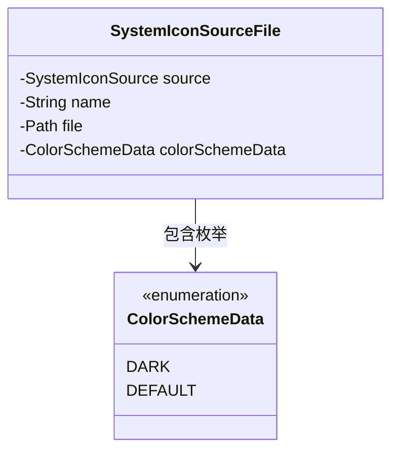
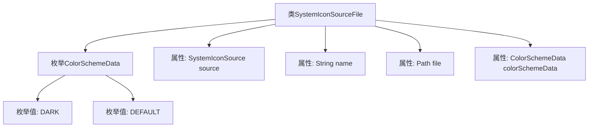

# 基础信息

|      |      |
|------|------|
| 名称 | SystemIconSourceFile |
| 编码语言 | .java |
| 代码路径 | xpipe/app/src/main/java/io/xpipe/app/icon/SystemIconSourceFile.java |
| 包名 | io.xpipe.app.icon |
| 依赖项 | ['lombok.Value', 'java.nio.file.Path'] |
| 概述说明 | 系统图标源文件类，含颜色方案枚举、源、名称、路径和颜色方案数据。 |

# 说明

该代码定义了一个名为SystemIconSourceFile的公共类，使用@Value注解标记。类中包含一个嵌套枚举ColorSchemeData，定义了DARK和DEFAULT两个常量。类包含四个成员变量：SystemIconSource类型的source、String类型的name、Path类型的file以及ColorSchemeData类型的colorSchemeData。整个结构用于描述系统图标源文件的相关属性。

# 类列表 Class Summary

| 名称   | 类型  | 说明 |
|-------|------|-------------|
| SystemIconSourceFile | class | 系统图标源文件类，含颜色方案枚举、源、名称、路径和颜色方案数据。 |

## 类 SystemIconSourceFile

|      |      |
|------|------|
| 访问范围 | @Value;public |
| 类型 | class |
| 名称 | SystemIconSourceFile |
| 说明 | 系统图标源文件类，含颜色方案枚举、源、名称、路径和颜色方案数据。 |

### UML类图

这段类图展示了SystemIconSourceFile类的结构，它包含四个私有字段：source（SystemIconSource类型）、name（字符串类型）、file（Path类型）和colorSchemeData（枚举类型）。其中ColorSchemeData是一个枚举类，定义了DARK和DEFAULT两个枚举值。类图通过箭头表示SystemIconSourceFile对ColorSchemeData枚举的包含关系，整体结构清晰体现了数据存储和枚举使用的设计模式。

### 内部方法调用关系图

该流程图展示了SystemIconSourceFile类的结构，包含一个嵌套枚举ColorSchemeData和四个属性。枚举定义了两个常量值DARK和DEFAULT，分别表示暗色和默认配色方案。类属性包括图标数据源(source)、名称(name)、文件路径(file)和配色方案(colorSchemeData)。整个结构清晰地反映了该类的数据组织方式，用于管理系统图标源文件的相关信息。

### 字段列表 Field List

| 名称  | 类型  | 说明 |
|-------|-------|------|
| name | String | 声明字符串变量name |
| source | SystemIconSource | 系统图标来源变量 |
| file | Path | 文件路径 |
| colorSchemeData | ColorSchemeData | 定义颜色方案数据变量 |

### 方法列表 Method List

| 名称  | 类型  | 说明 |
|-------|-------|------|

