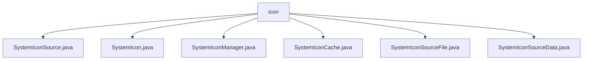

# 基础信息

|      |      |
|------|------|
| 名称 | icon |
| 编码语言 | .java |
| 代码路径 | xpipe/app/src/main/java/io/xpipe/app/icon |
| 包名 | xpipe.app.src.main.java.io.xpipe.app.icon |
| 概述说明 | 系统图标管理类，包含源数据、缓存、颜色方案处理及文件路径生成功能。 |

# 说明

```markdown
## 概述
该代码模块是一个系统图标管理系统，主要负责图标的加载、缓存、颜色方案适配及资源管理。模块采用分层设计，包含图标源管理（`SystemIconSource`）、图标缓存处理（`SystemIconCache`）、图标数据解析（`SystemIconSourceData`）等核心组件，支持多颜色方案（如暗色/亮色模式）、动态资源加载（本地目录/Git仓库）和高效缓存机制。通过静态管理类（`SystemIconManager`）统一调度，提供图标路径生成、校验、栅格化等功能。

## 主要业务场景
1. **图标资源管理**  
   - 支持从自定义目录或Git仓库加载图标源（`SystemIconSource`），针对中文用户优化镜像地址。
   - 通过`SystemIconSourceData`解析目录中的SVG文件，自动识别颜色方案（如`-dark`/`-light`后缀）。

2. **多主题适配**  
   - 定义`DARK`/`DEFAULT`等颜色方案（`ColorSchemeData`），根据系统主题动态匹配对应图标。
   - 图标缓存（`SystemIconCache`）支持反色处理、尺寸栅格化（4种预设尺寸）及MD5校验。

3. **缓存与性能优化**  
   - `SystemIconManager`维护图标源和缓存池，初始化时预加载数据，支持手动刷新或清理无效资源。
   - SVG文件栅格化为不同尺寸的位图，按颜色方案分类存储，减少运行时计算开销。

4. **异常处理与日志**  
   - 通过`ErrorEvent`捕获文件遍历或解析错误，结合日志记录（如缓存重建状态）保障稳定性。
```


### 包内部结构视图



该流程图展示了xpipe项目中icon目录下的文件结构关系。所有文件都直接位于icon目录下，没有更深层级的子目录。这些文件包括SystemIconSource.java、SystemIcon.java等6个Java源文件，它们共同构成了项目的图标管理模块，负责处理系统图标的加载、缓存和管理功能。

# 文件列表 File List

| 名称   | 类型  | 说明 |
|-------|------|-------------|
| [SystemIconSourceData.java](SystemIconSourceData.md) | file | 系统图标源数据处理类，遍历目录收集SVG图标，支持深浅色模式变体。 |
| [SystemIconSourceFile.java](SystemIconSourceFile.md) | file | 系统图标源文件类，含颜色方案枚举、源、名称、路径和颜色方案数据。 |
| [SystemIconCache.java](SystemIconCache.md) | file | 系统图标缓存类，支持多尺寸、颜色方案及MD5校验。 |
| [SystemIconManager.java](SystemIconManager.md) | file | 系统图标管理器类，管理图标源、缓存及加载，支持自定义和GitHub镜像源。 |
| [SystemIcon.java](SystemIcon.md) | file | 系统图标类，包含来源和ID属性。 |
| [SystemIconSource.java](SystemIconSource.md) | file | 输入内容为空，无法生成概要描述。请提供具体信息以便总结。 |


