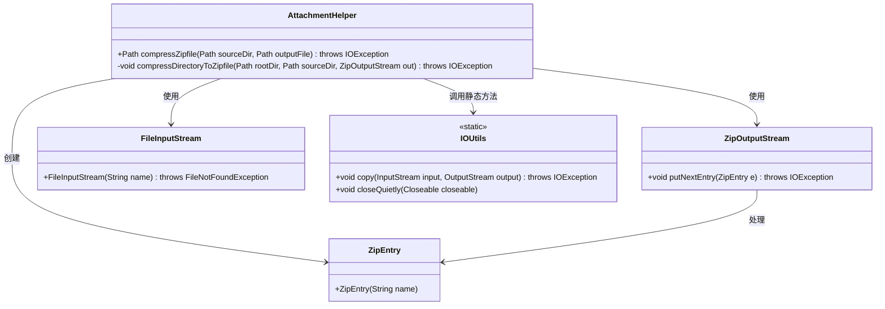

# 基础信息

|      |      |
|------|------|
| 名称 | AttachmentHelper |
| 编码语言 | .java |
| 代码路径 | xpipe/app/src/main/java/io/xpipe/app/issue/AttachmentHelper.java |
| 包名 | io.xpipe.app.issue |
| 依赖项 | ['org.apache.commons.io.IOUtils', 'java.io.File', 'java.io.FileInputStream', 'java.io.FileOutputStream', 'java.io.IOException', 'java.nio.file.Path', 'java.util.zip.ZipEntry', 'java.util.zip.ZipOutputStream'] |
| 概述说明 | Java类实现目录压缩为ZIP文件功能。 |

# 说明

该代码描述了一个用于压缩文件的工具类AttachmentHelper，包含两个静态方法。compressZipfile方法接收源目录和目标文件路径，创建ZipOutputStream并调用compressDirectoryToZipfile进行压缩，最后关闭流并返回输出文件路径。compressDirectoryToZipfile是递归方法，遍历源目录下的所有文件和子目录，将文件内容写入ZIP输出流，使用相对路径创建ZipEntry，并通过IOUtils工具类处理流的复制和关闭操作。整个过程实现了将指定目录递归压缩为ZIP文件的功能。

# 类列表 Class Summary

| 名称   | 类型  | 说明 |
|-------|------|-------------|
| AttachmentHelper | class | Java类实现目录压缩为ZIP文件功能。 |

## 类 AttachmentHelper

|      |      |
|------|------|
| 访问范围 | public |
| 类型 | class |
| 名称 | AttachmentHelper |
| 说明 | Java类实现目录压缩为ZIP文件功能。 |

### UML类图

这段代码展示了一个压缩工具类AttachmentHelper，主要功能是将目录压缩为ZIP文件。类图清晰地展示了其与Java I/O类的交互关系：通过ZipOutputStream处理压缩流，使用ZipEntry创建压缩条目，借助FileInputStream读取文件内容，并调用IOUtils工具类进行流操作。压缩过程采用递归方式处理子目录，体现了典型的组合模式应用场景。

### 内部方法调用关系图

这段代码实现了一个ZIP压缩工具类，主要包含两个方法：compressZipfile作为入口方法创建压缩流并调用核心压缩方法，compressDirectoryToZipfile递归处理目录结构。流程图清晰展示了从初始化压缩流、递归遍历目录结构、处理文件/目录判断、写入压缩条目到最终关闭流的完整流程，特别突出了递归处理目录和文件复制两个关键路径。所有IO操作都包含在try-with-resources或显式关闭逻辑中，体现了良好的资源管理实践。

### 字段列表 Field List

| 名称  | 类型  | 说明 |
|-------|-------|------|

### 方法列表 Method List

| 名称  | 类型  | 说明 |
|-------|-------|------|
| compressDirectoryToZipfile | void | 递归压缩目录到ZIP文件，处理子目录和文件。 |
| compressZipfile | Path | 压缩目录为ZIP文件，返回输出路径。 |

