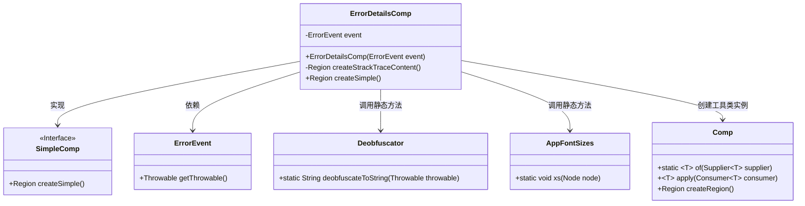
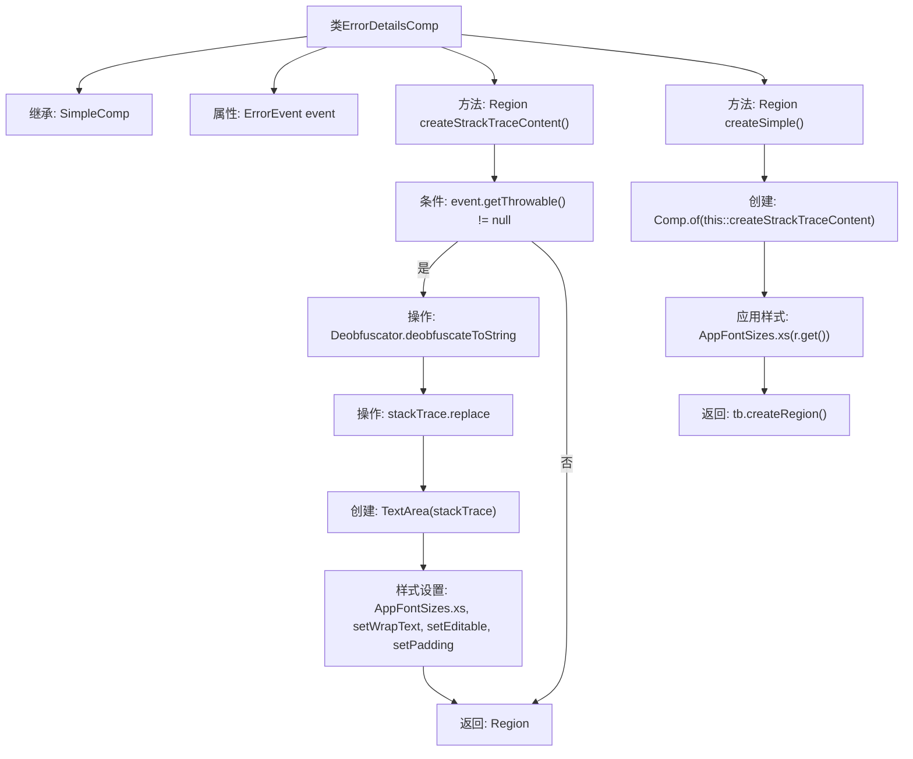

# 基础信息

|      |      |
|------|------|
| 名称 | ErrorDetailsComp |
| 编码语言 | .java |
| 代码路径 | xpipe/app/src/main/java/io/xpipe/app/issue/ErrorDetailsComp.java |
| 包名 | io.xpipe.app.issue |
| 依赖项 | ['io.xpipe.app.comp.Comp', 'io.xpipe.app.comp.SimpleComp', 'io.xpipe.app.core.AppFontSizes', 'io.xpipe.core.util.Deobfuscator', 'javafx.geometry.Insets', 'javafx.scene.control.TextArea', 'javafx.scene.layout.Region', 'lombok.AllArgsConstructor'] |
| 概述说明 | ErrorDetailsComp类继承SimpleComp，处理错误事件并生成堆栈跟踪显示区域。 |

# 说明

ErrorDetailsComp是一个继承自SimpleComp的类，用于处理错误详情显示。它包含一个ErrorEvent类型的私有字段event。类中定义了一个createStackTraceContent方法，用于生成堆栈跟踪内容区域：若event包含Throwable对象，则先通过Deobfuscator去混淆并转换为字符串，移除制表符后创建TextArea控件，设置XS字号、自动换行、不可编辑及内边距；若无Throwable则返回空Region。重写的createSimple方法调用createStackTraceContent生成内容，并应用XS字号样式后返回Region。

# 类列表 Class Summary

| 名称   | 类型  | 说明 |
|-------|------|-------------|
| ErrorDetailsComp | class | 错误详情组件类，含反混淆堆栈跟踪处理和UI渲染功能。 |

## 类 ErrorDetailsComp

|      |      |
|------|------|
| 访问范围 | @AllArgsConstructor;public |
| 类型 | class |
| 名称 | ErrorDetailsComp |
| 说明 | 错误详情组件类，含反混淆堆栈跟踪处理和UI渲染功能。 |

### UML类图

这段类图展示了ErrorDetailsComp及其相关依赖关系。ErrorDetailsComp继承自SimpleComp接口，包含对ErrorEvent、Deobfuscator、AppFontSizes和Comp的依赖。主要功能是通过createStrackTraceContent方法处理异常堆栈信息，使用Deobfuscator进行反混淆处理，并通过Comp工具类构建UI组件。整个设计体现了清晰的职责分离，ErrorDetailsComp专注于错误详情展示逻辑，而辅助功能则委托给其他工具类完成。

### 内部方法调用关系图

这段代码流程图展示了ErrorDetailsComp类的结构和主要方法调用关系。该类继承自SimpleComp，包含一个ErrorEvent属性和两个核心方法：createStrackTraceContent()用于处理异常堆栈跟踪的显示逻辑，createSimple()作为重写方法构建最终界面组件。流程清晰展现了条件判断、字符串处理、UI组件创建和样式设置的完整过程，最终返回一个可显示的Region区域。

### 字段列表 Field List

| 名称  | 类型  | 说明 |
|-------|-------|------|
| event | ErrorEvent | 私有错误事件对象 |

### 方法列表 Method List

| 名称  | 类型  | 说明 |
|-------|-------|------|
| createStrackTraceContent | Region | 创建堆栈跟踪内容区域，若存在异常则去混淆处理并显示文本区域，否则返回空区域。 |
| createSimple | Region | 重写方法创建简单区域，含堆栈跟踪内容并应用字体大小。 |

