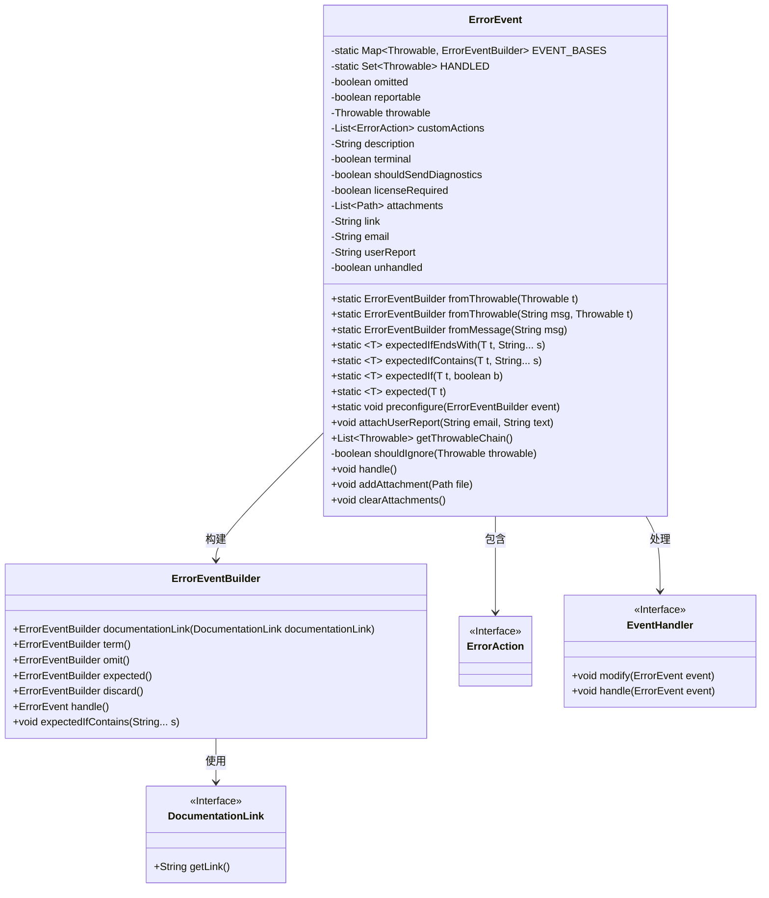
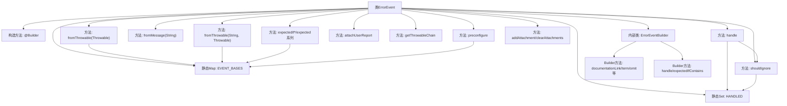

# 基础信息

|      |      |
|------|------|
| 名称 | ErrorEvent |
| 编码语言 | .java |
| 代码路径 | xpipe/app/src/main/java/io/xpipe/app/issue/ErrorEvent.java |
| 包名 | io.xpipe.app.issue |
| 依赖项 | ['io.xpipe.app.util.DocumentationLink', 'lombok.Builder', 'lombok.Getter', 'lombok.Setter', 'lombok.Singular', 'java.nio.file.Path', 'java.util', 'java.util.concurrent.ConcurrentHashMap', 'java.util.concurrent.CopyOnWriteArraySet'] |
| 概述说明 | 错误事件类，含异常处理、自定义动作、附件和用户报告功能。 |

# 说明

ErrorEvent类是一个用于处理错误事件的构建器模式实现，包含多种属性和方法。主要属性包括是否忽略错误、是否可报告、异常对象、自定义操作列表、描述信息、是否终止、是否发送诊断数据、是否需要许可证、附件路径列表、链接、电子邮件和用户报告等。类提供了从异常或消息创建构建器的静态方法，支持基于异常消息的条件判断和预处理。包含处理异常链、忽略特定异常、添加附件和清除附件等方法。ErrorEventBuilder内部类提供了设置文档链接、终止标记、忽略标记、预期标记等便捷方法，并支持条件判断和处理事件。整体设计灵活，适用于复杂的错误处理场景。

# 类列表 Class Summary

| 名称   | 类型  | 说明 |
|-------|------|-------------|
| ErrorEvent | class | 错误事件类，含异常处理、自定义动作和附件管理功能。 |

## 类 ErrorEvent

|      |      |
|------|------|
| 访问范围 | @Builder;@Getter;public |
| 类型 | class |
| 名称 | ErrorEvent |
| 说明 | 错误事件类，含异常处理、自定义动作和附件管理功能。 |

### UML类图

类图描述：该图展示了ErrorEvent及其构建器ErrorEventBuilder的核心结构。ErrorEvent通过ConcurrentHashMap和CopyOnWriteArraySet管理异常事件，包含异常处理、附件管理等方法。ErrorEventBuilder提供链式配置方法，支持文档链接、终止标记等操作。通过EventHandler接口实现事件处理逻辑，与DocumentationLink和ErrorAction接口形成协作关系，整体构成一个可扩展的异常事件处理框架。

### 内部方法调用关系图

该流程图展示了ErrorEvent类的完整结构，包含静态存储容器(EVENT_BASES/HANDLED)、核心构造方法、多种异常处理工厂方法、条件判断方法(shouldIgnore)和事件处理方法(handle)。特别突出了Builder模式的实现，包括内部类ErrorEventBuilder及其链式调用方法。类通过静态Map实现异常预处理机制，通过静态Set跟踪已处理异常，提供从异常/消息创建事件的多种方式，支持附件管理和用户报告附加功能。处理流程包含忽略判断、事件修改和处理器调用等关键步骤。

### 字段列表 Field List

| 名称  | 类型  | 说明 |
|-------|-------|------|
| licenseRequired | boolean | 设置私有布尔变量licenseRequired的setter方法。 |
| shouldSendDiagnostics | boolean | 私有布尔变量shouldSendDiagnostics的setter方法。 |
| customActions | List<ErrorAction> | 私有错误操作列表customActions。 |
| email | String | 私有字符串变量email |
| HANDLED = new CopyOnWriteArraySet<>() | Set<Throwable> | 私有静态终态集合HANDLED存储已处理的异常。 |
| unhandled | boolean | 私有布尔变量unhandled |
| attachments | List<Path> | 私有附件路径列表 |
| EVENT_BASES = new ConcurrentHashMap<>() | Map<Throwable, ErrorEventBuilder> | 私有静态最终映射表，键为异常，值为错误事件构建器，使用并发哈希映射实现。 |
| link | String | 私有字符串变量link |
| omitted = false | boolean | 私有布尔常量omitted默认为false。 |
| reportable = true | boolean | 默认设置可报告标志为真。 |
| description | String | 私有字符串类型变量description。 |
| throwable | Throwable | 私有不可变的异常对象 |
| userReport | String | 用户报告字段，存储用户报告信息。 |
| terminal | boolean | 私有布尔变量terminal |

### 方法列表 Method List

| 名称  | 类型  | 说明 |
|-------|-------|------|
| preconfigure | void | 静态方法预配置错误事件，将异常与事件构建器关联存储。 |
| getThrowableChain | List<Throwable> | 获取异常链列表，从当前异常回溯至根因。 |
| fromMessage | ErrorEventBuilder | 静态方法，通过消息创建ErrorEventBuilder实例。 |
| expected | T | 静态方法expected记录异常为预期事件并返回原异常。 |
| fromThrowable | ErrorEventBuilder | 静态方法根据异常构建错误事件，包含消息和异常详情。 |
| handle | void | 处理异常：忽略已处理异常，修改并处理事件，标记为已处理。 |
| expectedIfContains | T | 静态方法检查异常消息是否包含指定字符串，返回匹配的异常。 |
| expectedIfEndsWith | T | 静态方法检查异常消息是否以指定字符串结尾。 |
| expectedIf | T | 静态方法expectedIf接收异常和布尔值，若为真标记异常为预期事件并返回该异常。 |
| shouldIgnore | boolean | 检查异常是否可忽略：非空、已处理且非终止，或递归检查原因异常。 |
| fromThrowable | ErrorEventBuilder | 静态方法根据异常生成错误事件，存在则复用并移除，否则新建。 |
| attachUserReport | void | 方法attachUserReport接收email和text参数，赋值给类成员变量。 |
| addAttachment | void | 方法`addAttachment`将文件路径添加到附件列表，先复制原列表再添加新项。 |
| clearAttachments | void | 清空附件列表 |

