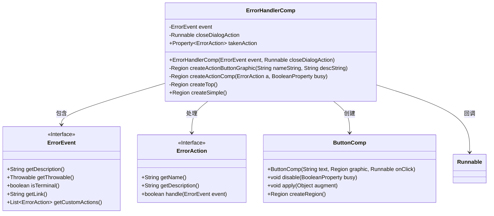
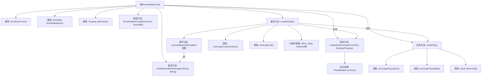

# 基础信息

|      |      |
|------|------|
| 名称 | ErrorHandlerComp |
| 编码语言 | .java |
| 代码路径 | xpipe/app/src/main/java/io/xpipe/app/issue/ErrorHandlerComp.java |
| 包名 | io.xpipe.app.issue |
| 依赖项 | ['io.xpipe.app.comp.SimpleComp', 'io.xpipe.app.comp.augment.GrowAugment', 'io.xpipe.app.comp.base.ButtonComp', 'io.xpipe.app.core.AppFontSizes', 'io.xpipe.app.core.AppI18n', 'io.xpipe.app.core.AppLayoutModel', 'io.xpipe.app.util.BooleanScope', 'io.xpipe.app.util.LicenseRequiredException', 'io.xpipe.app.util.ThreadHelper', 'javafx.beans.property.BooleanProperty', 'javafx.beans.property.Property', 'javafx.beans.property.SimpleBooleanProperty', 'javafx.beans.property.SimpleObjectProperty', 'javafx.geometry.Insets', 'javafx.geometry.Orientation', 'javafx.scene.control.Label', 'javafx.scene.control.Separator', 'javafx.scene.control.TextArea', 'javafx.scene.layout.Region', 'javafx.scene.layout.VBox', 'lombok.Getter', 'atlantafx.base.theme.Styles.ACCENT', 'atlantafx.base.theme.Styles.BUTTON_OUTLINED'] |
| 概述说明 | 错误处理组件类，包含错误事件处理、自定义动作按钮和顶部描述区域。 |

# 说明

ErrorHandlerComp是一个用于处理错误事件的JavaFX组件，继承自SimpleComp。它包含一个ErrorEvent事件和关闭对话框的Runnable动作。组件通过Property跟踪用户采取的操作，并提供创建按钮图形和操作组件的方法。createTop方法生成错误描述区域，根据错误类型和严重性显示不同内容。createSimple方法构建整体界面，包括错误描述和可能的操作按钮。组件支持自定义操作，如处理LicenseRequiredException时添加升级选项，还能根据错误链接添加打开文档的操作。界面布局采用VBox组织元素，包含样式类和响应式设计。

# 类列表 Class Summary

| 名称   | 类型  | 说明 |
|-------|------|-------------|
| ErrorHandlerComp | class | 错误处理组件，包含错误描述和自定义操作按钮，支持异步处理和关闭对话框。 |

## 类 ErrorHandlerComp

|      |      |
|------|------|
| 访问范围 | public |
| 类型 | class |
| 名称 | ErrorHandlerComp |
| 说明 | 错误处理组件，包含错误描述和自定义操作按钮，支持异步处理和关闭对话框。 |

### UML类图

这段类图展示了错误处理组件ErrorHandlerComp的核心结构。该组件继承自SimpleComp，主要处理ErrorEvent事件，通过ErrorAction接口定义多种处理行为，并使用ButtonComp创建交互按钮。组件包含事件描述生成、动作按钮创建和整体布局构建等功能，支持自定义错误处理动作和文档链接跳转，通过Property机制跟踪用户采取的操作。整个设计采用组合模式，将UI元素与业务逻辑分离，具有较好的扩展性。

### 内部方法调用关系图

这段代码实现了一个错误处理组件ErrorHandlerComp，继承自SimpleComp类。主要功能包括：通过构造方法接收错误事件和关闭对话框动作，提供多种错误处理方式的可视化界面。核心逻辑包含创建动作按钮图形、构建动作组件、生成顶部描述区域，以及重写createSimple()方法组合完整界面。特别处理了LicenseRequiredException异常情况，支持自定义动作和文档链接，并通过异步线程执行错误处理逻辑。整个组件采用JavaFX构建，包含丰富的UI交互元素和状态管理。

### 字段列表 Field List

| 名称  | 类型  | 说明 |
|-------|-------|------|
| takenAction = new SimpleObjectProperty<>() | Property<ErrorAction> | 私有属性takenAction，类型为Property<ErrorAction>，使用SimpleObjectProperty初始化。 |
| closeDialogAction | Runnable | 私有终态Runnable关闭对话框动作 |
| event | ErrorEvent | 私有错误事件对象 |

### 方法列表 Method List

| 名称  | 类型  | 说明 |
|-------|-------|------|
| createActionButtonGraphic | Region | 创建带标题和描述的按钮图形，标题大号，描述小号，垂直排列间距2。 |
| createActionComp | Region | 创建按钮组件，执行异步操作，处理异常并关闭对话框。 |
| createTop | Region | 创建顶部区域，处理事件描述，设置文本区域属性并返回。 |
| createSimple | Region | 创建错误处理界面，包含自定义操作按钮和许可证升级选项。 |

