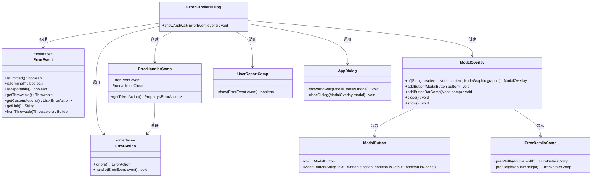
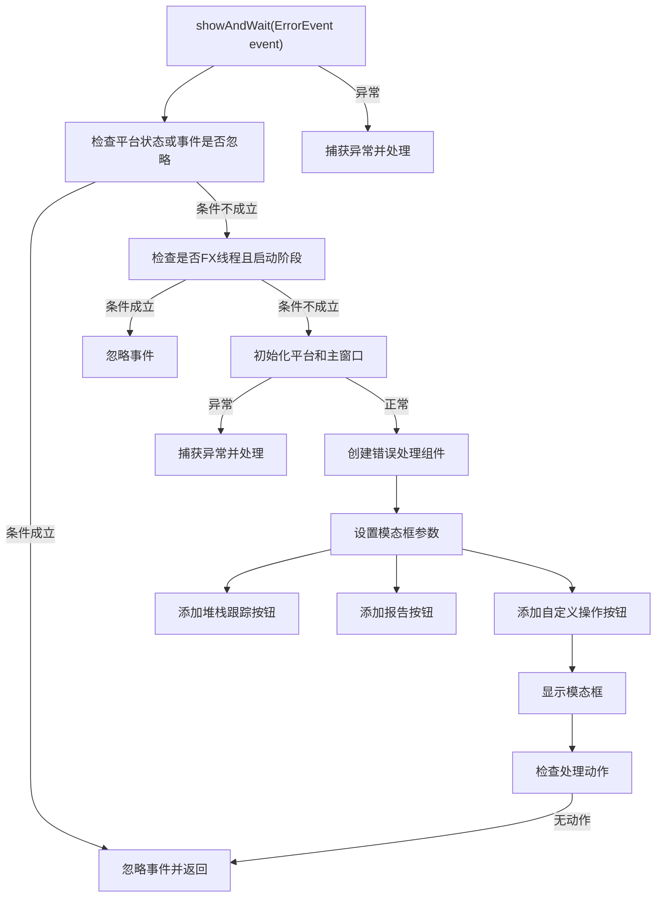

# 基础信息

|      |      |
|------|------|
| 名称 | ErrorHandlerDialog |
| 编码语言 | .java |
| 代码路径 | xpipe/app/src/main/java/io/xpipe/app/issue/ErrorHandlerDialog.java |
| 包名 | io.xpipe.app.issue |
| 依赖项 | ['io.xpipe.app.comp.Comp', 'io.xpipe.app.comp.base.ModalButton', 'io.xpipe.app.comp.base.ModalOverlay', 'io.xpipe.app.core.mode.OperationMode', 'io.xpipe.app.core.window.AppDialog', 'io.xpipe.app.core.window.AppMainWindow', 'io.xpipe.app.util.LabelGraphic', 'io.xpipe.app.util.PlatformInit', 'io.xpipe.app.util.PlatformState', 'javafx.application.Platform', 'javafx.scene.paint.Color', 'org.kordamp.ikonli.javafx.FontIcon', 'java.util.concurrent.atomic.AtomicReference'] |
| 概述说明 | 错误处理对话框类，显示错误事件并执行相应操作。 |

# 说明

ErrorHandlerDialog类包含showAndWait方法，用于处理错误事件。方法首先检查平台状态或错误是否被忽略，若满足条件则忽略错误。启动阶段在平台线程上遇到错误也会被忽略。随后初始化平台和主窗口，失败则忽略错误。方法创建模态对话框显示错误信息，包含警告图标、堆栈跟踪按钮和报告按钮。根据错误类型和自定义操作调整对话框内容。最后显示对话框并处理用户操作，若未选择操作则默认忽略错误。处理过程中任何异常都会被捕获并忽略。

# 类列表 Class Summary

| 名称   | 类型  | 说明 |
|-------|------|-------------|
| ErrorHandlerDialog | class | 错误处理对话框类，显示错误事件，支持忽略、报告和查看堆栈。 |

## 类 ErrorHandlerDialog

|      |      |
|------|------|
| 访问范围 | public |
| 类型 | class |
| 名称 | ErrorHandlerDialog |
| 说明 | 错误处理对话框类，显示错误事件，支持忽略、报告和查看堆栈。 |

### UML类图

这段代码展示了一个错误处理对话框系统，主要类包括ErrorHandlerDialog（主控制器）、ErrorEvent（错误事件数据）、ErrorAction（错误处理动作）和多个UI组件类（ModalOverlay、ErrorHandlerComp等）。系统通过判断错误类型和平台状态来决定处理方式，支持显示错误详情、上报错误和自定义操作等功能，采用模态对话框形式展示错误信息，并确保线程安全和异常处理。

### 内部方法调用关系图

该流程图描述了ErrorHandlerDialog.showAndWait方法的完整处理流程。方法首先检查平台状态和事件属性，根据条件决定是否忽略错误。随后尝试初始化平台和主窗口，失败时进行异常处理。成功初始化后，创建错误处理界面组件，配置模态框的各种按钮（堆栈跟踪、报告、自定义操作等），最后显示模态框并处理用户操作结果。整个过程包含多层异常捕获和处理机制，确保错误不会导致程序崩溃。

### 字段列表 Field List

| 名称  | 类型  | 说明 |
|-------|-------|------|

### 方法列表 Method List

| 名称  | 类型  | 说明 |
|-------|-------|------|
| showAndWait | void | 处理错误事件，忽略特定条件错误，初始化平台和窗口，显示错误模态框，支持报告和堆栈跟踪。 |

