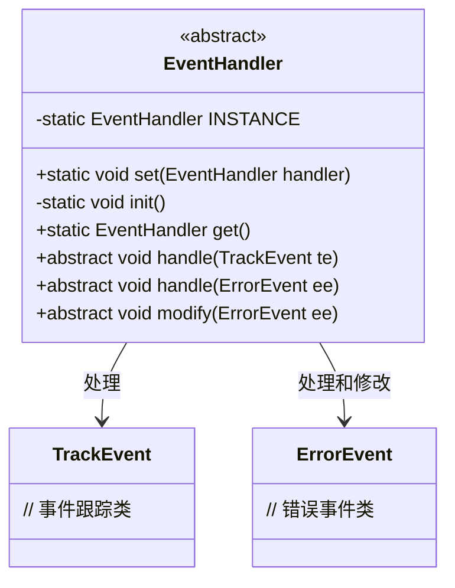
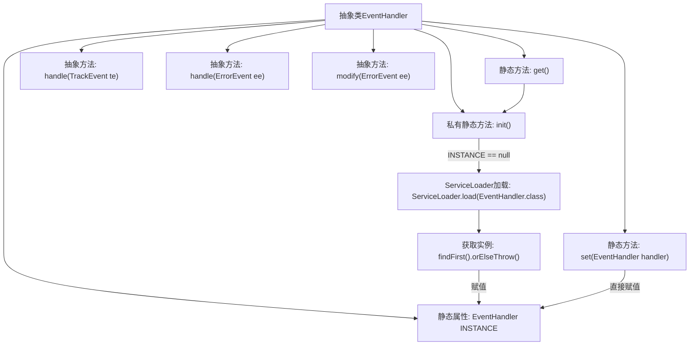

# 基础信息

|      |      |
|------|------|
| 名称 | EventHandler |
| 编码语言 | .java |
| 代码路径 | xpipe/app/src/main/java/io/xpipe/app/issue/EventHandler.java |
| 包名 | io.xpipe.app.issue |
| 依赖项 | ['java.util.ServiceLoader'] |
| 概述说明 | 事件处理器抽象类，单例模式，提供设置、初始化和获取实例方法，含三个抽象处理函数。 |

# 说明

这段代码定义了一个名为EventHandler的抽象类，用于管理事件处理逻辑。它采用单例模式，通过静态方法get()获取唯一实例，首次调用时会自动初始化。初始化过程使用ServiceLoader机制加载实现类，若无实现则抛出异常。类提供了三个抽象方法：handle(TrackEvent)和handle(ErrorEvent)用于处理不同类型的事件，modify(ErrorEvent)用于修改错误事件。通过set()方法可手动设置实例。整个设计实现了事件处理器的集中管理和灵活扩展。

# 类列表 Class Summary

| 名称   | 类型  | 说明 |
|-------|------|-------------|
| EventHandler | class | EventHandler类：单例模式，提供事件处理和修改功能。 |

## 类 EventHandler

|      |      |
|------|------|
| 访问范围 | public abstract |
| 类型 | class |
| 名称 | EventHandler |
| 说明 | EventHandler类：单例模式，提供事件处理和修改功能。 |

### UML类图

这段代码展示了一个抽象类EventHandler的设计，它采用单例模式管理实例，并通过静态方法提供全局访问点。该类定义了对TrackEvent和ErrorEvent两种事件的处理接口，包含三种抽象方法：两个重载的handle()方法分别处理不同类型事件，以及一个modify()方法专门修改错误事件。类图清晰地反映了EventHandler与两种事件类之间的依赖关系，以及其单例管理机制的核心结构。

### 内部方法调用关系图

这段代码展示了一个单例模式的抽象事件处理器类，通过静态方法控制实例的初始化和获取。流程图清晰地描述了类结构关系，包括INSTANCE属性的三种处理路径：直接通过set()方法赋值、通过get()方法触发延迟初始化、以及初始化时通过ServiceLoader动态加载实现类。抽象方法表明具体子类需实现三种不同事件的处理逻辑，体现了模板方法模式的设计思想。

### 字段列表 Field List

| 名称  | 类型  | 说明 |
|-------|-------|------|
| INSTANCE | EventHandler | 单例模式的事件处理器实例 |

### 方法列表 Method List

| 名称  | 类型  | 说明 |
|-------|-------|------|
| handle | void | 抽象方法，处理TrackEvent事件。 |
| handle | void | 抽象方法，处理错误事件。 |
| modify | void | 抽象方法，修改错误事件。 |
| set | void | 设置事件处理器实例。 |
| get | EventHandler | 静态方法get()初始化并返回单例实例INSTANCE。 |
| init | void | 初始化单例实例，若为空则加载服务实现。 |

