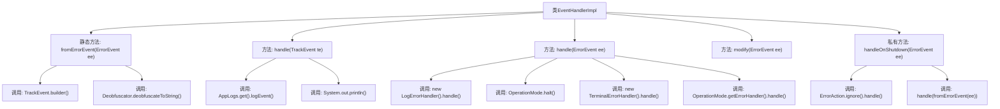
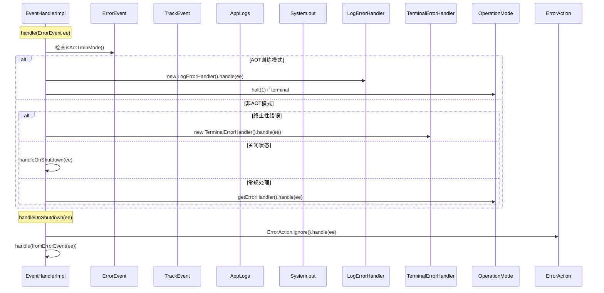

# 基础信息

|      |      |
|------|------|
| 名称 | EventHandlerImpl |
| 编码语言 | .java |
| 代码路径 | xpipe/app/src/main/java/io/xpipe/app/issue/EventHandlerImpl.java |
| 包名 | io.xpipe.app.issue |
| 依赖项 | ['io.xpipe.app.core.AppLogs', 'io.xpipe.app.core.AppProperties', 'io.xpipe.app.core.mode.OperationMode', 'io.xpipe.core.util.Deobfuscator', 'java.nio.file.Path'] |
| 概述说明 | EventHandlerImpl处理事件和错误，转换错误事件为TrackEvent，根据条件调用不同处理器，支持日志记录和附件添加。 |

# 说明

EventHandlerImpl类继承自EventHandler，实现了错误事件和跟踪事件的处理逻辑。主要功能包括：将ErrorEvent转换为TrackEvent，包含错误描述、堆栈信息和附件路径；根据事件类型和系统状态选择不同处理方式，如日志记录、终止程序或后台处理；在关机时特殊处理错误事件；支持为错误事件添加会话日志目录附件。处理逻辑考虑了AOT训练模式、终端错误和系统关机等不同场景。

# 类列表 Class Summary

| 名称   | 类型  | 说明 |
|-------|------|-------------|
| EventHandlerImpl | class | EventHandlerImpl处理错误和跟踪事件，转换错误事件为跟踪事件，记录日志并根据条件执行不同处理逻辑。 |

## 类 EventHandlerImpl

|      |      |
|------|------|
| 访问范围 | public |
| 类型 | class |
| 名称 | EventHandlerImpl |
| 说明 | EventHandlerImpl处理错误和跟踪事件，转换错误事件为跟踪事件，记录日志并根据条件执行不同处理逻辑。 |

### UML类图

```mermaid
classDiagram
    class EventHandler {
        <<Interface>>
        +handle(TrackEvent te) void
        +handle(ErrorEvent ee) void
        +modify(ErrorEvent ee) void
    }

    class EventHandlerImpl {
        +fromErrorEvent(ErrorEvent ee) TrackEvent
        +handle(TrackEvent te) void
        +handle(ErrorEvent ee) void
        +modify(ErrorEvent ee) void
        -handleOnShutdown(ErrorEvent ee) void
    }

    class TrackEvent {
        <<Builder>>
        +builder() TrackEventBuilder
        +message(String msg) TrackEventBuilder
        +type(String type) TrackEventBuilder
        +tag(String key, Object value) TrackEventBuilder
        +elements(List~String~ elements) TrackEventBuilder
        +build() TrackEvent
    }

    class ErrorEvent {
        +getDescription() String
        +getThrowable() Throwable
        +isOmitted() boolean
        +isTerminal() boolean
        +getAttachments() List~Path~
        +addAttachment(Path path) void
    }

    class AppLogs {
        <<Singleton>>
        +get() AppLogs
        +logEvent(TrackEvent te) void
        +getSessionLogsDirectory() Path
    }

    class AppProperties {
        <<Singleton>>
        +get() AppProperties
        +isAotTrainMode() boolean
    }

    class OperationMode {
        <<Enum>>
        +BACKGROUND
        +get() OperationMode
        +isInShutdown() boolean
        +halt(int code) void
        +getErrorHandler() ErrorHandler
    }

    class LogErrorHandler {
        +handle(ErrorEvent ee) void
    }

    class TerminalErrorHandler {
        +handle(ErrorEvent ee) void
    }

    class ErrorAction {
        +ignore() ErrorAction
        +handle(ErrorEvent ee) void
    }

    class Deobfuscator {
        +deobfuscateToString(Throwable t) String
    }

    EventHandlerImpl --|> EventHandler : 实现
    EventHandlerImpl --> TrackEvent : 创建
    EventHandlerImpl --> ErrorEvent : 处理
    EventHandlerImpl --> AppLogs : 依赖
    EventHandlerImpl --> AppProperties : 依赖
    EventHandlerImpl --> OperationMode : 依赖
    EventHandlerImpl --> LogErrorHandler : 使用
    EventHandlerImpl --> TerminalErrorHandler : 使用
    EventHandlerImpl --> ErrorAction : 使用
    EventHandlerImpl --> Deobfuscator : 使用
    ErrorEvent --> Path : 包含
    TrackEvent --> TrackEventBuilder : 构建
```

类图描述：该图展示了EventHandlerImpl类及其相关依赖关系。EventHandlerImpl实现了EventHandler接口，主要处理TrackEvent和ErrorEvent两种事件类型。它依赖于AppLogs、AppProperties等单例类，以及OperationMode枚举类来控制不同模式下的错误处理逻辑。图中还包含了构建TrackEvent的Builder模式、错误处理相关组件（如LogErrorHandler）和工具类（如Deobfuscator）的交互关系。

### 内部方法调用关系图

这段代码是EventHandler接口的实现类，主要处理三种事件：TrackEvent的日志记录、ErrorEvent的错误处理逻辑以及ErrorEvent的修改。流程图展示了类结构和方法调用关系，时序图详细描述了handle(ErrorEvent)方法的条件分支处理流程，包括AOT训练模式、终止性错误、关闭状态等不同场景的处理方式，最终可能触发halt、TerminalErrorHandler或OperationMode的默认错误处理器。

### 字段列表 Field List

| 名称  | 类型  | 说明 |
|-------|-------|------|

### 方法列表 Method List

| 名称  | 类型  | 说明 |
|-------|-------|------|
| handle | void | 处理错误事件，根据运行模式和错误类型调用不同处理器，必要时终止程序。 |
| modify | void | 重写方法，检查日志目录非空时附加到错误事件。 |
| handle | void | 重写方法处理TrackEvent，有日志则记录，否则打印输出。 |
| fromErrorEvent | TrackEvent | 静态方法将ErrorEvent转为TrackEvent，包含错误信息、类型标记及附件路径列表。 |
| handleOnShutdown | void | 处理关闭时的错误事件，忽略并转换处理。 |

