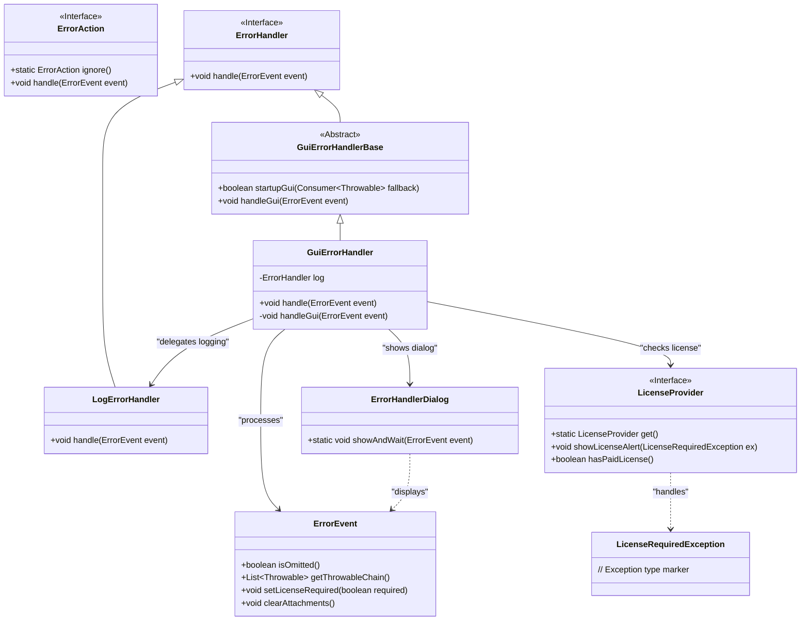
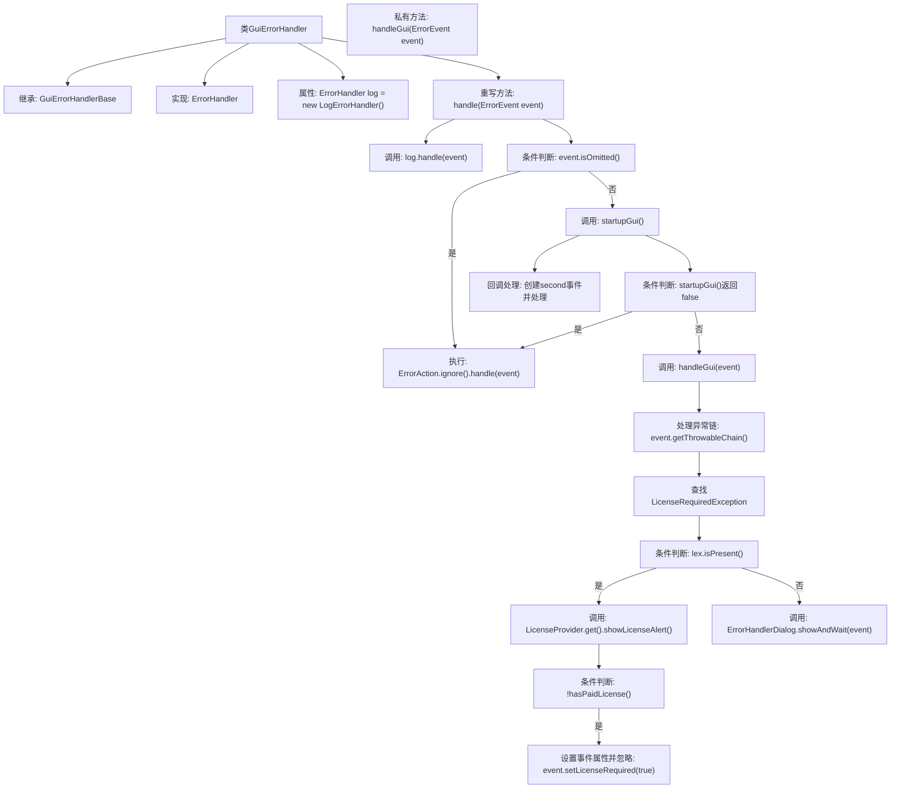

# 基础信息

|      |      |
|------|------|
| 名称 | GuiErrorHandler |
| 编码语言 | .java |
| 代码路径 | xpipe/app/src/main/java/io/xpipe/app/issue/GuiErrorHandler.java |
| 包名 | io.xpipe.app.issue |
| 依赖项 | ['io.xpipe.app.util.LicenseProvider', 'io.xpipe.app.util.LicenseRequiredException', 'java.util.stream.Stream'] |
| 概述说明 | GUI错误处理器：记录错误，忽略已省略事件，启动GUI处理未忽略事件，检查许可证并显示对话框。 |

# 说明

该内容描述了一个名为GuiErrorHandler的Java类，继承自GuiErrorHandlerBase并实现ErrorHandler接口。主要功能包括错误处理逻辑：首先通过LogErrorHandler记录错误事件，若事件被标记为忽略则直接终止处理。若需启动GUI，会尝试捕获次级异常并记录。处理GUI错误时，会检查异常链中的LicenseRequiredException，若无有效付费许可证则标记为需许可证并清理附件，否则显示错误处理对话框。整个过程结合了日志记录、许可证验证和用户界面交互。

# 类列表 Class Summary

| 名称   | 类型  | 说明 |
|-------|------|-------------|
| GuiErrorHandler | class | GUI错误处理器，记录错误并处理许可验证，未许可时忽略错误。 |

## 类 GuiErrorHandler

|      |      |
|------|------|
| 访问范围 | public |
| 类型 | class |
| 名称 | GuiErrorHandler |
| 说明 | GUI错误处理器，记录错误并处理许可验证，未许可时忽略错误。 |

### UML类图

这段类图描述了GUI错误处理系统的核心结构。GuiErrorHandler作为主要实现类，继承自抽象基类GuiErrorHandlerBase并实现ErrorHandler接口，通过组合LogErrorHandler实现日志记录。系统处理ErrorEvent事件时，会根据是否忽略错误、是否需要GUI交互、是否涉及许可证异常等不同情况，分别委托给LicenseProvider进行许可证验证或通过ErrorHandlerDialog显示交互界面。各组件通过清晰的职责划分实现错误处理的模块化，支持日志记录、静默忽略、许可证验证和用户交互等多种处理方式。

### 内部方法调用关系图

这段代码展示了一个GUI错误处理器的实现流程。首先通过日志处理器记录错误事件，然后根据事件是否被忽略决定处理方式。若未被忽略则尝试启动GUI，失败时直接返回，成功则进入GUI处理流程。在GUI处理中会检查异常链中的许可证异常，存在则显示许可证警告并根据付费状态调整事件属性，否则通过对话框显示错误。整个流程结合了日志记录、条件分支和GUI交互的多层次错误处理机制。

### 字段列表 Field List

| 名称  | 类型  | 说明 |
|-------|-------|------|
| log = new LogErrorHandler() | ErrorHandler | 私有错误处理器log初始化为LogErrorHandler实例。 |

### 方法列表 Method List

| 名称  | 类型  | 说明 |
|-------|-------|------|
| handle | void | 重写handle方法：记录错误，忽略已忽略事件，启动GUI失败则返回，否则处理GUI事件。 |
| handleGui | void | 处理GUI错误：检查许可证异常，无许可则清除附件并忽略，否则显示错误对话框。 |

