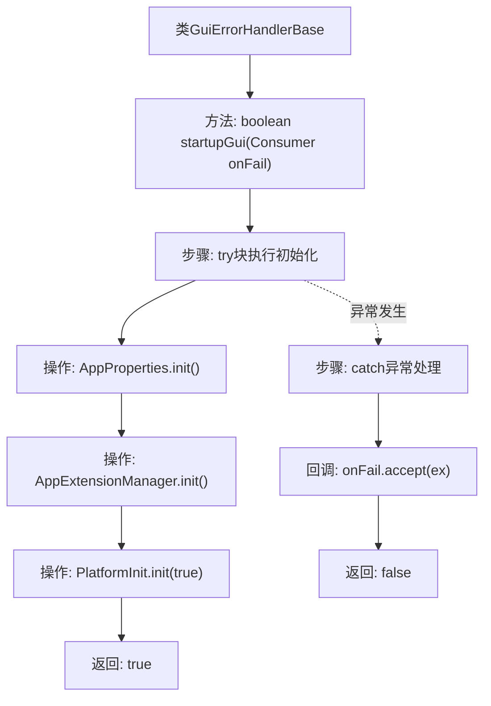

# 基础信息

|      |      |
|------|------|
| 名称 | GuiErrorHandlerBase |
| 编码语言 | .java |
| 代码路径 | xpipe/app/src/main/java/io/xpipe/app/issue/GuiErrorHandlerBase.java |
| 包名 | io.xpipe.app.issue |
| 依赖项 | ['io.xpipe.app.core', 'io.xpipe.app.util.PlatformInit', 'java.util.function.Consumer'] |
| 概述说明 | GUI错误处理基类，含启动GUI方法，失败回调处理。 |

# 说明

该内容描述了一个名为GuiErrorHandlerBase的类，其中包含一个受保护的startupGui方法。该方法接收一个Consumer<Throwable>类型的参数onFail，用于处理异常情况。方法内部依次调用AppProperties.init()、AppExtensionManager.init()和PlatformInit.init(true)进行初始化操作。若过程中抛出任何异常，会通过onFail.accept(ex)传递异常并返回false；若所有初始化成功则返回true。该方法主要用于GUI启动时的错误处理流程。

# 类列表 Class Summary

| 名称   | 类型  | 说明 |
|-------|------|-------------|
| GuiErrorHandlerBase | class | GUI错误处理基类，含启动GUI方法，失败回调处理。 |


## 类 GuiErrorHandlerBase

|      |      |
|------|------|
| 访问范围 | public |
| 类型 | class |
| 名称 | GuiErrorHandlerBase |
| 说明 | GUI错误处理基类，含启动GUI方法，失败回调处理。 |


### UML类图

```mermaid
classDiagram
    class GuiErrorHandlerBase {
        +startupGui(Consumer~Throwable~ onFail) boolean
    }
    class AppProperties {
        <<static>> +init() void
    }
    class AppExtensionManager {
        <<static>> +init() void
    }
    class PlatformInit {
        <<static>> +init(boolean) void
    }
    interface Consumer~T~ {
        <<Interface>>
        +accept(T t) void
    }

    GuiErrorHandlerBase --> Consumer : 依赖
    GuiErrorHandlerBase ..> AppProperties : 调用静态方法
    GuiErrorHandlerBase ..> AppExtensionManager : 调用静态方法
    GuiErrorHandlerBase ..> PlatformInit : 调用静态方法
```

这段代码展示了一个基础的GUI错误处理类`GuiErrorHandlerBase`，它通过`startupGui`方法初始化应用程序的三个核心组件（`AppProperties`、`AppExtensionManager`和`PlatformInit`），并在失败时通过回调接口`Consumer<Throwable>`传递异常。类图中清晰地呈现了主类与三个静态工具类的调用关系，以及泛型接口`Consumer`的依赖关系，体现了模块化的错误处理机制和组件初始化流程。


### 内部方法调用关系图



该流程图描述了GuiErrorHandlerBase类中startupGui方法的执行逻辑。方法首先尝试顺序执行三个初始化操作（AppProperties、扩展管理和平台初始化），若任一操作抛出异常则触发失败回调并返回false；若全部成功则返回true。流程清晰展现了正常路径和异常处理路径的分支关系，突出了对初始化失败的回调处理机制。

### 字段列表 Field List

| 名称  | 类型  | 说明 |
|-------|-------|------|

### 方法列表 Method List

| 名称  | 类型  | 说明 |
|-------|-------|------|
| startupGui | boolean | 启动GUI时初始化应用属性、扩展管理和平台，失败则回调并返回false。 |


