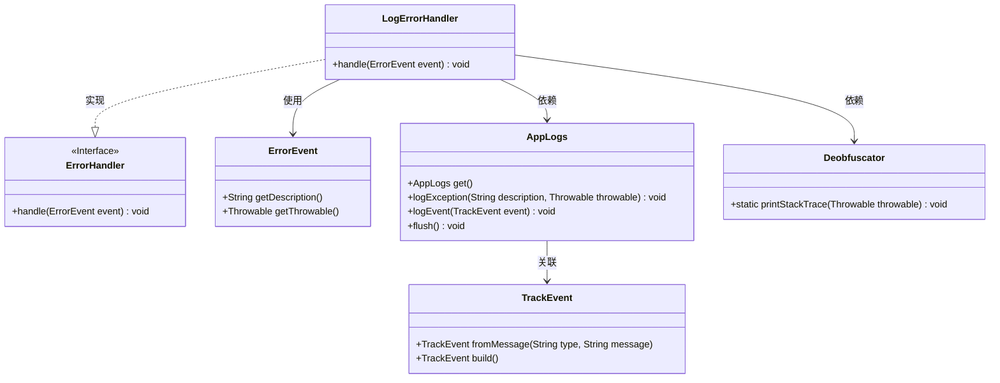
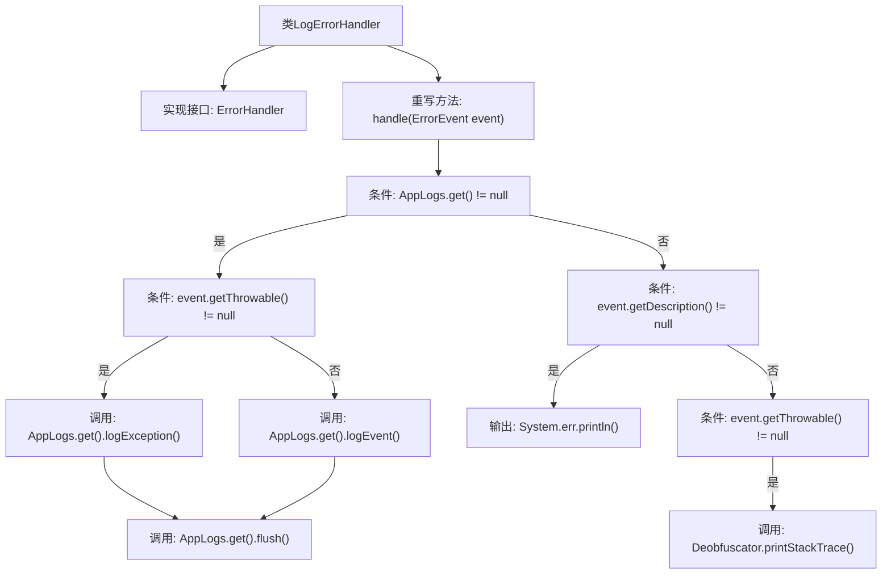

# 基础信息

|      |      |
|------|------|
| 名称 | LogErrorHandler |
| 编码语言 | .java |
| 代码路径 | xpipe/app/src/main/java/io/xpipe/app/issue/LogErrorHandler.java |
| 包名 | io.xpipe.app.issue |
| 依赖项 | ['io.xpipe.app.core.AppLogs', 'io.xpipe.core.util.Deobfuscator'] |
| 概述说明 | 日志错误处理器：记录异常或错误事件，无日志则打印到标准错误流。 |

# 说明

LogErrorHandler是一个实现了ErrorHandler接口的类，用于处理错误事件。当AppLogs实例存在时，若有异常则记录异常信息，否则记录错误事件并立即刷新日志。若AppLogs不存在，则将错误描述输出到标准错误流，并对异常进行反混淆后打印堆栈跟踪。该处理器确保错误信息被妥善记录或输出。

# 类列表 Class Summary

| 名称   | 类型  | 说明 |
|-------|------|-------------|
| LogErrorHandler | class | LogErrorHandler处理错误事件，记录异常或错误信息并输出。 |

## 类 LogErrorHandler

|      |      |
|------|------|
| 访问范围 | public |
| 类型 | class |
| 名称 | LogErrorHandler |
| 说明 | LogErrorHandler处理错误事件，记录异常或错误信息并输出。 |

### UML类图

这段代码展示了一个日志错误处理器 `LogErrorHandler`，它实现了 `ErrorHandler` 接口，用于处理不同类型的错误事件。当错误发生时，如果有日志系统 `AppLogs` 可用，它会记录异常或错误事件并刷新日志；否则，直接输出错误信息到标准错误流或打印堆栈跟踪。类图清晰地展示了各个类之间的关系，包括实现接口、依赖和关联关系。

### 内部方法调用关系图

这段流程图描述了LogErrorHandler类的错误处理逻辑。当接收到ErrorEvent时，首先检查AppLogs是否可用：若可用则根据异常是否存在选择记录异常或普通事件，并强制刷新日志；若不可用则直接向标准错误流输出描述信息，并通过Deobfuscator打印异常堆栈。整个流程包含两级条件判断和四种不同的处理路径，确保错误信息能够通过不同渠道妥善记录。

### 字段列表 Field List

| 名称  | 类型  | 说明 |
|-------|-------|------|

### 方法列表 Method List

| 名称  | 类型  | 说明 |
|-------|-------|------|
| handle | void | 处理错误事件：记录异常或错误信息并刷新日志，无日志则打印错误和堆栈。 |

