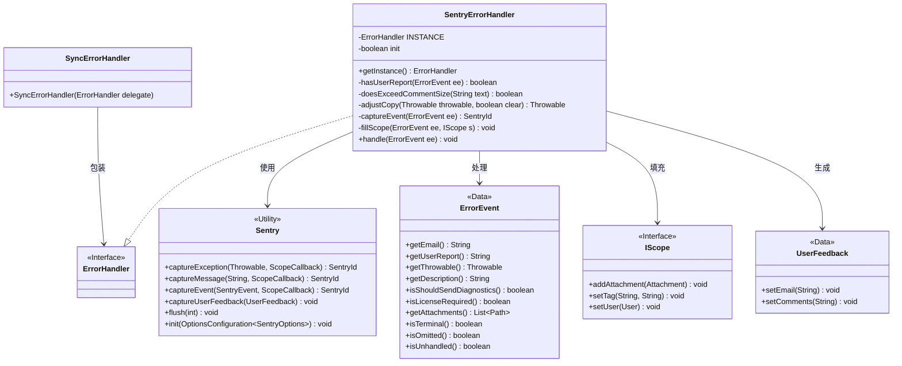
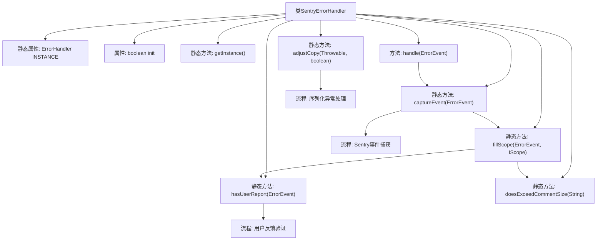

# 基础信息

|      |      |
|------|------|
| 名称 | SentryErrorHandler |
| 编码语言 | .java |
| 代码路径 | xpipe/app/src/main/java/io/xpipe/app/issue/SentryErrorHandler.java |
| 包名 | io.xpipe.app.issue |
| 依赖项 | ['io.xpipe.app.core.AppDistributionType', 'io.xpipe.app.core.AppLogs', 'io.xpipe.app.core.AppProperties', 'io.xpipe.app.core.mode.OperationMode', 'io.xpipe.app.prefs.AppPrefs', 'io.xpipe.app.util.LicenseProvider', 'io.sentry', 'io.sentry.protocol.Geo', 'io.sentry.protocol.SentryId', 'io.sentry.protocol.User', 'org.apache.commons.io.FileUtils', 'java.io.ByteArrayInputStream', 'java.io.ByteArrayOutputStream', 'java.io.ObjectInputStream', 'java.io.ObjectOutputStream', 'java.nio.file.FileSystemException', 'java.nio.file.Files', 'java.nio.file.InvalidPathException', 'java.util.stream.Collectors'] |
| 概述说明 | Sentry错误处理类，包含事件捕获、用户反馈和诊断信息收集功能。 |

# 说明

该代码实现了一个Sentry错误处理器，主要功能包括：通过单例模式提供错误处理实例，检查用户报告有效性，调整异常对象属性，捕获并发送错误事件到Sentry平台。处理器会初始化Sentry配置，收集诊断数据、用户反馈和系统信息，并设置相关标签如许可证状态、更新设置等。支持处理普通错误、异常和自定义事件，同时处理大文本附件和序列化异常对象。

# 类列表 Class Summary

| 名称   | 类型  | 说明 |
|-------|------|-------------|
| SentryErrorHandler | class | Sentry错误处理器，处理异常、用户报告和诊断数据，支持自定义标签和附件。 |

## 类 SentryErrorHandler

|      |      |
|------|------|
| 访问范围 | public |
| 类型 | class |
| 名称 | SentryErrorHandler |
| 说明 | Sentry错误处理器，处理异常、用户报告和诊断数据，支持自定义标签和附件。 |

### UML类图

该代码实现了一个Sentry错误处理器，主要功能包括：处理错误事件、调整异常对象、填充Sentry作用域、捕获事件并发送用户反馈。类图展示了SentryErrorHandler与多个辅助类的关系，包括错误事件处理、Sentry集成、作用域管理和用户反馈生成等核心功能。处理器通过单例模式提供实例，支持诊断信息发送、许可证验证和异常调整等复杂场景处理。

### 内部方法调用关系图

流程图描述：该流程图展示了SentryErrorHandler类的完整结构，包含8个核心方法和3个关键处理流程。静态方法adjustCopy负责异常对象的深度拷贝和字段清理，hasUserReport验证用户反馈有效性，captureEvent作为中枢协调Sentry事件上报。handle方法作为入口触发初始化逻辑，通过fillScope动态构建事件上下文，最终实现错误诊断数据的分级上报和用户反馈处理，整个过程包含严格的空值检查和异常防护机制。

### 字段列表 Field List

| 名称  | 类型  | 说明 |
|-------|-------|------|
| init | boolean | 私有布尔变量init |
| INSTANCE = new SyncErrorHandler(new SentryErrorHandler()) | ErrorHandler | 私有静态错误处理实例，同步与Sentry集成。 |

### 方法列表 Method List

| 名称  | 类型  | 说明 |
|-------|-------|------|
| getInstance | ErrorHandler | 单例模式获取ErrorHandler实例。 |
| fillScope | void | 填充错误事件范围：处理附件、设置标签和用户信息，包括日志、许可证、更新状态等。 |
| adjustCopy | Throwable | 方法通过序列化复制异常并清除敏感信息，如消息和文件路径，处理失败时返回原异常。 |
| hasUserReport | boolean | 检查错误事件是否有用户报告，需邮箱或文本非空。 |
| doesExceedCommentSize | boolean | 检查文本长度是否超过5000字符，空或null返回false。 |
| handle | void | 处理错误事件：初始化Sentry配置，捕获事件并发送用户反馈。 |
| captureEvent | SentryId | 捕获错误事件并发送到Sentry，处理异常、描述或无数据情况。 |

