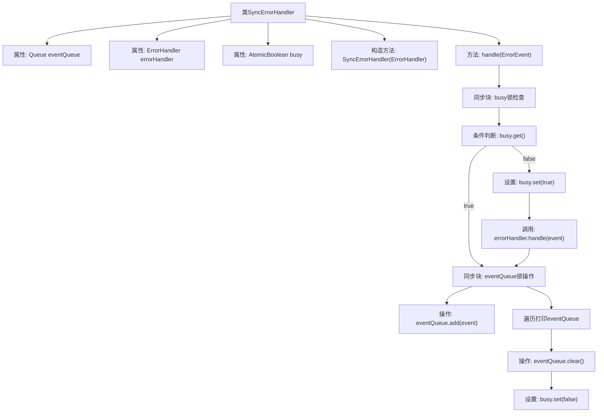

# 基础信息

|      |      |
|------|------|
| 名称 | SyncErrorHandler |
| 编码语言 | .java |
| 代码路径 | xpipe/app/src/main/java/io/xpipe/app/issue/SyncErrorHandler.java |
| 包名 | io.xpipe.app.issue |
| 依赖项 | ['java.util.Queue', 'java.util.concurrent.LinkedBlockingQueue', 'java.util.concurrent.atomic.AtomicBoolean'] |
| 概述说明 | 同步错误处理器，队列缓冲事件，避免并发冲突。 |

# 说明

SyncErrorHandler是一个实现了ErrorHandler接口的类，用于处理错误事件的同步管理。它包含一个事件队列（LinkedBlockingQueue）来存储待处理的错误事件，以及一个原子布尔标志（busy）来跟踪当前是否正在处理错误。构造函数接收一个ErrorHandler实例作为实际处理错误的委托。handle方法首先检查busy标志，如果正在处理错误，则将事件加入队列；否则设置busy为true并处理当前事件。处理完成后，会输出队列中积压的事件信息并清空队列，最后重置busy标志。该设计确保错误处理的同步性，避免并发冲突。

# 类列表 Class Summary

| 名称   | 类型  | 说明 |
|-------|------|-------------|
| SyncErrorHandler | class | 同步错误处理器，队列缓冲事件，避免并发处理冲突。 |


## 类 SyncErrorHandler

|      |      |
|------|------|
| 访问范围 | public |
| 类型 | class |
| 名称 | SyncErrorHandler |
| 说明 | 同步错误处理器，队列缓冲事件，避免并发处理冲突。 |


### UML类图

```mermaid
classDiagram
    class SyncErrorHandler {
        -Queue~ErrorEvent~ eventQueue
        -ErrorHandler errorHandler
        -AtomicBoolean busy
        +SyncErrorHandler(ErrorHandler errorHandler)
        +handle(ErrorEvent event) void
    }

    <<Interface>> ErrorHandler {
        <<interface>>
        +handle(ErrorEvent event) void
    }

    SyncErrorHandler --> ErrorHandler : 实现
```

类图描述：
SyncErrorHandler是一个实现了ErrorHandler接口的同步错误处理器类，它通过原子布尔值busy和事件队列eventQueue来管理错误事件的同步处理。当处理器处于忙碌状态时，新事件会被暂存到队列中；空闲时则直接处理事件并清空队列。该设计确保了在高并发场景下错误处理的线程安全性，同时通过队列机制避免了事件丢失。


### 内部方法调用关系图



这段代码展示了一个线程安全的错误处理器SyncErrorHandler，它通过双重锁机制确保在错误处理过程中新到达的事件会被缓存。当busy标志为true时，新事件被加入队列；否则立即处理事件并清空队列。流程图清晰展示了同步控制流程和事件处理路径，包括队列操作和状态切换的关键步骤。

### 字段列表 Field List

| 名称  | 类型  | 说明 |
|-------|-------|------|
| errorHandler | ErrorHandler | 私有错误处理器实例。 |
| eventQueue = new LinkedBlockingQueue<>() | Queue<ErrorEvent> | 私有队列存储错误事件，使用阻塞队列实现。 |
| busy = new AtomicBoolean() | AtomicBoolean | 私有原子布尔变量busy，用于线程安全状态控制。 |

### 方法列表 Method List

| 名称  | 类型  | 说明 |
|-------|-------|------|
| handle | void | 处理错误事件：忙时入队，否则立即处理并清空队列。 |


