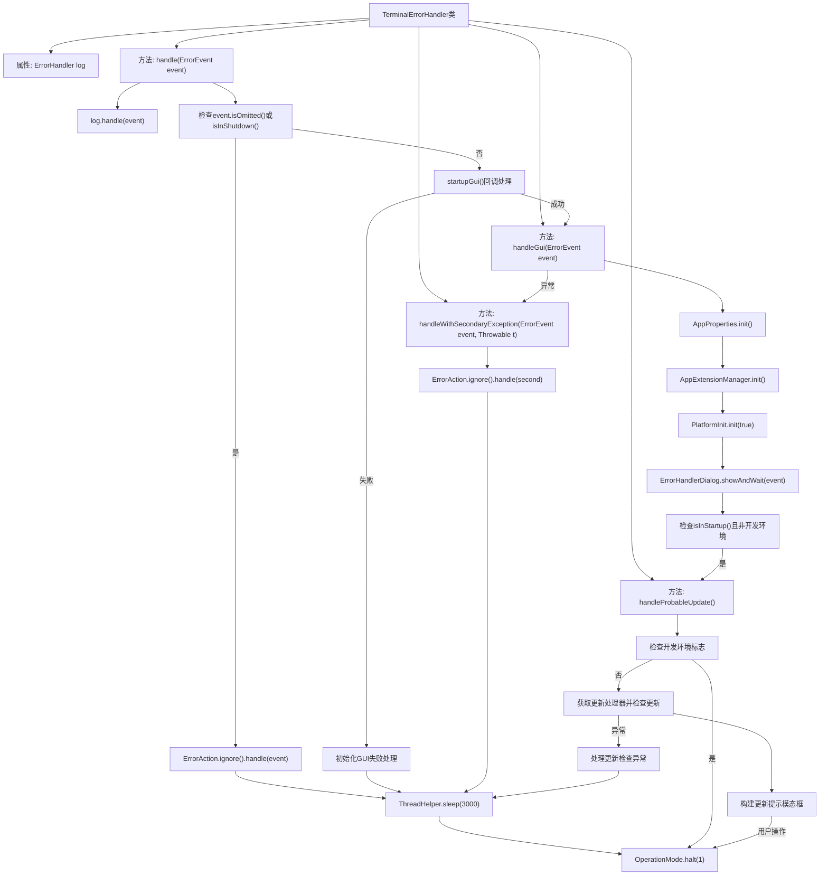

# 基础信息

|      |      |
|------|------|
| 名称 | TerminalErrorHandler |
| 编码语言 | .java |
| 代码路径 | xpipe/app/src/main/java/io/xpipe/app/issue/TerminalErrorHandler.java |
| 包名 | io.xpipe.app.issue |
| 依赖项 | ['io.xpipe.app.comp.base.ModalButton', 'io.xpipe.app.comp.base.ModalOverlay', 'io.xpipe.app.core', 'io.xpipe.app.core.mode.OperationMode', 'io.xpipe.app.core.window.AppDialog', 'io.xpipe.app.util.Hyperlinks', 'io.xpipe.app.util.PlatformInit', 'io.xpipe.app.util.ThreadHelper'] |
| 概述说明 | 终端错误处理器继承GUI基类，记录错误后根据状态忽略或关闭程序，支持更新检查。 |

# 说明

TerminalErrorHandler是一个继承自GuiErrorHandlerBase的错误处理器，实现了ErrorHandler接口。它通过LogErrorHandler记录错误事件，并根据不同情况处理错误。若事件被忽略或系统处于关闭状态，会延迟3秒后终止程序。若无法启动GUI，同样延迟后终止。成功启动GUI后，会初始化应用属性、扩展管理和平台，并显示错误对话框。若在启动阶段且非开发环境，会检查更新并提示用户。处理过程中出现异常会记录并终止程序。更新检查失败也会记录错误并终止。整个流程确保错误被妥善处理并系统安全退出。

# 类列表 Class Summary

| 名称   | 类型  | 说明 |
|-------|------|-------------|
| TerminalErrorHandler | class | 终端错误处理器：记录错误，启动GUI处理或忽略错误，检查更新后终止程序。 |

## 类 TerminalErrorHandler

|      |      |
|------|------|
| 访问范围 | public |
| 类型 | class |
| 名称 | TerminalErrorHandler |
| 说明 | 终端错误处理器：记录错误，启动GUI处理或忽略错误，检查更新后终止程序。 |

### UML类图

```mermaid
classDiagram
    class ErrorHandler {
        <<Interface>>
        +handle(ErrorEvent event) void
    }

    class GuiErrorHandlerBase {
        <<Abstract>>
        +handleGui(ErrorEvent event) void
        #startupGui(Consumer~Throwable~ callback) boolean
    }

    class TerminalErrorHandler {
        -ErrorHandler log
        +handle(ErrorEvent event) void
        -handleGui(ErrorEvent event) void
        -handleWithSecondaryException(ErrorEvent event, Throwable t) void
        -handleProbableUpdate() void
    }

    class LogErrorHandler {
        +handle(ErrorEvent event) void
    }

    class ErrorEvent {
        +isOmitted() boolean
        +clearAttachments() void
        +static fromThrowable(Throwable t) Builder
    }

    class OperationMode {
        <<Utility>>
        +static isInShutdown() boolean
        +static isInStartup() boolean
        +static halt(int code) void
    }

    class ErrorAction {
        <<Utility>>
        +static ignore() ErrorAction
        +handle(ErrorEvent event) void
    }

    class ThreadHelper {
        <<Utility>>
        +static sleep(long millis) void
    }

    class AppProperties {
        <<Utility>>
        +static init() void
        +static get() AppProperties
        +isDevelopmentEnvironment() boolean
    }

    class AppExtensionManager {
        <<Utility>>
        +static init() void
    }

    class PlatformInit {
        <<Utility>>
        +static init(boolean headless) void
    }

    class ErrorHandlerDialog {
        <<Utility>>
        +static showAndWait(ErrorEvent event) void
    }

    class AppDistributionType {
        <<Utility>>
        +static get() AppDistributionType
        +getUpdateHandler() UpdateHandler
    }

    class ModalOverlay {
        +static of(String titleKey, Node content) ModalOverlay
        +addButton(ModalButton button) void
    }

    class ModalButton {
        +ModalButton(String textKey, Runnable action, boolean isDefault, boolean isCancel)
    }

    class AppDialog {
        <<Utility>>
        +static dialogText(String text) Node
        +static showAndWait(ModalOverlay overlay) void
    }

    class AppI18n {
        <<Utility>>
        +static get(String key, Object... args) String
    }

    class Hyperlinks {
        <<Utility>>
        +static open(String url) void
    }

    ErrorHandler <|.. GuiErrorHandlerBase
    GuiErrorHandlerBase <|-- TerminalErrorHandler
    TerminalErrorHandler --> LogErrorHandler : "日志记录"
    TerminalErrorHandler --> ErrorEvent : "处理错误事件"
    TerminalErrorHandler --> OperationMode : "检查运行状态"
    TerminalErrorHandler --> ErrorAction : "执行错误动作"
    TerminalErrorHandler --> ThreadHelper : "线程控制"
    TerminalErrorHandler --> AppProperties : "应用配置"
    TerminalErrorHandler --> AppExtensionManager : "扩展管理"
    TerminalErrorHandler --> PlatformInit : "平台初始化"
    TerminalErrorHandler --> ErrorHandlerDialog : "显示错误对话框"
    TerminalErrorHandler --> AppDistributionType : "更新检查"
    TerminalErrorHandler --> ModalOverlay : "创建模态窗口"
    TerminalErrorHandler --> AppDialog : "对话框操作"
    TerminalErrorHandler --> AppI18n : "国际化文本"
    TerminalErrorHandler --> Hyperlinks : "打开链接"
    ModalOverlay --> ModalButton : "包含"
    AppDistributionType --> UpdateHandler : "获取"
```

类图描述：该图展示了TerminalErrorHandler及其相关类的结构关系。TerminalErrorHandler继承自抽象类GuiErrorHandlerBase并实现ErrorHandler接口，主要负责错误处理流程。它依赖多个工具类如LogErrorHandler记录日志、OperationMode检查运行状态、ErrorAction执行错误处理动作，以及AppProperties等配置类。处理流程包括日志记录、GUI初始化、错误对话框显示和更新检查等功能模块。

### 内部方法调用关系图

流程图描述：该流程图展示了TerminalErrorHandler类的错误处理流程。主要包含四个核心方法：handle作为主入口处理错误事件，handleGui负责图形界面错误处理，handleWithSecondaryException处理次级异常，handleProbableUpdate检查应用更新。流程从日志记录开始，根据错误类型和系统状态分别执行忽略、停机或GUI处理，涉及多个初始化步骤和条件判断，最终通过halt终止程序。更新检查模块包含模态对话框交互和异常处理分支。

### 字段列表 Field List

| 名称  | 类型  | 说明 |
|-------|-------|------|
| log = new LogErrorHandler() | ErrorHandler | 私有错误处理器log初始化为LogErrorHandler实例。 |

### 方法列表 Method List

| 名称  | 类型  | 说明 |
|-------|-------|------|
| handle | void | 处理错误事件：忽略关闭或忽略事件，启动GUI失败或成功处理GUI事件后暂停3秒并终止。 |
| handleWithSecondaryException | void | 处理异常并记录，忽略后休眠1秒并终止程序。 |
| handleGui | void | 处理GUI错误：初始化配置，显示错误对话框；异常时清理并处理；启动模式下检查更新；延迟后终止程序。 |
| handleProbableUpdate | void | 检查更新，非开发环境时刷新更新状态，有更新则弹窗提示，异常时记录并暂停运行。 |

