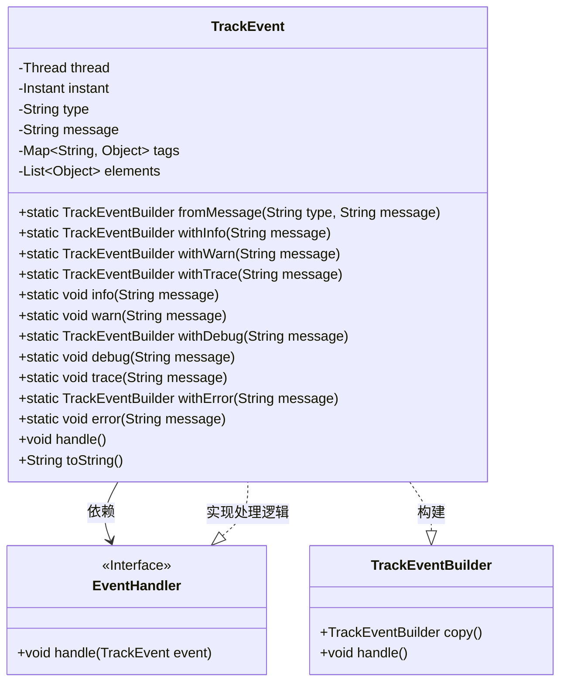

# 基础信息

|      |      |
|------|------|
| 名称 | TrackEvent |
| 编码语言 | .java |
| 代码路径 | xpipe/app/src/main/java/io/xpipe/app/issue/TrackEvent.java |
| 包名 | io.xpipe.app.issue |
| 依赖项 | ['lombok.Builder', 'lombok.Getter', 'lombok.Singular', 'java.time.Instant', 'java.util.ArrayList', 'java.util.List', 'java.util.Map', 'java.util.stream.Collectors'] |
| 概述说明 | TrackEvent类用于记录事件，包含类型、消息、标签和元素，提供多种静态方法创建和处理事件。 |

# 说明

这是一个使用Lombok构建的TrackEvent类，用于记录事件信息。类包含线程、时间戳、类型、消息等核心字段，支持通过标签和元素列表扩展信息。提供多种静态方法快速创建不同类型事件（info/warn/debug/error等），并内置事件处理机制。toString方法格式化输出事件详情，包括标签和元素的可读展示。Builder模式支持灵活构建事件对象，并可复制或直接处理事件。整体设计用于结构化日志记录和事件跟踪场景。

# 类列表 Class Summary

| 名称   | 类型  | 说明 |
|-------|------|-------------|
| TrackEvent | class | TrackEvent类用于记录线程、时间、类型、消息及标签元素，提供多种静态构建方法。 |

## 类 TrackEvent

|      |      |
|------|------|
| 访问范围 | @Builder;@Getter;public |
| 类型 | class |
| 名称 | TrackEvent |
| 说明 | TrackEvent类用于记录线程、时间、类型、消息及标签元素，提供多种静态构建方法。 |

### UML类图

这段代码展示了一个事件跟踪系统，TrackEvent类用于记录线程、时间戳、类型、消息以及附加标签和元素。通过Builder模式灵活构建事件对象，提供多种静态工厂方法（如withInfo/warn/error等）快速创建预配置事件。事件通过EventHandler接口处理，toString()方法实现了带格式的事件详情输出。TrackEventBuilder支持复制现有配置，所有事件最终通过handle()方法提交给事件处理器。

### 内部方法调用关系图

```mermaid
graph TD
    A["类TrackEvent"]
    B["属性: Thread thread"]
    C["属性: Instant instant"]
    D["属性: String type"]
    E["属性: String message"]
    F["属性: Map<String, Object> tags"]
    G["属性: List<Object> elements"]
    H["静态构造方法: fromMessage()"]
    I["静态构造方法: withInfo()"]
    J["静态构造方法: withWarn()"]
    K["静态构造方法: withTrace()"]
    L["静态方法: info()"]
    M["静态方法: warn()"]
    N["静态构造方法: withDebug()"]
    O["静态方法: debug()"]
    P["静态方法: trace()"]
    Q["静态构造方法: withError()"]
    R["静态方法: error()"]
    S["实例方法: handle()"]
    T["重写方法: toString()"]
    U["内部类: TrackEventBuilder"]
    V["方法: copy()"]
    W["方法: handle()"]

    A --> B
    A --> C
    A --> D
    A --> E
    A --> F
    A --> G
    A --> H
    A --> I
    A --> J
    A --> K
    A --> L
    A --> M
    A --> N
    A --> O
    A --> P
    A --> Q
    A --> R
    A --> S
    A --> T
    A --> U
    U --> V
    U --> W
```

这段代码定义了一个TrackEvent类，用于记录和跟踪事件信息。该类使用Lombok的@Builder和@Getter注解简化代码，包含线程、时间戳、类型、消息等核心属性，并提供多种静态工厂方法（如withInfo、withError等）快速创建不同级别的事件。内部类TrackEventBuilder支持链式调用和事件复制，事件处理通过handle()方法委托给EventHandler完成。toString()方法实现了带格式的事件信息输出，包含标签和元素的详细展示。整体设计支持灵活的事件构建、复制和处理流程。

### 字段列表 Field List

| 名称  | 类型  | 说明 |
|-------|-------|------|
| elements | List<Object> | 私有对象列表元素 |
| type | String | 私有字符串类型变量。 |
| tags | Map<String, Object> | 私有标签映射，键为字符串，值为对象。 |
| message | String | 私有字符串变量message |
| instant = Instant.now() | Instant | 私有不可变实例变量instant初始化为当前时间戳。 |
| thread = Thread.currentThread() | Thread | 私有线程变量指向当前线程 |

### 方法列表 Method List

| 名称  | 类型  | 说明 |
|-------|-------|------|
| error | void | 静态方法error记录错误信息并处理。 |
| handle | void | 处理事件：调用EventHandler处理当前实例。 |
| withInfo | TrackEventBuilder | 静态方法，创建带info类型和消息的TrackEventBuilder对象。 |
| withDebug | TrackEventBuilder | 静态方法创建调试事件构建器，设置类型为debug并包含消息。 |
| fromMessage | TrackEventBuilder | 静态方法创建TrackEventBuilder，传入类型和消息参数。 |
| withTrace | TrackEventBuilder | 静态方法，创建跟踪事件构建器，设置类型为trace并附带消息。 |
| warn | void | 静态方法warn，构建警告信息并处理。 |
| info | void | 静态方法info记录信息日志，参数为消息字符串。 |
| withWarn | TrackEventBuilder | 静态方法创建警告事件构建器，含类型和消息参数。 |
| debug | void | 静态方法debug，记录调试信息并处理。 |
| trace | void | 静态方法trace记录跟踪信息并处理。 |
| withError | TrackEventBuilder | 静态方法创建错误事件构建器，设置类型为"error"并包含消息。 |
| toString | String | 重写toString方法，格式化输出消息、标签和元素信息。 |

