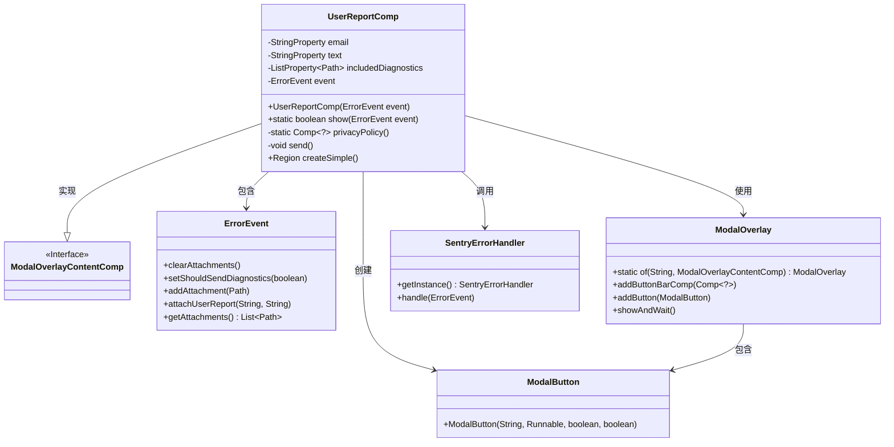
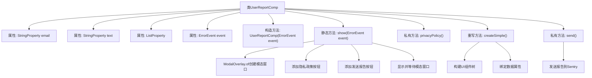

# 基础信息

|      |      |
|------|------|
| 名称 | UserReportComp |
| 编码语言 | .java |
| 代码路径 | xpipe/app/src/main/java/io/xpipe/app/issue/UserReportComp.java |
| 包名 | io.xpipe.app.issue |
| 依赖项 | ['io.xpipe.app.comp.Comp', 'io.xpipe.app.comp.base', 'io.xpipe.app.core', 'io.xpipe.app.resources.AppResources', 'javafx.beans.property', 'javafx.collections.FXCollections', 'javafx.geometry.Orientation', 'javafx.geometry.Pos', 'javafx.scene.control', 'javafx.scene.layout', 'atlantafx.base.controls.Popover', 'atlantafx.base.controls.Spacer', 'java.nio.file.Files', 'java.nio.file.Path'] |
| 概述说明 | 用户报告组件，含邮件、文本输入和附件选择功能，支持发送错误报告。 |

# 说明

该代码定义了一个用户报告组件UserReportComp，用于处理错误事件报告。组件包含电子邮件输入框、错误描述文本区域和附件选择器。用户可填写信息并选择附件，点击发送按钮后，错误报告会被提交到Sentry错误处理系统。组件还提供了隐私政策链接，以弹出窗口形式展示政策内容。整体界面布局为垂直结构，包含标题、输入区域和按钮栏，支持国际化文本显示。

# 类列表 Class Summary

| 名称   | 类型  | 说明 |
|-------|------|-------------|
| UserReportComp | class | 用户报告组件类，含邮件、文本输入及附件处理功能，支持错误事件上报。 |

## 类 UserReportComp

|      |      |
|------|------|
| 访问范围 | public |
| 类型 | class |
| 名称 | UserReportComp |
| 说明 | 用户报告组件类，含邮件、文本输入及附件处理功能，支持错误事件上报。 |

### UML类图

这段代码展示了一个用户错误报告组件`UserReportComp`的实现，它继承自`ModalOverlayContentComp`接口。主要功能包括：收集用户邮箱和错误描述文本，管理诊断附件列表，通过模态窗口展示表单，并提供发送报告功能。组件与`ErrorEvent`事件对象交互，使用`ModalOverlay`构建界面，最终通过`SentryErrorHandler`提交错误报告。隐私政策部分采用弹出式设计，体现了良好的用户交互设计。

### 内部方法调用关系图

这段代码实现了一个用户错误报告组件，继承自模态窗口内容基类。主要功能包括：通过静态方法show()创建模态对话框，构建包含邮箱输入、错误描述和附件选择的复杂UI界面，处理隐私政策链接的弹窗显示，以及最终将收集到的错误信息通过Sentry服务发送。流程图清晰展示了从类属性定义到核心方法调用的完整逻辑链条，特别是模态窗口的创建流程和UI组件的构建关系。

### 字段列表 Field List

| 名称  | 类型  | 说明 |
|-------|-------|------|
| email = new SimpleStringProperty() | StringProperty | 私有字符串属性email初始化为SimpleStringProperty。 |
| includedDiagnostics | ListProperty<Path> | 私有终态列表属性，存储Path类型诊断路径。 |
| event | ErrorEvent | 私有错误事件对象 |
| text = new SimpleStringProperty() | StringProperty | 私有字符串属性text初始化为SimpleStringProperty实例。 |

### 方法列表 Method List

| 名称  | 类型  | 说明 |
|-------|-------|------|
| show | boolean | 静态方法显示错误事件，创建用户报告组件和模态框，添加按钮并返回发送状态。 |
| send | void | 私有方法send：清空附件，启用诊断，添加诊断附件，附加用户报告，处理事件。 |
| privacyPolicy | Comp<?> | 创建隐私政策按钮，点击显示弹窗展示政策内容，包含关闭按钮和自适应布局。 |
| createSimple | Region | 创建包含邮箱输入、错误信息和附件列表的垂直布局区域。 |

