# 基础信息

|      |      |
|------|------|
| 名称 | issue |
| 编码语言 | .java |
| 代码路径 | xpipe/app/src/main/java/io/xpipe/app/issue |
| 包名 | xpipe.app.src.main.java.io.xpipe.app.issue |
| 概述说明 | 用户报告组件处理错误提交Sentry，含邮件、描述和附件功能。压缩工具类递归压缩目录为ZIP。错误处理类显示对话框，含堆栈跟踪和报告按钮。ErrorEvent类构建灵活错误处理。GUI错误处理器结合日志和许可证验证。同步错误处理器确保顺序处理。错误详情组件显示去混淆堆栈跟踪。事件处理器转换错误为跟踪事件并处理。终端错误处理器记录错误并安全退出。日志处理器记录或输出错误信息。事件处理器抽象类集中管理事件处理逻辑。 |

# 说明

```markdown
## 概述
该代码模块是一个完整的错误处理与报告系统，主要面向Java桌面应用程序开发。系统采用分层架构设计，包含错误事件建模、用户交互界面、日志记录、异步处理、压缩工具和第三方集成等功能组件。核心功能包括错误捕获、事件分类、用户报告生成、堆栈跟踪展示、诊断数据收集以及与Sentry平台的集成。模块采用构建器模式灵活构造错误事件，支持国际化显示和多线程安全处理，同时提供GUI对话框和隐私政策交互，实现了从错误检测到用户反馈的全流程管理。

## 主要业务场景
1. **错误捕获与分类**  
   - 通过`ErrorEvent`构建器模式创建结构化错误事件，支持异常链处理、自定义操作和附件管理
   - `ErrorHandler`接口体系实现不同处理策略（同步处理、GUI处理、终端处理等）

2. **用户交互与报告**  
   - `UserReportComp`组件收集用户反馈（邮件、描述、附件）
   - 通过`ErrorHandlerDialog`显示模态对话框，包含错误详情、堆栈跟踪和报告按钮
   - 隐私政策弹窗展示和法律合规处理

3. **诊断数据处理**  
   - `AttachmentHelper`提供目录压缩工具，支持递归ZIP打包
   - `SentryErrorHandler`集成第三方服务，发送诊断数据、用户报告和系统信息
   - `TrackEvent`实现结构化日志记录，包含线程、时间戳和扩展标签

4. **多场景错误处理**  
   - GUI应用场景：通过`GuiErrorHandler`处理界面错误，验证许可证状态
   - 终端场景：`TerminalErrorHandler`确保安全退出并延迟终止
   - 同步处理：`SyncErrorHandler`使用队列机制避免并发冲突

5. **辅助功能**  
   - 堆栈跟踪去混淆显示（`ErrorDetailsComp`）
   - 事件处理器动态加载（`EventHandler`抽象类）
   - 启动阶段错误特殊处理（`GuiErrorHandlerBase`初始化流程）
```


### 包内部结构视图

```mermaid
graph TD
    issue --> UserReportComp.java
    issue --> AttachmentHelper.java
    issue --> ErrorHandlerDialog.java
    issue --> ErrorEvent.java
    issue --> GuiErrorHandler.java
    issue --> ErrorAction.java
    issue --> SyncErrorHandler.java
    issue --> ErrorDetailsComp.java
    issue --> ErrorHandlerComp.java
    issue --> TrackEvent.java
    issue --> GuiErrorHandlerBase.java
    issue --> SentryErrorHandler.java
    issue --> EventHandlerImpl.java
    issue --> ErrorHandler.java
    issue --> TerminalErrorHandler.java
    issue --> LogErrorHandler.java
    issue --> EventHandler.java
```



该流程图展示了xpipe项目中issue目录下的文件层级结构，所有文件均直接隶属于issue节点。包含18个具体实现类文件，主要涉及错误处理、事件跟踪、用户报告等功能模块，形成扁平化结构。每个文件代表不同的错误处理组件或事件处理实现，共同构成完整的错误管理子系统。

# 文件列表 File List

| 名称   | 类型  | 说明 |
|-------|------|-------------|
| [ErrorAction.java](ErrorAction.md) | file | 输入内容为空，无法生成概要。请提供具体信息。 |
| [ErrorEvent.java](ErrorEvent.md) | file | 错误事件类，含异常处理、自定义动作、附件和用户报告功能。 |
| [ErrorHandlerDialog.java](ErrorHandlerDialog.md) | file | 错误处理对话框类，显示错误事件并执行相应操作。 |
| [AttachmentHelper.java](AttachmentHelper.md) | file | Java类实现目录压缩为ZIP文件功能。 |
| [TerminalErrorHandler.java](TerminalErrorHandler.md) | file | 终端错误处理器继承GUI基类，记录错误后根据状态忽略或关闭程序，支持更新检查。 |
| [ErrorHandler.java](ErrorHandler.md) | file | 输入内容为空，无法生成概要描述。请提供具体信息以便总结。 |
| [EventHandlerImpl.java](EventHandlerImpl.md) | file | EventHandlerImpl处理事件和错误，转换错误事件为TrackEvent，根据条件调用不同处理器，支持日志记录和附件添加。 |
| [SentryErrorHandler.java](SentryErrorHandler.md) | file | Sentry错误处理类，包含事件捕获、用户反馈和诊断信息收集功能。 |
| [GuiErrorHandlerBase.java](GuiErrorHandlerBase.md) | file | GUI错误处理基类，含启动GUI方法，失败回调处理。 |
| [TrackEvent.java](TrackEvent.md) | file | TrackEvent类用于记录事件，包含类型、消息、标签和元素，提供多种静态方法创建和处理事件。 |
| [ErrorHandlerComp.java](ErrorHandlerComp.md) | file | 错误处理组件类，包含错误事件处理、自定义动作按钮和顶部描述区域。 |
| [ErrorDetailsComp.java](ErrorDetailsComp.md) | file | ErrorDetailsComp类继承SimpleComp，处理错误事件并生成堆栈跟踪显示区域。 |
| [EventHandler.java](EventHandler.md) | file | 事件处理器抽象类，单例模式，提供设置、初始化和获取实例方法，含三个抽象处理函数。 |
| [LogErrorHandler.java](LogErrorHandler.md) | file | 日志错误处理器：记录异常或错误事件，无日志则打印到标准错误流。 |
| [SyncErrorHandler.java](SyncErrorHandler.md) | file | 同步错误处理器，队列缓冲事件，避免并发冲突。 |
| [GuiErrorHandler.java](GuiErrorHandler.md) | file | GUI错误处理器：记录错误，忽略已省略事件，启动GUI处理未忽略事件，检查许可证并显示对话框。 |
| [UserReportComp.java](UserReportComp.md) | file | 用户报告组件，含邮件、文本输入和附件选择功能，支持发送错误报告。 |


