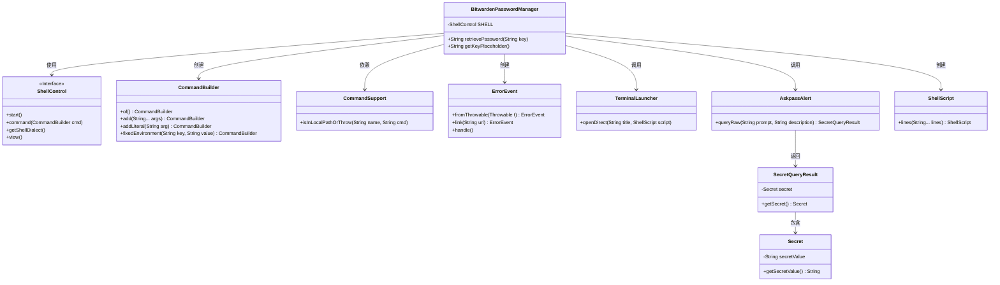
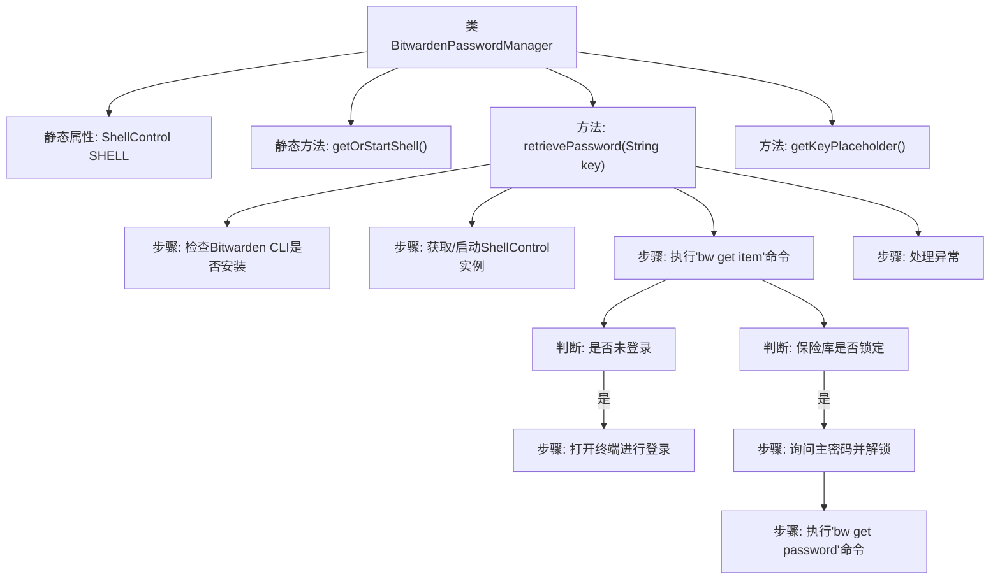
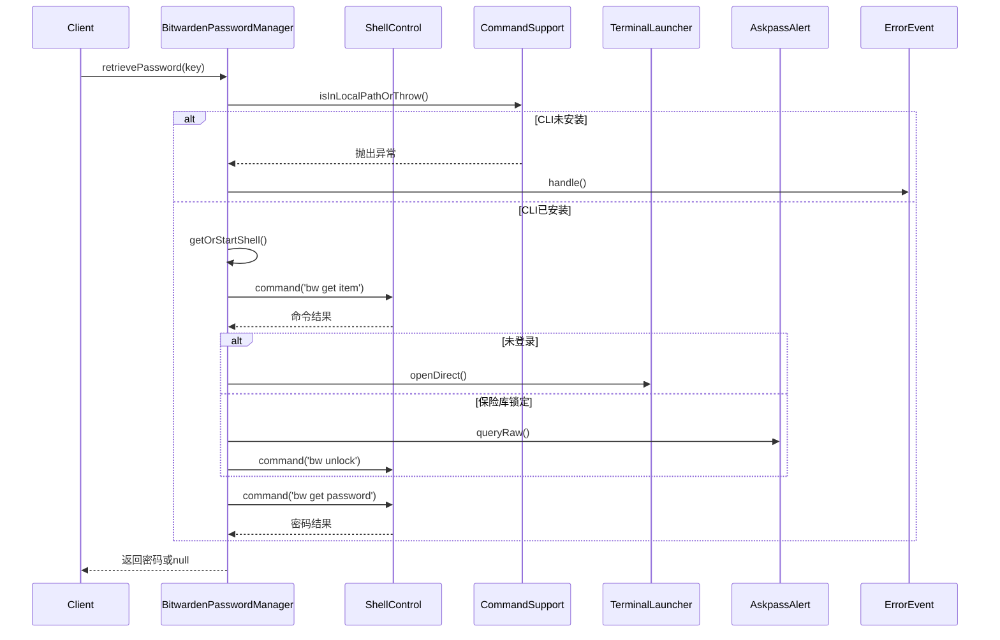

# 基础信息

|      |      |
|------|------|
| 名称 | BitwardenPasswordManager |
| 编码语言 | .java |
| 代码路径 | xpipe/app/src/main/java/io/xpipe/app/password/BitwardenPasswordManager.java |
| 包名 | io.xpipe.app.password |
| 依赖项 | ['io.xpipe.app.ext.ProcessControlProvider', 'io.xpipe.app.issue.ErrorEvent', 'io.xpipe.app.terminal.TerminalLauncher', 'io.xpipe.app.util', 'io.xpipe.core.process.CommandBuilder', 'io.xpipe.core.process.ShellControl', 'io.xpipe.core.process.ShellScript', 'com.fasterxml.jackson.annotation.JsonTypeName'] |
| 概述说明 | Bitwarden密码管理器实现，包含登录、解锁及密码获取逻辑。 |

# 说明

该代码定义了一个名为BitwardenPasswordManager的类，实现密码管理功能。它通过Bitwarden CLI工具获取密码，包含以下关键逻辑：检查本地是否安装CLI工具；处理未登录或保险库锁定状态；通过命令行交互实现登录和解锁；最终获取指定名称的密码项。类中还定义了密码项名称的占位符文本。整个过程涉及敏感信息处理，并包含错误捕获机制。

# 类列表 Class Summary

| 名称   | 类型  | 说明 |
|-------|------|-------------|
| BitwardenPasswordManager | class | Bitwarden密码管理器实现，支持CLI交互、登录解锁及密码获取。 |

## 类 BitwardenPasswordManager

|      |      |
|------|------|
| 访问范围 | @JsonTypeName("bitwarden");public |
| 类型 | class |
| 名称 | BitwardenPasswordManager |
| 说明 | Bitwarden密码管理器实现，支持CLI交互、登录解锁及密码获取。 |

### UML类图

该代码实现了一个Bitwarden密码管理器，主要功能是通过命令行与Bitwarden CLI交互来检索密码。类图展示了BitwardenPasswordManager与多个辅助类的关系，包括ShellControl用于执行命令、CommandBuilder构建命令、ErrorEvent处理错误、TerminalLauncher打开终端、AskpassAlert获取主密码等。整个设计采用分层结构，核心类通过组合方式使用各种工具类，实现了密码检索、错误处理和用户交互等功能。

### 内部方法调用关系图

这段代码实现了Bitwarden密码管理器的功能，主要包含密码检索和保险库状态管理。流程图展示了类结构和主要方法调用关系，时序图详细描述了密码检索过程中的交互步骤。代码首先检查CLI工具是否安装，然后处理登录状态和保险库锁定情况，最后获取指定密钥的密码。整个过程包含完善的错误处理和用户交互机制，确保安全性和可用性。

### 字段列表 Field List

| 名称  | 类型  | 说明 |
|-------|-------|------|
| SHELL | ShellControl | 私有静态ShellControl实例SHELL |

### 方法列表 Method List

| 名称  | 类型  | 说明 |
|-------|-------|------|
| getOrStartShell | ShellControl | 获取或启动Shell实例，若不存在则创建并启动。 |
| retrievePassword | String | 同步方法通过Bitwarden CLI获取密码，处理登录、解锁及错误情况。 |
| getKeyPlaceholder | String | 重写方法，返回键占位符"Item name"。 |

