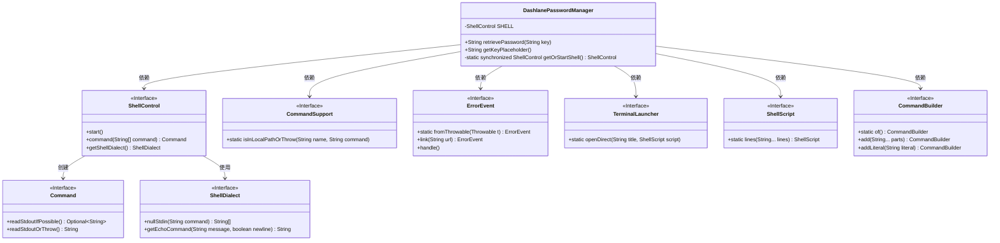
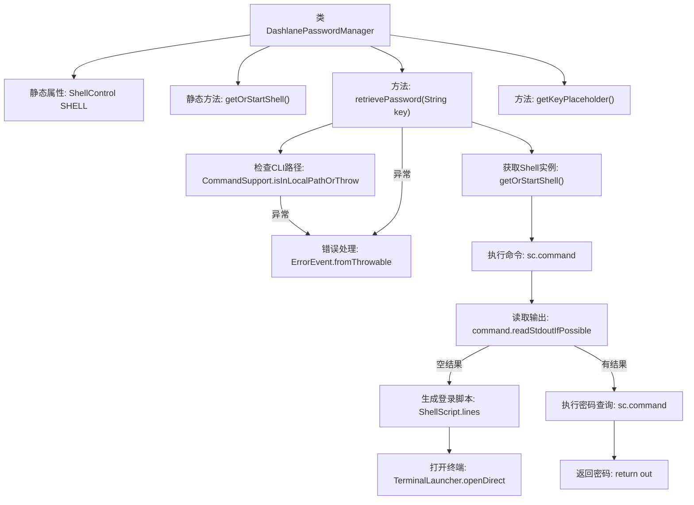

# 基础信息

|      |      |
|------|------|
| 名称 | DashlanePasswordManager |
| 编码语言 | .java |
| 代码路径 | xpipe/app/src/main/java/io/xpipe/app/password/DashlanePasswordManager.java |
| 包名 | io.xpipe.app.password |
| 依赖项 | ['io.xpipe.app.ext.ProcessControlProvider', 'io.xpipe.app.issue.ErrorEvent', 'io.xpipe.app.terminal.TerminalLauncher', 'io.xpipe.app.util.CommandSupport', 'io.xpipe.core.process.CommandBuilder', 'io.xpipe.core.process.ShellControl', 'io.xpipe.core.process.ShellScript', 'com.fasterxml.jackson.annotation.JsonTypeName'] |
| 概述说明 | Dashlane密码管理类，通过CLI获取密码，需登录验证。 |

# 说明

这段代码定义了一个名为DashlanePasswordManager的类，实现了PasswordManager接口，用于通过Dashlane CLI管理密码。主要功能包括：通过getOrStartShell方法创建或获取ShellControl实例；retrievePassword方法通过命令行工具dcli检索密码，若未登录会提示用户登录；错误处理通过ErrorEvent记录并跳转安装链接；getKeyPlaceholder方法返回占位符文本"Item name"。整个过程涉及本地进程控制、命令行交互和错误处理。

# 类列表 Class Summary

| 名称   | 类型  | 说明 |
|-------|------|-------------|
| DashlanePasswordManager | class | Dashlane密码管理器类，通过CLI获取密码，需登录验证。 |

## 类 DashlanePasswordManager

|      |      |
|------|------|
| 访问范围 | @JsonTypeName("dashlane");public |
| 类型 | class |
| 名称 | DashlanePasswordManager |
| 说明 | Dashlane密码管理器类，通过CLI获取密码，需登录验证。 |

### UML类图

这段代码展示了一个Dashlane密码管理器的实现，它通过命令行接口与Dashlane交互。类图清晰地呈现了DashlanePasswordManager与多个接口的依赖关系，包括ShellControl用于执行命令、ErrorEvent处理错误、TerminalLauncher打开终端等。核心功能retrievePassword()通过多步骤验证和命令执行来获取密码，体现了良好的错误处理和用户引导机制。

### 内部方法调用关系图

这段代码实现了一个Dashlane密码管理器，主要功能包括通过CLI工具检索密码。流程图展示了完整的控制流程：首先检查CLI工具是否可用，然后获取Shell实例执行命令，处理空结果时引导用户登录，成功获取密码后返回结果。整个过程包含异常处理和用户交互环节，体现了健壮的错误处理机制和用户引导设计。

### 字段列表 Field List

| 名称  | 类型  | 说明 |
|-------|-------|------|
| SHELL | ShellControl | 私有静态ShellControl实例SHELL |

### 方法列表 Method List

| 名称  | 类型  | 说明 |
|-------|-------|------|
| getOrStartShell | ShellControl | 获取或启动Shell实例，单例同步确保线程安全。 |
| retrievePassword | String | 同步方法通过Dashlane CLI获取密码，处理错误并返回结果。 |
| getKeyPlaceholder | String | 重写方法返回键占位符"Item name"。 |

