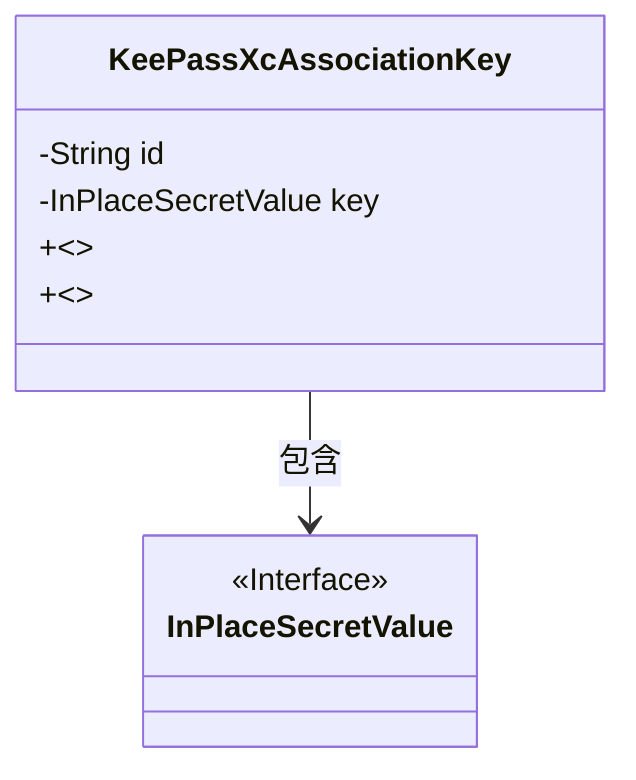
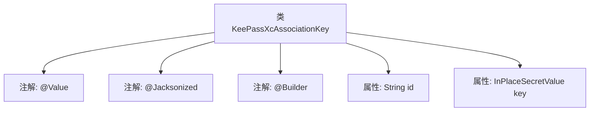

# 基础信息

|      |      |
|------|------|
| 名称 | KeePassXcAssociationKey |
| 编码语言 | .java |
| 代码路径 | xpipe/app/src/main/java/io/xpipe/app/password/KeePassXcAssociationKey.java |
| 包名 | io.xpipe.app.password |
| 依赖项 | ['io.xpipe.core.util.InPlaceSecretValue', 'lombok.Builder', 'lombok.Value', 'lombok.extern.jackson.Jacksonized'] |
| 概述说明 | KeePassXc关联密钥类，含ID和密钥字段。 |

# 说明

这是一个名为KeePassXcAssociationKey的Java类定义，使用了Lombok库的@Builder和@Jacksonized注解。类包含两个字段：id（字符串类型）和key（InPlaceSecretValue类型）。@Builder注解提供了建造者模式支持，@Jacksonized注解优化了Jackson反序列化能力。整个类设计用于处理KeePassXC关联密钥的数据结构。

# 类列表 Class Summary

| 名称   | 类型  | 说明 |
|-------|------|-------------|
| KeePassXcAssociationKey | class | KeePassXc关联键类，含ID和密钥字段。 |

## 类 KeePassXcAssociationKey

|      |      |
|------|------|
| 访问范围 | @Value;@Jacksonized;@Builder;public |
| 类型 | class |
| 名称 | KeePassXcAssociationKey |
| 说明 | KeePassXc关联键类，含ID和密钥字段。 |

### UML类图

这段类图描述了一个KeePassXcAssociationKey类，它包含两个私有字段：String类型的id和InPlaceSecretValue类型的key。该类使用了@Jacksonized和@Builder注解，表明它是一个支持Jackson序列化的构建器模式类。KeePassXcAssociationKey依赖于InPlaceSecretValue接口，后者可能用于安全存储敏感数据。整个结构展示了密码管理工具中密钥关联的简单数据模型，通过构建器模式提供灵活的实例化方式。

### 内部方法调用关系图

该流程图展示了KeePassXcAssociationKey类的结构，包含三个类级注解（@Value、@Jacksonized、@Builder）和两个属性字段（String类型的id和InPlaceSecretValue类型的key）。通过注解组合实现了不可变对象的构建和JSON序列化支持，适用于密码管理场景下的安全密钥关联操作。类设计简洁，符合值对象模式的特征。

### 字段列表 Field List

| 名称  | 类型  | 说明 |
|-------|-------|------|
| id | String | 字符串标识符 |
| key | InPlaceSecretValue | 密钥占位符 |

### 方法列表 Method List

| 名称  | 类型  | 说明 |
|-------|-------|------|

