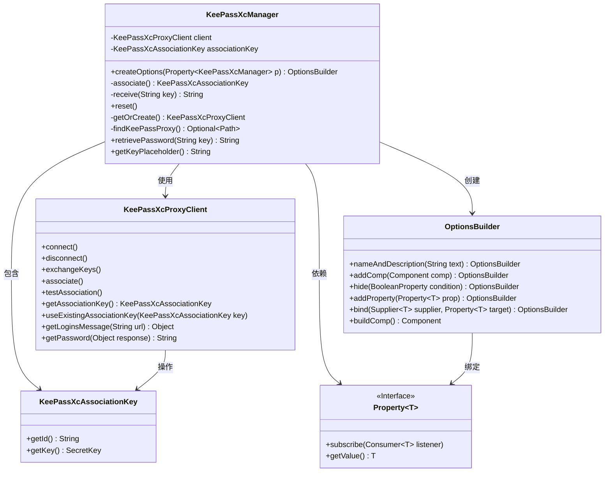
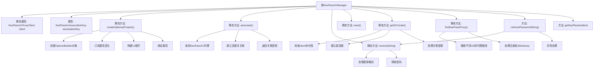

# 基础信息

|      |      |
|------|------|
| 名称 | KeePassXcManager |
| 编码语言 | .java |
| 代码路径 | xpipe/app/src/main/java/io/xpipe/app/password/KeePassXcManager.java |
| 包名 | io.xpipe.app.password |
| 依赖项 | ['io.xpipe.app.comp.base.ButtonComp', 'io.xpipe.app.core.AppI18n', 'io.xpipe.app.issue.ErrorEvent', 'io.xpipe.app.prefs.AppPrefs', 'io.xpipe.app.util', 'io.xpipe.core.process.OsType', 'javafx.beans.property.Property', 'javafx.beans.property.SimpleObjectProperty', 'com.fasterxml.jackson.annotation.JsonTypeName', 'lombok.Builder', 'lombok.Getter', 'lombok.ToString', 'lombok.extern.jackson.Jacksonized', 'java.io.IOException', 'java.nio.file.Files', 'java.nio.file.Path', 'java.util.List', 'java.util.Optional', 'java.util.regex.Pattern'] |
| 概述说明 | KeePassXcManager实现密码管理，支持代理连接、密钥交换和关联测试，跨平台查找代理程序。 |

# 说明

该代码定义了一个名为KeePassXcManager的密码管理器类，实现了PasswordManager接口。主要功能包括：通过keepassxc-proxy客户端与KeePassXC应用交互，管理关联密钥，获取密码等。类中包含静态方法用于创建选项、关联密钥、重置连接、查找代理程序路径等。支持跨平台操作，包括Linux、MacOS和Windows系统。通过本地Shell和Windows注册表查找代理程序，处理密码请求时会对密钥进行格式化，并返回掩码处理后的密钥信息。错误处理通过ErrorEvent机制实现。

# 类列表 Class Summary

| 名称   | 类型  | 说明 |
|-------|------|-------------|
| KeePassXcManager | class | KeePassXC密码管理器实现，包含关联、查找代理和密码获取功能。 |

## 类 KeePassXcManager

|      |      |
|------|------|
| 访问范围 | @Getter;@Builder(toBuilder = true);@ToString;@Jacksonized;@JsonTypeName("keePassXc");public |
| 类型 | class |
| 名称 | KeePassXcManager |
| 说明 | KeePassXC密码管理器实现，包含关联、查找代理和密码获取功能。 |

### UML类图

这段代码实现了一个KeePassXC密码管理器，主要功能包括与KeePassXC代理客户端交互、管理关联密钥、查找本地代理程序、获取密码等。KeePassXcManager作为核心类，通过静态方法管理KeePassXcProxyClient实例，使用Builder模式创建配置选项，并实现了PasswordManager接口的密码检索功能。类图中清晰地展示了各组件间的依赖关系，包括与代理客户端的交互、关联密钥的管理，以及通过OptionsBuilder构建UI配置选项的流程。

### 内部方法调用关系图

该流程图展示了KeePassXcManager类的完整结构，包含静态属性client、核心方法createOptions用于构建配置界面、associate用于建立与KeePassXC的关联、receive用于获取密码、以及跨平台的findKeePassProxy代理查找逻辑。类实现了PasswordManager接口的密码获取功能，通过getOrCreate方法维护单例连接，并包含Windows/Linux/MacOS三端的代理路径查找策略。异常处理贯穿各个关键操作，确保系统稳定性。

### 字段列表 Field List

| 名称  | 类型  | 说明 |
|-------|-------|------|
| associationKey | KeePassXcAssociationKey | 私有终态KeePassXc关联密钥 |
| client | KeePassXcProxyClient | 私有静态KeePassXcProxyClient客户端实例。 |

### 方法列表 Method List

| 名称  | 类型  | 说明 |
|-------|-------|------|
| retrievePassword | String | 重写方法，通过密钥获取密码，异常时返回空并处理错误。 |
| reset | void | 静态方法reset()断开客户端连接并置空。 |
| receive | String | 私有方法接收键值，补全URL后获取密码并返回。 |
| associate | KeePassXcAssociationKey | 查找KeePassXC代理，连接并交换密钥，返回关联密钥后断开。未找到则报错。 |
| findKeePassProxy | Optional<Path> | 查找KeePass代理路径，支持Linux、MacOs和Windows系统。 |
| createOptions | OptionsBuilder | 静态方法创建选项，绑定KeePassXc关联键，含按钮和隐藏逻辑。 |
| getOrCreate | KeePassXcProxyClient | 获取或创建KeePassXC客户端实例，处理连接、密钥交换及关联测试。 |
| getKeyPlaceholder | String | 重写方法返回本地化的密钥占位符文本。 |

