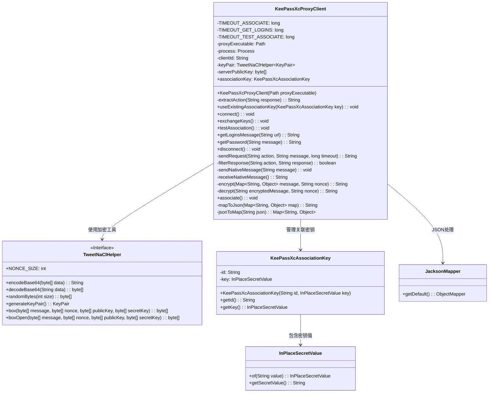
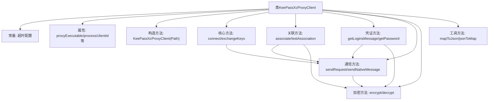
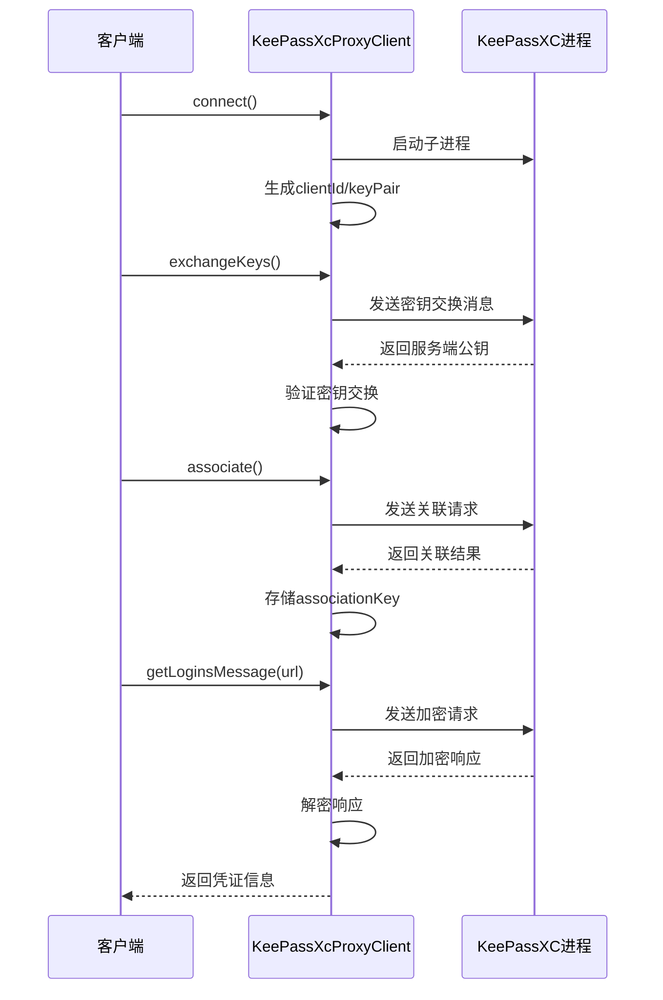

# 基础信息

|      |      |
|------|------|
| 名称 | KeePassXcProxyClient |
| 编码语言 | .java |
| 代码路径 | xpipe/app/src/main/java/io/xpipe/app/password/KeePassXcProxyClient.java |
| 包名 | io.xpipe.app.password |
| 依赖项 | ['io.xpipe.app.issue.ErrorEvent', 'io.xpipe.app.util.DocumentationLink', 'io.xpipe.app.util.ThreadHelper', 'io.xpipe.core.util.InPlaceSecretValue', 'io.xpipe.core.util.JacksonMapper', 'com.fasterxml.jackson.core.type.TypeReference', 'com.fasterxml.jackson.databind.node.ObjectNode', 'com.fasterxml.jackson.databind.type.TypeFactory', 'lombok.Getter', 'lombok.SneakyThrows', 'java.io.IOException', 'java.nio.ByteBuffer', 'java.nio.ByteOrder', 'java.nio.charset.StandardCharsets', 'java.nio.file.Path', 'java.util.HashMap', 'java.util.List', 'java.util.Map', 'java.util.UUID', 'java.util.regex.Matcher', 'java.util.regex.Pattern'] |
| 概述说明 | KeePassXC代理客户端类，处理加密通信、密钥交换和凭证获取。 |

# 说明

KeePassXcProxyClient是一个用于与KeePassXC密码管理器进行安全通信的Java客户端类。它通过本地代理进程建立连接，使用TweetNaCl加密库实现端到端加密。主要功能包括：密钥交换、关联认证、测试关联状态、获取登录凭据等。类中定义了不同操作的超时时间，采用JSON格式进行消息传递，并实现了原生消息协议处理（包含长度前缀的小端序编码）。核心流程涉及生成随机客户端ID、非对称密钥对、处理加密/解密消息，并通过输入输出流与KeePassXC进程交互。异常处理机制完善，包含超时控制和错误状态检测。

# 类列表 Class Summary

| 名称   | 类型  | 说明 |
|-------|------|-------------|
| KeePassXcProxyClient | class | KeePassXC代理客户端类，处理密钥交换、关联测试、密码获取及加密通信。 |

## 类 KeePassXcProxyClient

|      |      |
|------|------|
| 访问范围 | public |
| 类型 | class |
| 名称 | KeePassXcProxyClient |
| 说明 | KeePassXC代理客户端类，处理密钥交换、关联测试、密码获取及加密通信。 |

### UML类图

类图描述：
该图展示了KeePassXC代理客户端的核心结构，包含主类KeePassXcProxyClient及其关联组件。主类通过TweetNaClHelper进行加密操作，使用KeePassXcAssociationKey管理长期关联密钥，通过JacksonMapper处理JSON数据交换。类图中清晰地体现了加密通信、密钥管理、JSON序列化三大核心功能模块的协作关系，展示了客户端如何通过进程通信与KeePassXC进行安全交互的全过程。

### 内部方法调用关系图

该流程图展示了KeePassXcProxyClient类的完整结构，包含加密通信、密钥交换、凭证获取三大核心功能模块。时序图详细描述了从建立连接到获取密码的完整交互过程，突出显示了加密通信和异步消息处理机制。类通过ProcessBuilder与KeePassXC进程交互，使用TweetNaCl进行端到端加密，实现了安全的密码管理代理功能。

### 字段列表 Field List

| 名称  | 类型  | 说明 |
|-------|-------|------|
| associationKey | KeePassXcAssociationKey | 私有KeePassXc关联密钥的Getter方法。 |
| TIMEOUT_ASSOCIATE = 30000 | long | 私有静态长整型常量，超时设为30000毫秒。 |
| TIMEOUT_TEST_ASSOCIATE = 2000 | long | 私有静态长整型常量TIMEOUT_TEST_ASSOCIATE值为2000。 |
| keyPair | TweetNaClHelper.KeyPair | 私有TweetNaCl密钥对变量keyPair |
| proxyExecutable | Path | 私有代理可执行文件路径 |
| serverPublicKey | byte[] | 服务器公钥字节数组 |
| process | Process | 私有进程变量process。 |
| TIMEOUT_GET_LOGINS = 5000 | long | 定义获取登录信息的超时时间为5000毫秒。 |
| clientId | String | 私有字符串变量clientId |

### 方法列表 Method List

| 名称  | 类型  | 说明 |
|-------|-------|------|
| connect | void | 生成随机ID和密钥，启动代理进程。 |
| exchangeKeys | void | 生成随机nonce和公钥，发送密钥交换请求并等待响应，验证成功后存储服务器公钥，超时或失败抛出异常。 |
| filterResponse | boolean | 方法过滤响应：根据动作匹配决定返回true或false，处理特定数据库锁定状态。 |
| useExistingAssociationKey | void | 使用现有关联密钥，将其赋值给当前对象的关联密钥属性。 |
| extractAction | String | Java方法：用正则从JSON提取action字段值，无则返null。 |
| getPassword | String | 解析JSON获取密码，检查数量并返回唯一密码。 |
| sendRequest | String | 发送请求并等待响应，超时抛出异常。 |
| sendNativeMessage | void | 私有方法发送UTF-8编码消息，包含长度头和小端序处理。 |
| disconnect | void | 断开连接并销毁进程对象。 |
| getLoginsMessage | String | 生成加密请求获取登录信息，处理响应并解密返回结果。 |
| testAssociation | void | 测试关联功能，检查密钥有效性，处理加密消息和响应。 |
| receiveNativeMessage | String | 读取进程输入流的小端序消息，验证长度后返回UTF-8字符串。 |
| encrypt | String | 加密方法：将消息和nonce转为字节，使用NaCl库加密后返回Base64编码结果。 |
| decrypt | String | 解密方法：用nonce和密钥解密Base64消息，失败抛异常。 |
| associate | void | 生成密钥对和随机数，加密请求并发送，处理响应验证成功则保存关联密钥，否则抛出异常。 |
| mapToJson | String | 将Map转为JSON字符串的方法，使用Jackson库实现。 |
| jsonToMap | Map<String, Object> | Java方法：使用Jackson将JSON字符串转为Map。 |

