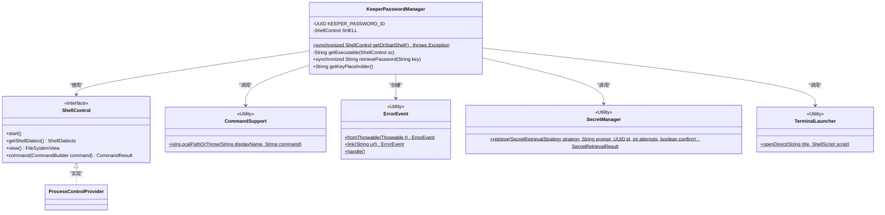
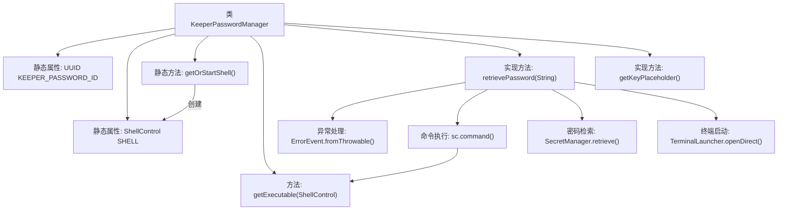

# 基础信息

|      |      |
|------|------|
| 名称 | KeeperPasswordManager |
| 编码语言 | .java |
| 代码路径 | xpipe/app/src/main/java/io/xpipe/app/password/KeeperPasswordManager.java |
| 包名 | io.xpipe.app.password |
| 依赖项 | ['io.xpipe.app.ext.ProcessControlProvider', 'io.xpipe.app.issue.ErrorEvent', 'io.xpipe.app.terminal.TerminalLauncher', 'io.xpipe.app.util.CommandSupport', 'io.xpipe.app.util.SecretManager', 'io.xpipe.app.util.SecretRetrievalStrategy', 'io.xpipe.core.process', 'com.fasterxml.jackson.annotation.JsonTypeName', 'java.util.UUID'] |
| 概述说明 | Keeper密码管理类，实现密码检索和密钥占位符功能。 |

# 说明

KeeperPasswordManager是一个实现PasswordManager接口的类，用于管理Keeper密码。它通过本地Shell控制与Keeper Commander CLI交互，包含获取或启动Shell的方法。retrievePassword方法负责检索密码，首先检查CLI是否安装，未安装则提示用户安装。若配置文件不存在，会引导用户登录Keeper账户。用户需输入主密码解锁，然后通过CLI命令获取指定记录的密码。getKeyPlaceholder方法返回记录UID的占位符。整个过程包含错误处理和用户提示。

# 类列表 Class Summary

| 名称   | 类型  | 说明 |
|-------|------|-------------|
| KeeperPasswordManager | class | Keeper密码管理类，实现密码检索功能，支持命令行交互和本地配置检查。 |

## 类 KeeperPasswordManager

|      |      |
|------|------|
| 访问范围 | @JsonTypeName("keeper");public |
| 类型 | class |
| 名称 | KeeperPasswordManager |
| 说明 | Keeper密码管理类，实现密码检索功能，支持命令行交互和本地配置检查。 |

### UML类图

类图描述：该图展示了KeeperPasswordManager类及其相关依赖，实现了密码管理功能。核心类通过静态方法调用CommandSupport、ErrorEvent等工具类，依赖ShellControl接口执行命令操作，并与SecretManager交互处理密钥。类结构体现了密码检索、错误处理和终端交互的职责分离，通过同步方法确保线程安全。

### 内部方法调用关系图

该流程图展示了KeeperPasswordManager类的核心结构和关键方法调用关系。类包含静态密码ID和Shell控制实例，通过getOrStartShell()实现单例模式。主要业务逻辑在retrievePassword()中实现，包含命令行工具检查、配置文件验证、主密码输入和密钥检索等步骤，整个过程有完善的异常处理机制。getExecutable()方法根据操作系统类型返回不同的可执行文件名，TerminalLauncher用于交互式登录流程。

### 字段列表 Field List

| 名称  | 类型  | 说明 |
|-------|-------|------|
| KEEPER_PASSWORD_ID = UUID.randomUUID() | UUID | 私有静态UUID常量KEEPER_PASSWORD_ID，值为随机生成。 |
| SHELL | ShellControl | 私有静态ShellControl实例SHELL |

### 方法列表 Method List

| 名称  | 类型  | 说明 |
|-------|-------|------|
| getExecutable | String | 获取可执行文件路径，根据Shell类型和操作系统选择不同名称。 |
| retrievePassword | String | 同步方法通过Keeper CLI获取密码，检查本地路径、登录及主密码验证，返回密码或错误处理。 |
| getOrStartShell | ShellControl | 获取或启动Shell实例，若不存在则创建并启动。 |
| getKeyPlaceholder | String | 重写getKeyPlaceholder方法，返回"Record UID"。 |

