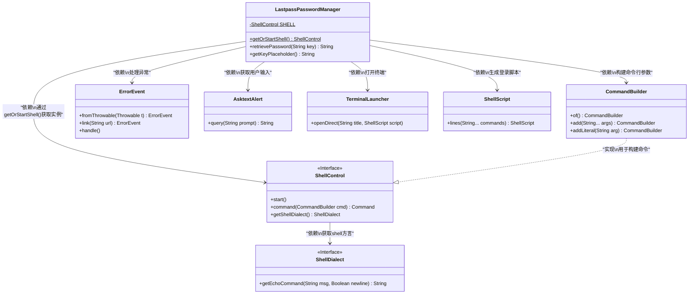
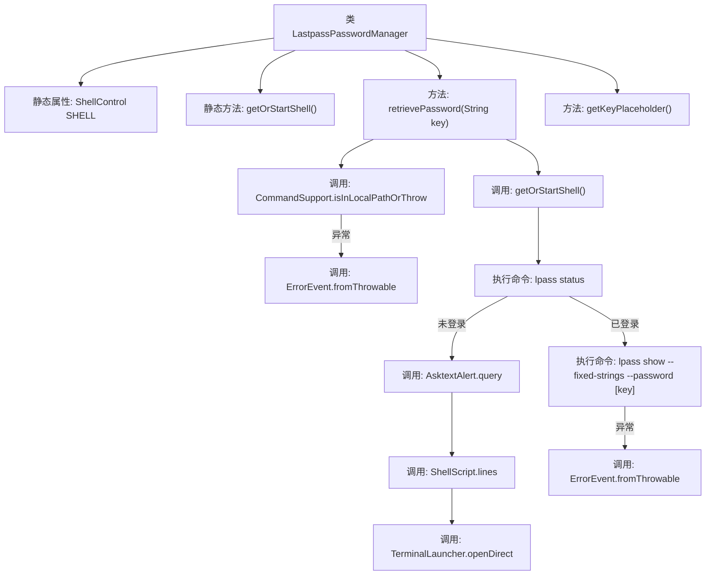
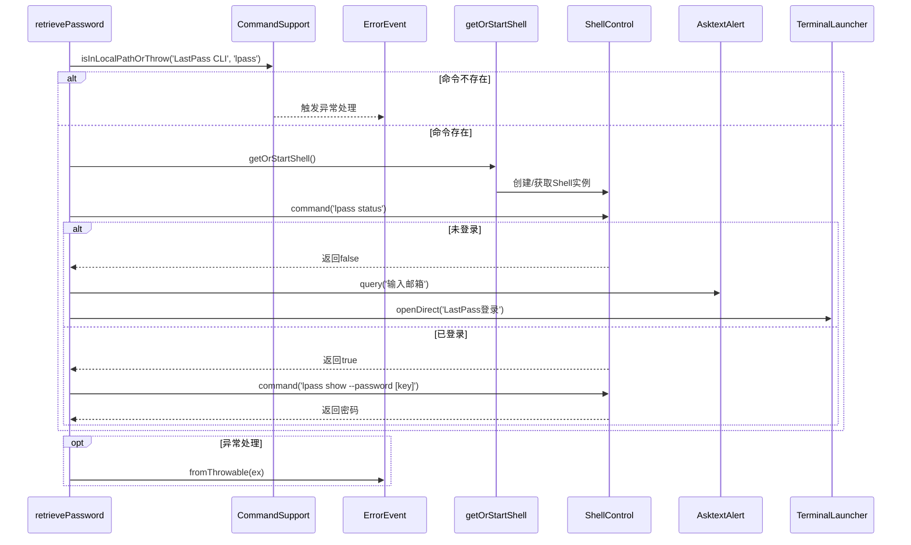

# 基础信息

|      |      |
|------|------|
| 名称 | LastpassPasswordManager |
| 编码语言 | .java |
| 代码路径 | xpipe/app/src/main/java/io/xpipe/app/password/LastpassPasswordManager.java |
| 包名 | io.xpipe.app.password |
| 依赖项 | ['io.xpipe.app.ext.ProcessControlProvider', 'io.xpipe.app.issue.ErrorEvent', 'io.xpipe.app.terminal.TerminalLauncher', 'io.xpipe.app.util', 'io.xpipe.core.process', 'com.fasterxml.jackson.annotation.JsonTypeName'] |
| 概述说明 | Lastpass密码管理类，实现密码检索和登录功能。 |

# 说明

该代码定义了一个名为LastpassPasswordManager的类，实现了PasswordManager接口，用于通过LastPass CLI管理密码。类中包含同步方法getOrStartShell用于获取或启动本地Shell控制。retrievePassword方法首先检查LastPass CLI是否安装，若未安装则提示错误并返回null。若已安装，检查用户是否登录，未登录则提示输入邮箱并打开终端进行登录。登录成功后，通过Shell命令获取指定键对应的密码并返回。若过程中出现异常，会记录错误并返回null。getKeyPlaceholder方法返回密码条目的占位符提示文本。整个类通过Shell命令与LastPass CLI交互实现密码管理功能。

# 类列表 Class Summary

| 名称   | 类型  | 说明 |
|-------|------|-------------|
| LastpassPasswordManager | class | Lastpass密码管理类，实现登录检查、密码检索功能，依赖LastPass CLI工具。 |

## 类 LastpassPasswordManager

|      |      |
|------|------|
| 访问范围 | @JsonTypeName("lastpass");public |
| 类型 | class |
| 名称 | LastpassPasswordManager |
| 说明 | Lastpass密码管理类，实现登录检查、密码检索功能，依赖LastPass CLI工具。 |

### UML类图

类图描述：
该图展示了LastpassPasswordManager及其相关组件的结构关系。LastpassPasswordManager实现了密码管理功能，通过静态方法getOrStartShell()获取ShellControl实例，使用CommandBuilder构建命令行参数，并依赖ErrorEvent处理异常。当需要用户交互时，通过AsktextAlert获取输入，利用TerminalLauncher打开终端窗口执行ShellScript脚本。ShellControl接口定义了与Shell交互的基本操作，并通过ShellDialect适配不同Shell方言。整个设计体现了模块化、异常处理和用户交互的完整流程。

### 内部方法调用关系图

流程图描述了LastpassPasswordManager类的核心逻辑，展示了密码检索过程中的关键步骤：首先检查LastPass CLI是否安装，然后验证登录状态，未登录时引导用户认证，已登录时获取密码。时序图则详细呈现了方法间的调用顺序和异常处理路径，突出了与外部组件(如ShellControl和TerminalLauncher)的交互过程。两个图表共同揭示了该密码管理器的双阶段验证机制和错误处理策略。

### 字段列表 Field List

| 名称  | 类型  | 说明 |
|-------|-------|------|
| SHELL | ShellControl | 私有静态ShellControl实例SHELL。 |

### 方法列表 Method List

| 名称  | 类型  | 说明 |
|-------|-------|------|
| getOrStartShell | ShellControl | 获取或启动Shell实例，若不存在则创建并启动。 |
| retrievePassword | String | 同步方法通过LastPass CLI获取密码，处理登录异常并返回密码或null。 |
| getKeyPlaceholder | String | 重写方法返回大小写敏感的名称提示。 |

