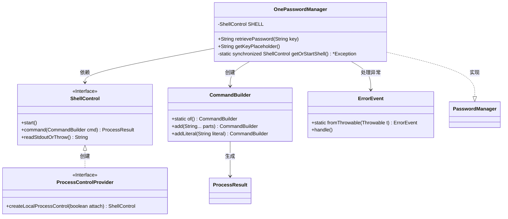
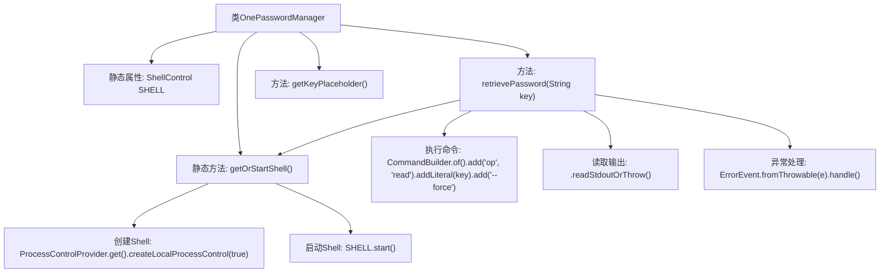

# 基础信息

|      |      |
|------|------|
| 名称 | OnePasswordManager |
| 编码语言 | .java |
| 代码路径 | xpipe/app/src/main/java/io/xpipe/app/password/OnePasswordManager.java |
| 包名 | io.xpipe.app.password |
| 依赖项 | ['io.xpipe.app.ext.ProcessControlProvider', 'io.xpipe.app.issue.ErrorEvent', 'io.xpipe.core.process.CommandBuilder', 'io.xpipe.core.process.ShellControl', 'com.fasterxml.jackson.annotation.JsonTypeName'] |
| 概述说明 | OnePasswordManager类实现密码管理，通过shell命令读取密码，异常处理返回null。 |

# 说明

这段代码定义了一个名为OnePasswordManager的类，实现了PasswordManager接口。它通过本地Shell控制与1Password命令行工具交互来获取密码。类中包含一个静态ShellControl实例，通过同步方法getOrStartShell确保单例并启动Shell。retrievePassword方法执行op read命令读取指定key的密码，key格式为op://<vault>/<item>/<field>。若出错会处理异常并返回null。getKeyPlaceholder方法返回key的占位符格式字符串。

# 类列表 Class Summary

| 名称   | 类型  | 说明 |
|-------|------|-------------|
| OnePasswordManager | class | OnePasswordManager类实现PasswordManager接口，通过ShellControl调用1Password CLI获取密码，密钥格式为op://<vault>/<item>/<field>。 |

## 类 OnePasswordManager

|      |      |
|------|------|
| 访问范围 | @JsonTypeName("onePassword");public |
| 类型 | class |
| 名称 | OnePasswordManager |
| 说明 | OnePasswordManager类实现PasswordManager接口，通过ShellControl调用1Password CLI获取密码，密钥格式为op://<vault>/<item>/<field>。 |

### UML类图

这段类图展示了OnePasswordManager密码管理器的实现结构。该类通过ShellControl接口执行系统命令，使用CommandBuilder构建命令行参数，并通过ProcessControlProvider获取Shell实例。当出现异常时通过ErrorEvent处理错误。关键功能包括通过retrievePassword方法获取密码，以及提供密钥占位符格式。类图中清晰地展示了静态依赖关系、接口实现关系和异常处理流程。

### 内部方法调用关系图

这段代码展示了一个名为OnePasswordManager的类，实现了PasswordManager接口，用于管理1Password的密码操作。主要功能包括通过ShellControl执行1Password命令行操作来检索密码，并提供了获取密钥占位符的方法。流程图清晰地展示了类结构、方法调用关系以及关键操作步骤，如Shell的初始化和命令执行流程。异常处理机制也被明确标注，体现了代码的健壮性设计。

### 字段列表 Field List

| 名称  | 类型  | 说明 |
|-------|-------|------|
| SHELL | ShellControl | 私有静态ShellControl实例SHELL |

### 方法列表 Method List

| 名称  | 类型  | 说明 |
|-------|-------|------|
| getOrStartShell | ShellControl | 获取或启动Shell实例，单例同步控制。 |
| retrievePassword | String | Java方法：通过Shell命令读取密码，异常返回null。 |
| getKeyPlaceholder | String | 重写方法返回密钥占位符格式："op://<vault>/<item>/<field>" |

