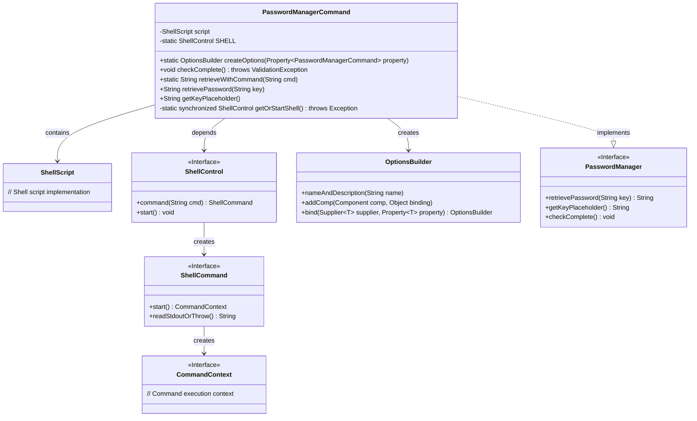
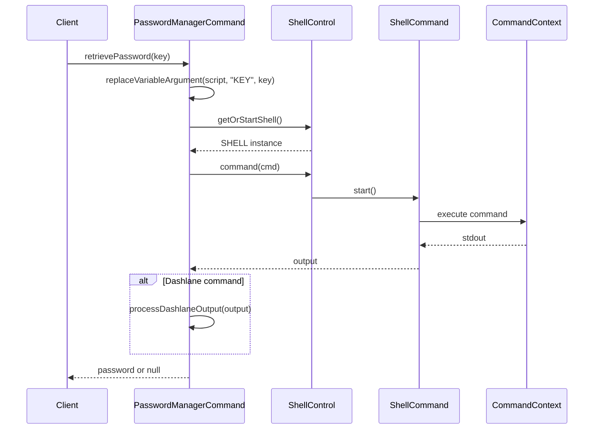
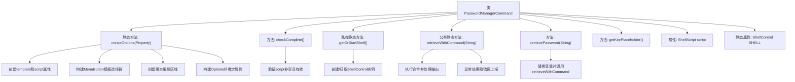

# 基础信息

|      |      |
|------|------|
| 名称 | PasswordManagerCommand |
| 编码语言 | .java |
| 代码路径 | xpipe/app/src/main/java/io/xpipe/app/password/PasswordManagerCommand.java |
| 包名 | io.xpipe.app.password |
| 依赖项 | ['io.xpipe.app.comp.Comp', 'io.xpipe.app.comp.base.IntegratedTextAreaComp', 'io.xpipe.app.core.AppFontSizes', 'io.xpipe.app.core.AppI18n', 'io.xpipe.app.ext.ProcessControlProvider', 'io.xpipe.app.issue.ErrorEvent', 'io.xpipe.app.prefs.ExternalApplicationHelper', 'io.xpipe.app.storage.DataStorage', 'io.xpipe.app.util', 'io.xpipe.core.process.ShellControl', 'io.xpipe.core.process.ShellScript', 'io.xpipe.core.util.ValidationException', 'javafx.beans.property.Property', 'javafx.beans.property.SimpleObjectProperty', 'javafx.scene.control.MenuButton', 'javafx.scene.control.MenuItem', 'com.fasterxml.jackson.annotation.JsonTypeName', 'lombok.Builder', 'lombok.Value', 'lombok.extern.jackson.Jacksonized'] |
| 概述说明 | 密码管理命令类，含脚本执行、模板选择及密码检索功能。 |

# 说明

该代码定义了一个名为PasswordManagerCommand的类，实现了PasswordManager接口，用于通过命令行脚本管理密码。类中包含创建选项界面的静态方法，构建包含脚本编辑区和模板选择菜单的UI组件。核心功能包括检查脚本完整性、启动本地Shell进程、执行密码检索命令，并支持变量替换（如$KEY）。特别处理了Dashlane命令行工具的输出格式，提供错误处理和日志记录机制。整体设计采用建造者模式和属性绑定，支持国际化文本显示。

# 类列表 Class Summary

| 名称   | 类型  | 说明 |
|-------|------|-------------|
| PasswordManagerCommand | class | 密码管理命令类，含模板选择、脚本执行及密码检索功能。 |

## 类 PasswordManagerCommand

|      |      |
|------|------|
| 访问范围 | @JsonTypeName("passwordManagerCommand");@Value;@Jacksonized;@Builder;public |
| 类型 | class |
| 名称 | PasswordManagerCommand |
| 说明 | 密码管理命令类，含模板选择、脚本执行及密码检索功能。 |

### UML类图

这段代码实现了一个基于Shell命令的密码管理器，主要功能是通过执行外部命令来获取密码。类图展示了PasswordManagerCommand作为核心类，实现了PasswordManager接口，依赖于ShellScript和ShellControl来执行命令。序列图展示了密码检索流程：客户端调用retrievePassword()后，系统构建命令、启动Shell进程、执行命令并处理输出（特别是Dashlane的特殊处理），最后返回结果。该设计支持可扩展的命令模板和安全的Shell操作，同时提供了配置界面构建能力。

### 内部方法调用关系图

这段代码实现了一个基于命令行的密码管理器，主要功能包括：通过createOptions方法构建GUI配置界面，使用ShellControl执行外部命令获取密码，支持变量替换和模板选择。核心流程包含命令执行、输出处理、异常捕获和GUI组件构建，特别处理了Dashlane密码管理器的特殊输出格式。类通过实现PasswordManager接口提供密码检索功能，并内置了输入验证和进程控制机制。

### 字段列表 Field List

| 名称  | 类型  | 说明 |
|-------|-------|------|
| SHELL | ShellControl | 私有静态ShellControl实例SHELL |
| script | ShellScript | Shell脚本编程语言。 |

### 方法列表 Method List

| 名称  | 类型  | 说明 |
|-------|-------|------|
| getOrStartShell | ShellControl | 获取或启动Shell实例，单例同步控制。 |
| checkComplete | void | 检查脚本非空且内容不为空，否则抛出异常。 |
| createOptions | OptionsBuilder | 创建密码管理器命令选项，包含模板选择菜单和脚本编辑区，绑定属性生成命令对象。 |
| retrieveWithCommand | String | 静态方法通过命令获取输出，处理Dashlane特殊格式，异常时返回null。 |
| retrievePassword | String | 重写方法：通过命令和变量检索密码。 |
| getKeyPlaceholder | String | 重写方法返回键占位符"$KEY"。 |

