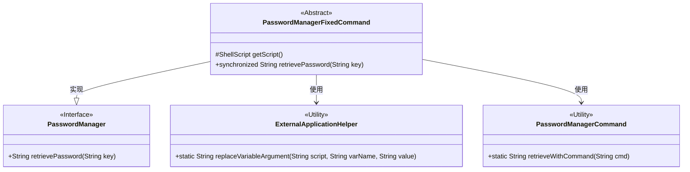
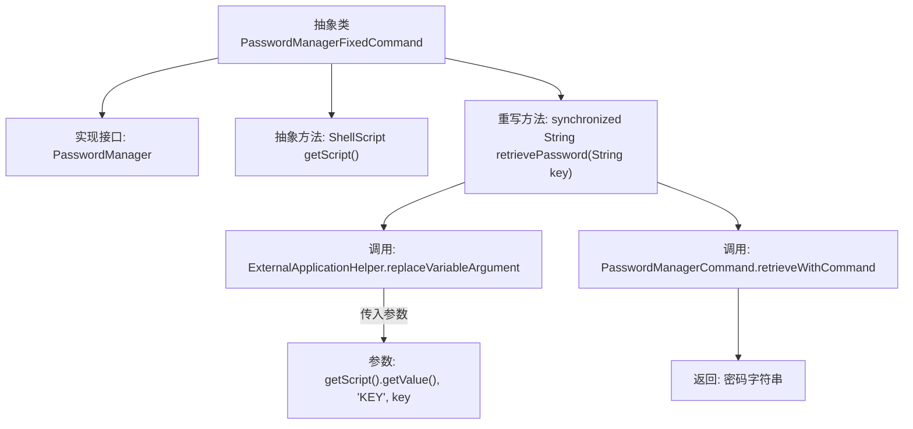

# 基础信息

|      |      |
|------|------|
| 名称 | PasswordManagerFixedCommand |
| 编码语言 | .java |
| 代码路径 | xpipe/app/src/main/java/io/xpipe/app/password/PasswordManagerFixedCommand.java |
| 包名 | io.xpipe.app.password |
| 依赖项 | ['io.xpipe.app.prefs.ExternalApplicationHelper', 'io.xpipe.core.process.ShellScript', 'com.fasterxml.jackson.annotation.JsonTypeName'] |
| 概述说明 | 密码管理命令基类，同步获取密码，使用脚本和键生成命令。 |

# 说明

该内容描述了一个名为PasswordManagerFixedCommand的抽象类，实现了PasswordManager接口。该类包含一个受保护的抽象方法getScript用于获取ShellScript对象，并重写了retrievePassword方法。该方法通过替换脚本中的KEY变量并调用PasswordManagerCommand.retrieveWithCommand来检索密码。整个类使用synchronized关键字确保线程安全。

# 类列表 Class Summary

| 名称   | 类型  | 说明 |
|-------|------|-------------|
| PasswordManagerFixedCommand | class | 密码管理命令基类，同步获取密码，使用脚本和键替换。 |

## 类 PasswordManagerFixedCommand

|      |      |
|------|------|
| 访问范围 | @JsonTypeName("passwordManagerFixedCommand");public abstract |
| 类型 | class |
| 名称 | PasswordManagerFixedCommand |
| 说明 | 密码管理命令基类，同步获取密码，使用脚本和键替换。 |

### UML类图

这段代码展示了一个密码管理系统的核心结构。PasswordManagerFixedCommand作为抽象类实现了PasswordManager接口，提供了密码检索的基础实现。它依赖ExternalApplicationHelper处理脚本变量替换，并通过PasswordManagerCommand执行实际密码检索命令。该设计体现了模板方法模式，将可变部分(getScript())延迟到子类实现，而固定流程(retrievePassword)则在父类中定义。所有密码检索操作都是线程安全的(synchronized)，确保多线程环境下的数据一致性。

### 内部方法调用关系图

这段代码展示了一个抽象类PasswordManagerFixedCommand，它实现了PasswordManager接口并提供了密码检索功能。流程图清晰地描述了类结构和方法调用链：通过getScript()获取脚本模板后，替换变量并执行外部命令来获取密码。关键点包括线程安全的synchronized方法、模板参数替换和外部命令执行，体现了安全性和扩展性设计。

### 字段列表 Field List

| 名称  | 类型  | 说明 |
|-------|-------|------|

### 方法列表 Method List

| 名称  | 类型  | 说明 |
|-------|-------|------|
| getScript | ShellScript | 获取Shell脚本对象的方法。 |
| retrievePassword | String | 重写方法，同步获取密码，替换变量后执行命令返回结果。 |

