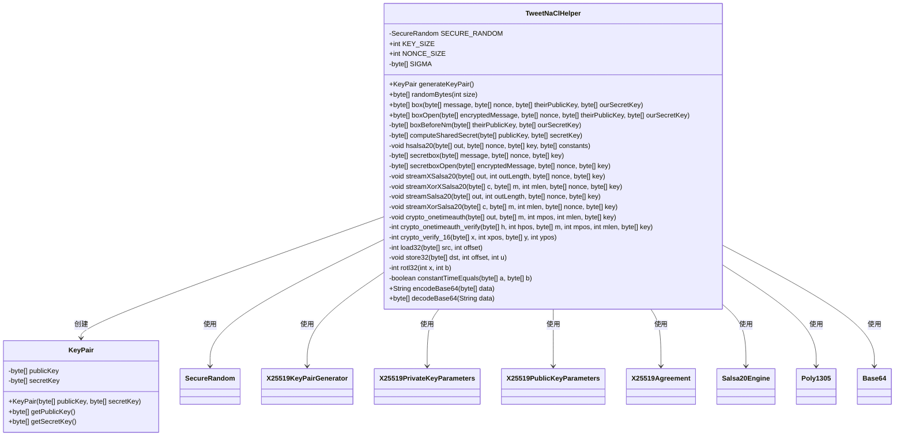
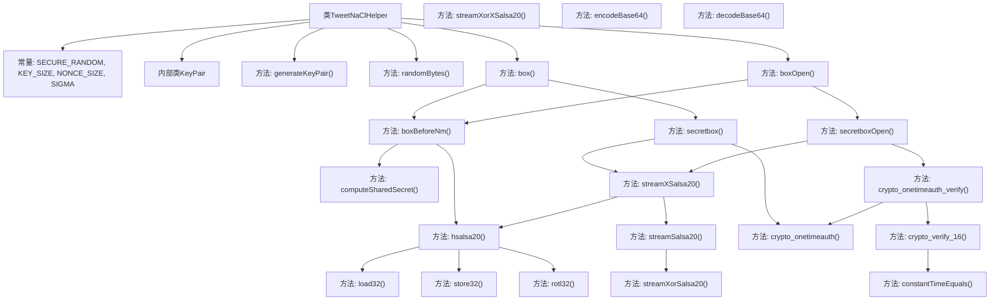

# 基础信息

|      |      |
|------|------|
| 名称 | TweetNaClHelper |
| 编码语言 | .java |
| 代码路径 | xpipe/app/src/main/java/io/xpipe/app/password/TweetNaClHelper.java |
| 包名 | io.xpipe.app.password |
| 依赖项 | ['org.bouncycastle.crypto.AsymmetricCipherKeyPair', 'org.bouncycastle.crypto.KeyGenerationParameters', 'org.bouncycastle.crypto.agreement.X25519Agreement', 'org.bouncycastle.crypto.generators.X25519KeyPairGenerator', 'org.bouncycastle.crypto.params.X25519PrivateKeyParameters', 'org.bouncycastle.crypto.params.X25519PublicKeyParameters', 'org.bouncycastle.util.Arrays', 'java.security.SecureRandom', 'java.util.Base64'] |
| 概述说明 | TweetNaClHelper实现X25519密钥交换和XSalsa20-Poly1305加密。 |

# 说明

该代码实现了一个基于TweetNaCl加密库的Java辅助类，提供X25519密钥对生成、随机字节生成、NaCl加密盒功能。主要包含密钥对生成、共享密钥计算、XSalsa20-Poly1305加密解密、HSalsa20子密钥派生等核心功能。使用X25519进行密钥交换，XSalsa20进行流加密，Poly1305进行消息认证。支持Base64编解码，包含常量时间比较等安全工具方法，完整实现了NaCl加密标准。

# 类列表 Class Summary

| 名称   | 类型  | 说明 |
|-------|------|-------------|
| TweetNaClHelper | class | TweetNaClHelper实现X25519密钥交换和XSalsa20-Poly1305加密。 |

## 类 TweetNaClHelper

|      |      |
|------|------|
| 访问范围 | public |
| 类型 | class |
| 名称 | TweetNaClHelper |
| 说明 | TweetNaClHelper实现X25519密钥交换和XSalsa20-Poly1305加密。 |

### UML类图

这段代码实现了一个基于TweetNaCl的加密工具类，提供了密钥生成、加密解密、随机数生成等功能。主要包含TweetNaClHelper主类和KeyPair内部类，通过X25519算法实现密钥交换，使用XSalsa20-Poly1305进行加密认证。类图展示了核心数据结构和方法调用关系，包括与BouncyCastle加密组件的交互。该实现严格遵循NaCl密码库规范，提供了完整的加密套件功能。

### 内部方法调用关系图

这段代码实现了一个基于TweetNaCl加密库的Java辅助类，提供了密钥生成、加密解密、随机数生成等功能。流程图展示了类的主要结构和关键方法调用关系，包括密钥生成(generateKeyPair)、加密(box)、解密(boxOpen)等核心功能，以及底层加密算法实现(hsalsa20、streamXSalsa20等)。类内部通过X25519实现密钥交换，使用XSalsa20-Poly1305进行认证加密，严格遵循了TweetNaCl.js的实现规范。

### 字段列表 Field List

| 名称  | 类型  | 说明 |
|-------|-------|------|
| NONCE_SIZE = 24 | int | 定义常量NONCE_SIZE，值为24。 |
| SIGMA = {101, 120, 112, 97, 110, 100, 32, 51, 50, 45, 98, 121, 116, 101, 32, 107} | byte[] | 定义常量字节数组SIGMA，值为"expand 32-byte k"的ASCII码。 |
| KEY_SIZE = 32 | int | 定义常量KEY_SIZE，值为32。 |
| SECURE_RANDOM = new SecureRandom() | SecureRandom | 私有安全随机数生成器实例。 |

### 方法列表 Method List

| 名称  | 类型  | 说明 |
|-------|-------|------|
| boxBeforeNm | byte[] | 使用X25519和HSalsa20生成共享密钥。 |
| crypto_onetimeauth_verify | int | 验证消息认证码，比较16字节哈希值。 |
| streamXorSalsa20 | void | 使用BouncyCastle的Salsa20算法对字节数组进行异或加密处理。 |
| hsalsa20 | void | HSalsa20算法实现：加载常量、密钥和随机数，进行20轮Salsa20核心运算后输出结果。 |
| crypto_verify_16 | int | 比较x和y的16字节片段，相等返回0，否则-1。 |
| randomBytes | byte[] | 生成指定长度的随机字节数组。 |
| computeSharedSecret | byte[] | X25519密钥交换计算共享密钥方法。 |
| streamXSalsa20 | void | 使用HSalsa20生成子密钥，再用Salsa20处理剩余nonce生成输出。 |
| streamSalsa20 | void | 使用Salsa20算法生成指定长度的密钥流，输入包括输出数组、长度、随机数和密钥。 |
| crypto_onetimeauth | void | Poly1305认证函数，输入消息和密钥，输出认证码。 |
| streamXorXSalsa20 | void | 使用HSalsa20生成子密钥，再用子密钥和nonce剩余字节进行XSalsa20流加密。 |
| load32 | int | 从字节数组加载32位整数 |
| store32 | void | 将32位整数按小端序存入字节数组的指定位置。 |
| rotl32 | int | 32位整数循环左移b位 |
| constantTimeEquals | boolean | 比较两字节数组是否相等，长度不同直接返回假，逐位异或后结果为零则相等。 |
| encodeBase64 | String | 静态方法，将字节数组编码为Base64字符串。 |
| decodeBase64 | byte[] | 解码Base64字符串为字节数组。 |
| secretbox | byte[] | XSalsa20加密结合Poly1305 MAC，处理消息并生成加密结果。 |
| generateKeyPair | KeyPair | 生成X25519密钥对并返回编码的公私钥。 |
| boxOpen | byte[] | 解密函数：使用公钥和私钥生成共享密钥，再解密消息。 |
| box | byte[] | 使用共享密钥加密消息，先生成密钥再加密。 |
| secretboxOpen | byte[] | 解密函数：验证消息长度、MAC标签，解密后返回有效数据。失败返回null。 |

