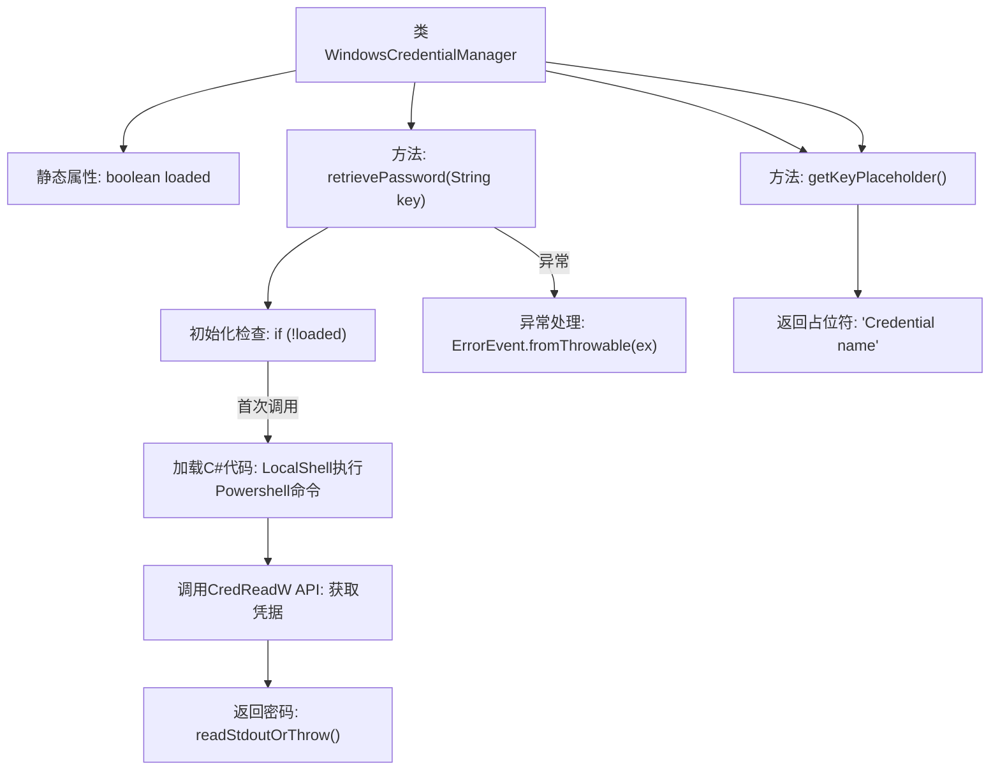
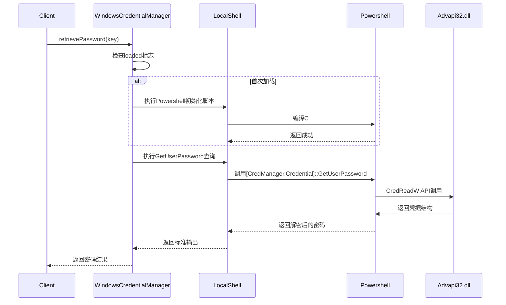

# 基础信息

|      |      |
|------|------|
| 名称 | WindowsCredentialManager |
| 编码语言 | .java |
| 代码路径 | xpipe/app/src/main/java/io/xpipe/app/password/WindowsCredentialManager.java |
| 包名 | io.xpipe.app.password |
| 依赖项 | ['io.xpipe.app.issue.ErrorEvent', 'io.xpipe.app.util.LocalShell', 'com.fasterxml.jackson.annotation.JsonTypeName', 'lombok.Value'] |
| 概述说明 | Windows凭据管理器类，通过PowerShell调用WinAPI读取密码。 |

# 说明

该代码定义了一个名为WindowsCredentialManager的类，实现了PasswordManager接口，用于从Windows凭据管理器检索密码。类中包含一个静态布尔变量loaded确保初始化代码仅执行一次。retrievePassword方法通过PowerShell调用C#代码，使用Windows API CredReadW读取指定目标的凭据信息，并返回密码字符串。若发生异常，会记录错误并返回null。getKeyPlaceholder方法返回提示文本"Credential name"。整个实现通过同步方法确保线程安全，并处理了字符串转义等细节。

# 类列表 Class Summary

| 名称   | 类型  | 说明 |
|-------|------|-------------|
| WindowsCredentialManager | class | Windows凭据管理器类，通过Powershell调用系统API读取密码。 |


## 类 WindowsCredentialManager

|      |      |
|------|------|
| 访问范围 | @JsonTypeName("windowsCredentialManager");@Value;public |
| 类型 | class |
| 名称 | WindowsCredentialManager |
| 说明 | Windows凭据管理器类，通过Powershell调用系统API读取密码。 |


### UML类图

```mermaid
classDiagram
    class WindowsCredentialManager {
        -static boolean loaded
        +synchronized String retrievePassword(String key)
        +String getKeyPlaceholder()
    }
    <<Interface>> PasswordManager {
        <<Interface>>
        +String retrievePassword(String key)
        +String getKeyPlaceholder()
    }
    class LocalShell {
        +static LocalShell getLocalPowershell()
        +LocalShell command(String cmd)
        +String readStdoutOrThrow()
        +void execute()
    }
    class ErrorEvent {
        +static ErrorEvent fromThrowable(Throwable t)
        +ErrorEvent expected()
        +void handle()
    }

    WindowsCredentialManager ..|> PasswordManager : 实现
    WindowsCredentialManager --> LocalShell : 调用
    WindowsCredentialManager --> ErrorEvent : 异常处理
```

该代码展示了一个Windows凭据管理器实现，通过PowerShell调用Windows API读取系统凭据。类图显示WindowsCredentialManager实现了PasswordManager接口，包含同步密码检索方法和密钥占位符获取方法。核心依赖LocalShell执行PowerShell命令，并通过ErrorEvent处理异常。静态loaded标志确保DLL仅加载一次，P/Invoke调用封装在嵌入式C#代码中，通过Marshal处理非托管内存操作。


### 内部方法调用关系图





流程图描述了WindowsCredentialManager类的核心逻辑，主要展示凭据检索的两阶段过程：首次调用时通过Powershell加载C#编写的凭据读取组件，后续调用直接使用该组件查询Windows凭据管理器。时序图详细呈现了跨语言调用的完整链条，从Java层到Powershell再到Windows API的交互过程，突出了异常处理路径和关键的安全边界转换点。该实现巧妙地利用JVM-Powershell互操作来访问Windows特有的凭据管理API，同时通过同步机制确保线程安全。

### 字段列表 Field List

| 名称  | 类型  | 说明 |
|-------|-------|------|
| loaded = false | boolean | 静态布尔变量loaded初始为false |

### 方法列表 Method List

| 名称  | 类型  | 说明 |
|-------|-------|------|
| retrievePassword | String | 同步方法通过Powershell调用CredRead获取密码，异常返回null。 |
| getKeyPlaceholder | String | 重写方法返回凭证名称占位文本 |


