# 基础信息

|      |      |
|------|------|
| 名称 | password |
| 编码语言 | .java |
| 代码路径 | xpipe/app/src/main/java/io/xpipe/app/password |
| 包名 | xpipe.app.src.main.java.io.xpipe.app.password |
| 概述说明 | KeePassXcAssociationKey类含id和key字段，支持建造者模式。TweetNaClHelper实现X25519加密。Bitwarden等类通过CLI管理密码。KeePassXcProxyClient安全通信。WindowsCredentialManager读取凭据。 |

# 说明

## 概述

该代码模块是一个密码管理系统的Java实现，提供了与多种主流密码管理器（如KeePassXC、Bitwarden、LastPass、1Password等）的集成功能。模块采用模块化设计，通过统一的`PasswordManager`接口规范各类密码管理器的实现，支持跨平台操作（包括Linux、MacOS和Windows系统）。核心功能包括密码检索、密钥管理、加密通信和命令行交互等。

模块主要特点包括：
- 支持多种密码管理器（KeePassXC、Bitwarden、LastPass、1Password等）
- 使用TweetNaCl加密库实现安全通信
- 提供统一的密码管理接口
- 支持跨平台操作
- 包含完善的错误处理机制

## 主要业务场景

1. **密码检索**：
   - 通过统一接口从不同密码管理器中检索密码
   - 处理密码管理器的登录/解锁状态
   - 支持多种密码格式和存储方式

2. **安全通信**：
   - 使用X25519进行密钥交换
   - 实现XSalsa20-Poly1305加密/解密
   - 处理端到端加密通信（如与KeePassXC的代理通信）

3. **命令行交互**：
   - 与各密码管理器的CLI工具交互
   - 处理命令行输出和错误
   - 支持变量替换和脚本执行

4. **密钥管理**：
   - 生成和管理加密密钥对
   - 处理关联密钥和认证
   - 实现安全的密钥存储和交换

5. **跨平台支持**：
   - 处理不同操作系统的特定实现（如Windows凭据管理器）
   - 支持多种Shell环境
   - 处理平台特定的路径和配置

6. **用户交互**：
   - 提示用户输入必要信息（如主密码）
   - 提供安装指引和错误提示
   - 处理用户认证流程

### 包内部结构视图

```mermaid
graph TD
    password --> KeePassXcAssociationKey.java
    password --> PasswordManager.java
    password --> TweetNaClHelper.java
    password --> BitwardenPasswordManager.java
    password --> PasswordManagerFixedCommand.java
    password --> LastpassPasswordManager.java
    password --> PasswordManagerCommandTemplate.java
    password --> KeePassXcProxyClient.java
    password --> KeePassXcManager.java
    password --> KeeperPasswordManager.java
    password --> DashlanePasswordManager.java
    password --> WindowsCredentialManager.java
    password --> PasswordManagerCommand.java
    password --> OnePasswordManager.java
```

该流程图展示了xpipe项目中password目录下的所有Java文件结构。根节点为password文件夹，直接包含14个不同的Java类文件，这些文件主要涉及密码管理功能，包括KeePassXc、Bitwarden、Lastpass等多种密码管理器的实现类，以及通用的密码管理工具类和辅助类。所有文件均位于同一层级，没有子目录结构。

# 文件列表 File List

| 名称   | 类型  | 说明 |
|-------|------|-------------|
| [PasswordManagerCommand.java](PasswordManagerCommand.md) | file | 密码管理命令类，含脚本执行、模板选择及密码检索功能。 |
| [TweetNaClHelper.java](TweetNaClHelper.md) | file | TweetNaClHelper实现X25519密钥交换和XSalsa20-Poly1305加密。 |
| [PasswordManager.java](PasswordManager.md) | file | 输入内容为空，无法生成概要。请提供具体信息。 |
| [KeePassXcAssociationKey.java](KeePassXcAssociationKey.md) | file | KeePassXc关联密钥类，含ID和密钥字段。 |
| [WindowsCredentialManager.java](WindowsCredentialManager.md) | file | Windows凭据管理器类，通过PowerShell调用WinAPI读取密码。 |
| [DashlanePasswordManager.java](DashlanePasswordManager.md) | file | Dashlane密码管理类，通过CLI获取密码，需登录验证。 |
| [KeeperPasswordManager.java](KeeperPasswordManager.md) | file | Keeper密码管理类，实现密码检索和密钥占位符功能。 |
| [KeePassXcManager.java](KeePassXcManager.md) | file | KeePassXcManager实现密码管理，支持代理连接、密钥交换和关联测试，跨平台查找代理程序。 |
| [KeePassXcProxyClient.java](KeePassXcProxyClient.md) | file | KeePassXC代理客户端类，处理加密通信、密钥交换和凭证获取。 |
| [PasswordManagerCommandTemplate.java](PasswordManagerCommandTemplate.md) | file | 输入为空，无法生成概要描述。请提供具体内容。 |
| [LastpassPasswordManager.java](LastpassPasswordManager.md) | file | Lastpass密码管理类，实现密码检索和登录功能。 |
| [PasswordManagerFixedCommand.java](PasswordManagerFixedCommand.md) | file | 密码管理命令基类，同步获取密码，使用脚本和键生成命令。 |
| [BitwardenPasswordManager.java](BitwardenPasswordManager.md) | file | Bitwarden密码管理器实现，包含登录、解锁及密码获取逻辑。 |
| [OnePasswordManager.java](OnePasswordManager.md) | file | OnePasswordManager类实现密码管理，通过shell命令读取密码，异常处理返回null。 |

