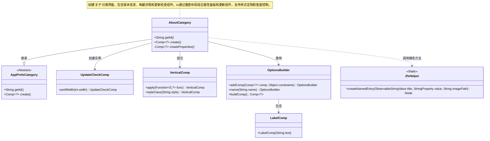
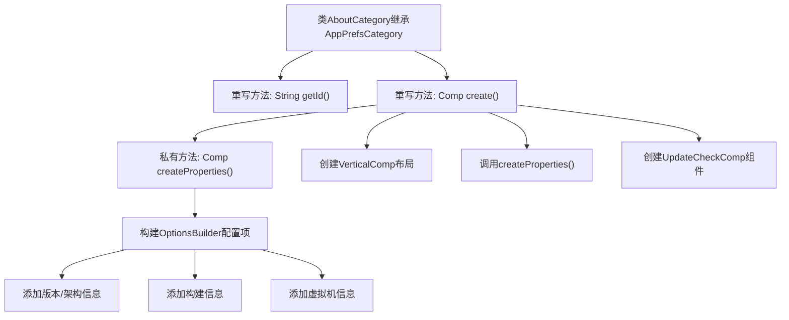

# 基础信息

|      |      |
|------|------|
| 名称 | AboutCategory |
| 编码语言 | .java |
| 代码路径 | xpipe/app/src/main/java/io/xpipe/app/prefs/AboutCategory.java |
| 包名 | io.xpipe.app.prefs |
| 依赖项 | ['io.xpipe.app.comp.Comp', 'io.xpipe.app.comp.base.LabelComp', 'io.xpipe.app.comp.base.VerticalComp', 'io.xpipe.app.core.AppDistributionType', 'io.xpipe.app.core.AppI18n', 'io.xpipe.app.core.AppProperties', 'io.xpipe.app.util.JfxHelper', 'io.xpipe.app.util.OptionsBuilder', 'io.xpipe.core.process.OsType', 'javafx.beans.property.SimpleStringProperty', 'javafx.geometry.Insets', 'atlantafx.base.theme.Styles', 'java.util.List'] |
| 概述说明 | 关于页面的Java类，包含版本信息和更新检查组件。 |

# 说明

该代码定义了一个名为AboutCategory的类，继承自AppPrefsCategory，用于创建关于页面的UI组件。类中包含两个主要方法：getId返回页面标识符"about"，create方法构建垂直布局的界面，包含属性信息、更新检查组件和分隔线。createProperties方法生成属性信息部分，显示应用名称、版本、架构、构建信息、分发类型和JVM详情。界面宽度限制为600像素，采用特定样式类进行美化。

# 类列表 Class Summary

| 名称   | 类型  | 说明 |
|-------|------|-------------|
| AboutCategory | class | 关于页面的Java类，包含版本信息和更新检查组件。 |

## 类 AboutCategory

|      |      |
|------|------|
| 访问范围 | public |
| 类型 | class |
| 名称 | AboutCategory |
| 说明 | 关于页面的Java类，包含版本信息和更新检查组件。 |

### UML类图

类图描述：该图展示了AboutCategory继承自抽象类AppPrefsCategory，并组合使用VerticalComp、UpdateCheckComp等组件构建界面。核心功能是通过createProperties()方法创建包含版本信息的属性面板，与更新检查组件共同构成垂直布局的"关于"页面。OptionsBuilder用于结构化构建属性条目，JfxHelper提供静态工具方法创建UI元素。整体设计体现了GUI组件的分层组合与配置灵活性。

### 内部方法调用关系图

这段代码流程图展示了AboutCategory类的核心结构，该类继承自AppPrefsCategory并实现两个关键重写方法。getId()返回固定标识符"about"，而create()方法构建包含版本信息、更新检查组件和系统属性的垂直布局。createProperties()私有方法通过OptionsBuilder动态组装系统属性组件，包括软件版本、构建信息和JVM详情，最终形成带样式的配置面板。整个流程体现了GUI组件的层次化构建过程。

### 字段列表 Field List

| 名称  | 类型  | 说明 |
|-------|-------|------|

### 方法列表 Method List

| 名称  | 类型  | 说明 |
|-------|-------|------|
| getId | String | 重写getId方法，返回"about"。 |
| create | Comp<?> | 创建垂直布局组件，包含属性、更新检查及分隔线，宽度600，间距12，样式类为information和about-tab。 |
| createProperties | Comp<?> | 创建属性组件，包含标题、版本、架构、构建信息、分发类型和虚拟机详情。 |

