# 基础信息

|      |      |
|------|------|
| 名称 | AppPrefs |
| 编码语言 | .java |
| 代码路径 | xpipe/app/src/main/java/io/xpipe/app/prefs/AppPrefs.java |
| 包名 | io.xpipe.app.prefs |
| 依赖项 | ['io.xpipe.app.comp.Comp', 'io.xpipe.app.core', 'io.xpipe.app.core.mode.OperationMode', 'io.xpipe.app.ext.PrefsHandler', 'io.xpipe.app.ext.PrefsProvider', 'io.xpipe.app.icon.SystemIconSource', 'io.xpipe.app.password.PasswordManager', 'io.xpipe.app.password.PasswordManagerCommand', 'io.xpipe.app.storage.DataStorage', 'io.xpipe.app.terminal.ExternalTerminalType', 'io.xpipe.app.terminal.TerminalMultiplexer', 'io.xpipe.app.terminal.TerminalPrompt', 'io.xpipe.app.util.PlatformState', 'io.xpipe.app.util.PlatformThread', 'io.xpipe.core.process.ShellScript', 'javafx.beans.property', 'javafx.beans.value.ObservableBooleanValue', 'javafx.beans.value.ObservableDoubleValue', 'javafx.beans.value.ObservableStringValue', 'javafx.beans.value.ObservableValue', 'com.fasterxml.jackson.core.type.TypeReference', 'com.fasterxml.jackson.databind.JavaType', 'com.fasterxml.jackson.databind.type.SimpleType', 'com.fasterxml.jackson.databind.type.TypeFactory', 'lombok.AllArgsConstructor', 'lombok.Builder', 'lombok.Getter', 'lombok.Value', 'java.nio.file.Path', 'java.util', 'java.util.stream.Stream'] |
| 概述说明 | 应用配置类，管理本地和共享远程设置，包含主题、终端、密码管理等属性，支持保存和加载。 |

# 说明

AppPrefs类是一个应用程序偏好设置管理类，用于管理本地和远程共享的配置项。它包含多种类型的属性，如布尔值、字符串、枚举等，涵盖外观、终端、SSH、RDP、密码管理、开发者选项等多个类别。类通过Mapping结构存储配置项元数据，支持本地和远程存储分离，提供加载、保存、默认值初始化等功能。配置变更可触发重启需求，并包含开发者模式、性能模式等特殊选项。类采用单例模式，通过静态方法提供全局访问，同时支持自定义配置项扩展。

# 类列表 Class Summary

| 名称   | 类型  | 说明 |
|-------|------|-------------|
| AppPrefs | class | 应用偏好设置类，包含终端、外观、安全等配置项，支持本地和远程存储。 |

## 类 AppPrefs

|      |      |
|------|------|
| 访问范围 | public |
| 类型 | class |
| 名称 | AppPrefs |
| 说明 | 应用偏好设置类，包含终端、外观、安全等配置项，支持本地和远程存储。 |

### UML类图

```mermaid
classDiagram
    class AppPrefs {
        -Path DEFAULT_STORAGE_DIR
        -String DEVELOPER_MODE_PROP
        -static AppPrefs INSTANCE
        -List~Mapping~ mapping
        -BooleanProperty requiresRestart
        -BooleanProperty pinLocalMachineOnStartup
        -BooleanProperty enableHttpApi
        -BooleanProperty dontAutomaticallyStartVmSshServer
        -BooleanProperty dontAcceptNewHostKeys
        +BooleanProperty performanceMode
        +ObjectProperty~AppTheme.Theme~ theme
        -BooleanProperty useSystemFont
        -Property~Integer~ uiScale
        -BooleanProperty saveWindowLocation
        -ObjectProperty~ExternalTerminalType~ terminalType
        -ObjectProperty~ExternalRdpClientType~ rdpClientType
        -DoubleProperty windowOpacity
        -StringProperty customRdpClientCommand
        -StringProperty customTerminalCommand
        -BooleanProperty clearTerminalOnInit
        -Property~List~SystemIconSource~~ iconSources
        -BooleanProperty disableCertutilUse
        -BooleanProperty useLocalFallbackShell
        -BooleanProperty disableTerminalRemotePasswordPreparation
        -Property~Boolean~ alwaysConfirmElevation
        -BooleanProperty dontCachePasswords
        -Property~PasswordManager~ passwordManager
        -Property~ShellScript~ terminalInitScript
        -Property~UUID~ terminalProxy
        -Property~TerminalMultiplexer~ terminalMultiplexer
        -Property~Boolean~ terminalPromptForRestart
        -Property~TerminalPrompt~ terminalPrompt
        -StringProperty passwordManagerCommand
        -ObjectProperty~StartupBehaviour~ startupBehaviour
        -BooleanProperty enableGitStorage
        -StringProperty storageGitRemote
        -ObjectProperty~CloseBehaviour~ closeBehaviour
        -ObjectProperty~ExternalEditorType~ externalEditor
        -StringProperty customEditorCommand
        -BooleanProperty customEditorCommandInTerminal
        -BooleanProperty automaticallyCheckForUpdates
        -BooleanProperty encryptAllVaultData
        -BooleanProperty enableTerminalLogging
        -BooleanProperty checkForSecurityUpdates
        -BooleanProperty disableApiHttpsTlsCheck
        -BooleanProperty condenseConnectionDisplay
        -BooleanProperty showChildCategoriesInParentCategory
        -BooleanProperty lockVaultOnHibernation
        -BooleanProperty openConnectionSearchWindowOnConnectionCreation
        -ObjectProperty~String~ downloadsDirectory
        -BooleanProperty developerMode
        -BooleanProperty developerDisableUpdateVersionCheck
        -BooleanProperty developerForceSshTty
        -BooleanProperty developerDisableSshTunnelGateways
        -BooleanProperty developerPrintInitFiles
        -ObjectProperty~SupportedLocale~ language
        -BooleanProperty requireDoubleClickForConnections
        -BooleanProperty editFilesWithDoubleClick
        -BooleanProperty enableTerminalDocking
        -BooleanProperty censorMode
        -BooleanProperty sshVerboseOutput
        -StringProperty lockCrypt
        -StringProperty apiKey
        -BooleanProperty disableApiAuthentication
        -IntegerProperty editorReloadTimeout
        -BooleanProperty confirmDeletions
        -List~AppPrefsCategory~ categories
        -AppPrefsStorageHandler globalStorageHandler
        -Map~Mapping,Comp~?~~ customEntries
        -Property~AppPrefsCategory~ selectedCategory
        -PrefsHandler extensionHandler
        -AppPrefsStorageHandler vaultStorageHandler
        +initLocal()
        +initSharedRemote()
        +setLocalDefaultsIfNeeded()
        +reset()
        +get() AppPrefs
        +isDevelopmentEnvironment() boolean
        +passwordManager() ObservableValue~PasswordManager~
        +terminalMultiplexer() ObservableValue~TerminalMultiplexer~
        +terminalInitScript() ObservableValue~ShellScript~
        +language() ObservableValue~SupportedLocale~
        +dontAutomaticallyStartVmSshServer() ObservableBooleanValue
        +dontAcceptNewHostKeys() ObservableBooleanValue
        +performanceMode() ObservableBooleanValue
        +useSystemFont() ObservableValue~Boolean~
        +uiScale() ReadOnlyProperty~Integer~
        +clearTerminalOnInit() ReadOnlyBooleanProperty
        +disableCertutilUse() ObservableBooleanValue
        +useLocalFallbackShell() ObservableBooleanValue
        +disableTerminalRemotePasswordPreparation() ObservableBooleanValue
        +lockVaultOnHibernation() ObservableBooleanValue
        +alwaysConfirmElevation() ObservableValue~Boolean~
        +dontCachePasswords() ObservableBooleanValue
        +enableGitStorage() ObservableBooleanValue
        +storageGitRemote() ObservableStringValue
        +encryptAllVaultData() ObservableBooleanValue
        +condenseConnectionDisplay() ObservableBooleanValue
        +showChildCategoriesInParentCategory() ObservableBooleanValue
        +openConnectionSearchWindowOnConnectionCreation() ObservableBooleanValue
        +closeBehaviour() ReadOnlyProperty~CloseBehaviour~
        +externalEditor() ReadOnlyProperty~ExternalEditorType~
        +customEditorCommand() ObservableValue~String~
        +customEditorCommandInTerminal() ObservableBooleanValue
        +editorReloadTimeout() ReadOnlyIntegerProperty
        +startupBehaviour() ReadOnlyProperty~StartupBehaviour~
        +automaticallyUpdate() ReadOnlyBooleanProperty
        +confirmDeletions() ReadOnlyBooleanProperty
        +terminalType() ObservableValue~ExternalTerminalType~
        +rdpClientType() ObservableValue~ExternalRdpClientType~
        +customTerminalCommand() ObservableValue~String~
        +customRdpClientCommand() ObservableValue~String~
        +downloadsDirectory() ObservableValue~String~
        +developerMode() ObservableBooleanValue
        +windowOpacity() ObservableDoubleValue
        +saveWindowLocation() ObservableBooleanValue
        +developerDisableUpdateVersionCheck() ObservableBooleanValue
        +developerForceSshTty() ObservableBooleanValue
        +developerDisableSshTunnelGateways() ObservableBooleanValue
        +theme() ObservableValue~AppTheme.Theme~
        +developerPrintInitFiles() ObservableBooleanValue
        +checkForSecurityUpdates() ObservableBooleanValue
        +enableTerminalLogging() ObservableBooleanValue
        +apiKey() ObservableStringValue
        +disableApiAuthentication() ObservableBooleanValue
        +enableHttpApi() ObservableBooleanValue
        +pinLocalMachineOnStartup() ObservableBooleanValue
        +editFilesWithDoubleClick() ObservableBooleanValue
        +sshVerboseOutput() ObservableBooleanValue
        +censorMode() ObservableBooleanValue
        +requireDoubleClickForConnections() ObservableBooleanValue
        +enableTerminalDocking() ObservableBooleanValue
        +getIconSources() ObservableValue~List~SystemIconSource~~
        +setFromExternal(ObservableValue~T~ prop, T newValue)
        +initDefaultValues()
        +getCustomComp(String id) Comp~?~
        +loadLocal()
        +adjustLocalValues()
        +loadSharedRemote()
        +loadValue(AppPrefsStorageHandler handler, Mapping value) T
        +save()
        +selectCategory(String id)
        +getMapping(Object property) Mapping
    }

    class Mapping {
        -String key
        -Property~?~ property
        -JavaType valueType
        -boolean vaultSpecific
        -boolean requiresRestart
        -String licenseFeatureId
        -boolean log
        +Mapping(String key, Property~?~ property, Class~?~ valueType, boolean vaultSpecific, boolean requiresRestart, boolean log)
        +Mapping(String key, Property~?~ property, JavaType valueType, boolean vaultSpecific, boolean requiresRestart, boolean log)
    }

    class PrefsHandlerImpl {
        -AppPrefs this$0
        +addSetting(String id, JavaType t, Property~T~ property, Comp~?~ comp, boolean requiresRestart, boolean log)
    }

    AppPrefs --> Mapping : 包含
    AppPrefs --> PrefsHandlerImpl : 包含
    PrefsHandlerImpl ..|> PrefsHandler : <<Interface>>
```

类图描述：
AppPrefs是一个管理应用程序配置的单例类，包含大量可观察属性和配置项，如主题、终端设置、密码管理等。它通过Mapping类封装配置项的元数据，并使用PrefsHandlerImpl处理自定义设置。类图展示了AppPrefs与Mapping和PrefsHandlerImpl的包含关系，以及PrefsHandlerImpl实现PrefsHandler接口的层级结构。该类通过多种存储处理器(AppPrefsStorageHandler)实现本地和远程配置的加载与保存。

### 内部方法调用关系图

```mermaid
graph TD
    A["类AppPrefs"]
    B["静态属性: Path DEFAULT_STORAGE_DIR"]
    C["私有静态属性: String DEVELOPER_MODE_PROP"]
    D["私有静态属性: AppPrefs INSTANCE"]
    E["私有属性: List<Mapping> mapping"]
    F["@Getter属性: BooleanProperty requiresRestart"]
    G["多个配置属性定义\n(如pinLocalMachineOnStartup,\nenableHttpApi等)"]
    H["方法: getIconSources()"]
    I["方法: theme()"]
    J["方法: developerPrintInitFiles()"]
    K["方法: checkForSecurityUpdates()"]
    L["方法: enableTerminalLogging()"]
    M["私有方法: map()"]
    N["私有方法: mapLocal()"]
    O["私有方法: mapVaultShared()"]
    P["公共方法: setFromExternal()"]
    Q["公共方法: initDefaultValues()"]
    R["公共方法: getCustomComp()"]
    S["私有方法: loadLocal()"]
    T["私有方法: adjustLocalValues()"]
    U["私有方法: loadSharedRemote()"]
    V["私有方法: loadValue()"]
    W["公共方法: save()"]
    X["公共方法: selectCategory()"]
    Y["公共方法: getMapping()"]
    Z["内部类: Mapping"]
    AA["内部类: PrefsHandlerImpl"]

    A --> B
    A --> C
    A --> D
    A --> E
    A --> F
    A --> G
    A --> H
    A --> I
    A --> J
    A --> K
    A --> L
    A --> M
    A --> N
    A --> O
    A --> P
    A --> Q
    A --> R
    A --> S
    A --> T
    A --> U
    A --> V
    A --> W
    A --> X
    A --> Y
    A --> Z
    A --> AA

    S --> V
    U --> V
    W --> V
    P --> W
    Q --> M
    R --> M
    X --> Y
```

这段代码定义了一个应用程序偏好设置管理类AppPrefs，采用单例模式管理各种配置属性。主要功能包括：1) 通过Mapping内部类定义配置项元数据；2) 提供三种映射方法(mapLocal/mapVaultShared/map)来创建不同类型配置；3) 实现本地和远程配置的加载/保存机制；4) 包含20多个配置分类(categories)的管理；5) 支持配置变更监听和重启标记。类结构复杂但层次清晰，通过属性装饰器模式实现类型安全的配置管理，同时支持扩展自定义配置项。

### 字段列表 Field List

| 名称  | 类型  | 说明 |
|-------|-------|------|
| INSTANCE | AppPrefs | 单例模式下的静态实例变量 |
| categories | List<AppPrefsCategory> | 私有不可变分类列表 |
| editorReloadTimeout =            mapLocal(new SimpleIntegerProperty(1000), "editorReloadTimeout", Integer.class, false) | IntegerProperty | 私有整型属性editorReloadTimeout初始化为1000，映射本地配置且不可为空。 |
| rdpClientType =            mapLocal(new SimpleObjectProperty<>(), "rdpClientType", ExternalRdpClientType.class, false) | ObjectProperty<ExternalRdpClientType> | 定义rdpClientType对象属性，映射本地配置，类型为ExternalRdpClientType。 |
| terminalPrompt = map(Mapping.builder()            .property(new SimpleObjectProperty<>(null))            .key("terminalPrompt")            .valueClass(TerminalPrompt.class)            .log(false)            .build()) | Property<TerminalPrompt> | 创建终端提示属性映射，包含键值对和类型配置。 |
| developerDisableUpdateVersionCheck =            mapLocal(new SimpleBooleanProperty(false), "developerDisableUpdateVersionCheck", Boolean.class, false) | BooleanProperty | 禁用开发者版本检查的布尔属性初始化。 |
| useSystemFont =            mapLocal(new SimpleBooleanProperty(true), "useSystemFont", Boolean.class, false) | BooleanProperty | 使用系统字体属性，默认为真，映射本地配置。 |
| vaultStorageHandler | AppPrefsStorageHandler | 私有存储处理对象vaultStorageHandler |
| enableTerminalLogging = map(Mapping.builder()            .property(new SimpleBooleanProperty(false))            .key("enableTerminalLogging")            .valueClass(Boolean.class)            .licenseFeatureId("logging")            .build()) | BooleanProperty | 布尔属性enableTerminalLogging映射配置，默认false，关联licenseFeatureId为logging。 |
| useLocalFallbackShell =            mapLocal(new SimpleBooleanProperty(false), "useLocalFallbackShell", Boolean.class, true) | BooleanProperty | 定义布尔属性useLocalFallbackShell，默认值false，可映射本地配置。 |
| requiresRestart = new SimpleBooleanProperty(false) | BooleanProperty | 私有布尔属性requiresRestart，初始值为false。 |
| pinLocalMachineOnStartup = map(Mapping.builder()            .property(new SimpleBooleanProperty(false))            .key("pinLocalMachineOnStartup")            .valueClass(Boolean.class)            .requiresRestart(true)            .build()) | BooleanProperty | 启动时固定本地机器选项，需重启生效，默认关闭。 |
| apiKey =            mapVaultShared(new SimpleStringProperty(UUID.randomUUID().toString()), "apiKey", String.class, true) | StringProperty | 定义final字符串属性apiKey，使用UUID初始化并通过mapVaultShared映射存储。 |
| encryptAllVaultData =            mapVaultShared(new SimpleBooleanProperty(false), "encryptAllVaultData", Boolean.class, true) | BooleanProperty | 定义布尔属性encryptAllVaultData，初始值为false，映射到vault共享数据。 |
| mapping = new ArrayList<>() | List<Mapping> | 私有映射列表初始化为空数组 |
| condenseConnectionDisplay =            mapLocal(new SimpleBooleanProperty(false), "condenseConnectionDisplay", Boolean.class, false) | BooleanProperty | 布尔属性condenseConnectionDisplay初始为false，映射本地配置。 |
| lockCrypt =            mapVaultShared(new SimpleStringProperty(), "workspaceLock", String.class, true) | StringProperty | 私有字符串属性lockCrypt，通过mapVaultShared初始化，关联workspaceLock键值。 |
| automaticallyCheckForUpdates =            mapLocal(new SimpleBooleanProperty(true), "automaticallyCheckForUpdates", Boolean.class, false) | BooleanProperty | 自动检查更新的布尔属性，默认值为true，映射本地配置。 |
| iconSources = map(Mapping.builder()            .property(new SimpleObjectProperty<>(new ArrayList<>()))            .key("iconSources")            .valueType(TypeFactory.defaultInstance().constructType(new TypeReference<List<SystemIconSource>>() {}))            .build()) | Property<List<SystemIconSource>> | 属性iconSources映射为SystemIconSource列表类型。 |
| clearTerminalOnInit =            mapLocal(new SimpleBooleanProperty(true), "clearTerminalOnInit", Boolean.class, false) | BooleanProperty | 初始化时清空终端的布尔属性配置。 |
| sshVerboseOutput =            mapLocal(new SimpleBooleanProperty(false), "sshVerboseOutput", Boolean.class, false) | BooleanProperty | 设置SSH详细输出布尔属性，默认为false。 |
| globalStorageHandler = new AppPrefsStorageHandler(            AppProperties.get().getDataDir().resolve("settings").resolve("preferences.json")) | AppPrefsStorageHandler | 私有全局存储处理器初始化，路径为设置目录下的preferences.json。 |
| customEditorCommandInTerminal =            mapLocal(new SimpleBooleanProperty(false), "customEditorCommandInTerminal", Boolean.class, false) | BooleanProperty | 定义布尔属性customEditorCommandInTerminal，默认值false，映射本地存储。 |
| DEVELOPER_MODE_PROP = "io.xpipe.app.developerMode" | String | 定义开发者模式属性常量"io.xpipe.app.developerMode"。 |
| terminalMultiplexer = map(Mapping.builder()            .property(new SimpleObjectProperty<>(null))            .key("terminalMultiplexer")            .valueClass(TerminalMultiplexer.class)            .log(false)            .build()) | Property<TerminalMultiplexer> | 创建TerminalMultiplexer属性映射，禁用日志。 |
| customTerminalCommand =            mapLocal(new SimpleStringProperty(null), "customTerminalCommand", String.class, false) | StringProperty | 定义字符串属性customTerminalCommand，映射本地配置，可空。 |
| censorMode = mapLocal(new SimpleBooleanProperty(false), "censorMode", Boolean.class, false) | BooleanProperty | 定义布尔属性censorMode，初始值为false，支持本地映射存储。 |
| disableApiAuthentication =            mapLocal(new SimpleBooleanProperty(false), "disableApiAuthentication", Boolean.class, false) | BooleanProperty | 禁用API认证的布尔属性初始化为false。 |
| customEditorCommand =            mapLocal(new SimpleStringProperty(""), "customEditorCommand", String.class, false) | StringProperty | 定义字符串属性customEditorCommand，映射本地配置，类型为String，非必需。 |
| disableCertutilUse =            mapLocal(new SimpleBooleanProperty(false), "disableCertutilUse", Boolean.class, false) | BooleanProperty | 禁用证书工具使用的布尔属性设置。 |
| customRdpClientCommand =            mapLocal(new SimpleStringProperty(null), "customRdpClientCommand", String.class, false) | StringProperty | 定义字符串属性customRdpClientCommand，映射本地配置，可空。 |
| externalEditor =            mapLocal(new SimpleObjectProperty<>(), "externalEditor", ExternalEditorType.class, false) | ObjectProperty<ExternalEditorType> | 定义外部编辑器属性，映射本地配置，类型为ExternalEditorType。 |
| enableTerminalDocking =            mapLocal(new SimpleBooleanProperty(true), "enableTerminalDocking", Boolean.class, false) | BooleanProperty | 定义布尔属性enableTerminalDocking，默认值true，映射本地配置。 |
| DEFAULT_STORAGE_DIR =            AppProperties.get() != null ? AppProperties.get().getDataDir().resolve("storage") : null | Path | 静态常量DEFAULT_STORAGE_DIR路径由AppProperties决定，未配置则为空。 |
| windowOpacity = mapLocal(new SimpleDoubleProperty(1.0), "windowOpacity", Double.class, false) | DoubleProperty | 定义窗口透明度属性，初始值1.0，可映射本地设置。 |
| editFilesWithDoubleClick =            mapLocal(new SimpleBooleanProperty(false), "editFilesWithDoubleClick", Boolean.class, false) | BooleanProperty | 布尔属性editFilesWithDoubleClick初始为false，映射本地配置。 |
| language = mapLocal(            new SimpleObjectProperty<>(SupportedLocale.getInitial()), "language", SupportedLocale.class, false) | ObjectProperty<SupportedLocale> | 初始化语言属性，映射本地化设置，支持多语言切换。 |
| storageGitRemote =            mapLocal(new SimpleStringProperty(""), "storageGitRemote", String.class, true) | StringProperty | 定义字符串属性storageGitRemote，映射本地配置并支持远程存储。 |
| enableGitStorage =            mapLocal(new SimpleBooleanProperty(false), "enableGitStorage", Boolean.class, true) | BooleanProperty | 定义布尔属性enableGitStorage，初始值为false，支持本地映射。 |
| developerPrintInitFiles =            mapLocal(new SimpleBooleanProperty(false), "developerPrintInitFiles", Boolean.class, false) | BooleanProperty | 布尔属性developerPrintInitFiles初始化为false，映射本地配置。 |
| startupBehaviour = mapLocal(            new SimpleObjectProperty<>(StartupBehaviour.GUI), "startupBehaviour", StartupBehaviour.class, true) | ObjectProperty<StartupBehaviour> | 初始化启动行为属性，映射本地配置。 |
| closeBehaviour =            mapLocal(new SimpleObjectProperty<>(CloseBehaviour.QUIT), "closeBehaviour", CloseBehaviour.class, false) | ObjectProperty<CloseBehaviour> | 定义final对象属性closeBehaviour，初始值为QUIT，映射本地配置。 |
| terminalType =            mapLocal(new SimpleObjectProperty<>(), "terminalType", ExternalTerminalType.class, false) | ObjectProperty<ExternalTerminalType> | 定义终端类型属性映射，关联外部终端类型类。 |
| saveWindowLocation =            mapLocal(new SimpleBooleanProperty(true), "saveWindowLocation", Boolean.class, false) | BooleanProperty | 保存窗口位置布尔属性，默认为真，可本地映射。 |
| passwordManagerCommand =            mapLocal(new SimpleStringProperty(null), "passwordManagerCommand", String.class, false) | StringProperty | 定义密码管理器命令的不可变字符串属性。 |
| developerForceSshTty =            mapLocal(new SimpleBooleanProperty(false), "developerForceSshTty", Boolean.class, false) | BooleanProperty | 定义布尔属性developerForceSshTty，默认值false，映射本地配置。 |
| showChildCategoriesInParentCategory =            mapLocal(new SimpleBooleanProperty(true), "showChildrenConnectionsInParentCategory", Boolean.class, false) | BooleanProperty | 布尔属性控制子类在父类中显示，默认开启。 |
| uiScale = mapLocal(new SimpleObjectProperty<>(null), "uiScale", Integer.class, true) | Property<Integer> | 定义整数属性uiScale，映射本地配置，支持空值。 |
| terminalPromptForRestart =            mapLocal(new SimpleBooleanProperty(true), "terminalPromptForRestart", Boolean.class, false) | Property<Boolean> | 定义布尔属性terminalPromptForRestart，默认值true，映射本地配置。 |
| developerMode =            mapLocal(new SimpleBooleanProperty(false), "developerMode", Boolean.class, true) | BooleanProperty | 设置开发者模式布尔属性，默认为false，可本地映射存储。 |
| requireDoubleClickForConnections =            mapLocal(new SimpleBooleanProperty(false), "requireDoubleClickForConnections", Boolean.class, false) | BooleanProperty | 定义布尔属性requireDoubleClickForConnections，默认值false，映射本地配置。 |
| customEntries = new LinkedHashMap<>() | Map<Mapping, Comp<?>> | 私有LinkedHashMap存储自定义映射与组件对。 |
| downloadsDirectory =            mapLocal(new SimpleObjectProperty<>(), "downloadsDirectory", String.class, false) | ObjectProperty<String> | 定义可观察下载目录属性，支持本地映射和类型检查。 |
| developerDisableSshTunnelGateways =            mapLocal(new SimpleBooleanProperty(false), "developerDisableSshTunnelGateways", Boolean.class, false) | BooleanProperty | 定义布尔属性developerDisableSshTunnelGateways，初始值为false。 |
| performanceMode =            mapLocal(new SimpleBooleanProperty(), "performanceMode", Boolean.class, false) | BooleanProperty | 定义布尔属性performanceMode，默认值false。 |
| extensionHandler = new PrefsHandlerImpl() | PrefsHandler | 私有PrefsHandler实例extensionHandler初始化为PrefsHandlerImpl。 |
| openConnectionSearchWindowOnConnectionCreation = mapLocal(            new SimpleBooleanProperty(true), "openConnectionSearchWindowOnConnectionCreation", Boolean.class, false) | BooleanProperty | 布尔属性控制连接创建时是否打开搜索窗口，默认开启。 |
| dontAcceptNewHostKeys =            mapVaultShared(new SimpleBooleanProperty(false), "dontAcceptNewHostKeys", Boolean.class, false) | BooleanProperty | 映射共享属性dontAcceptNewHostKeys，初始值为false。 |
| selectedCategory | Property<AppPrefsCategory> | 私有只读属性selectedCategory，类型为Property<AppPrefsCategory>。 |
| terminalInitScript = map(Mapping.builder()            .property(new SimpleObjectProperty<>(null))            .key("terminalInitScript")            .valueClass(ShellScript.class)            .log(false)            .build()) | Property<ShellScript> | 终端初始化脚本属性映射配置，包含键值对和值类型。 |
| lockVaultOnHibernation =            mapLocal(new SimpleBooleanProperty(false), "lockVaultOnHibernation", Boolean.class, false) | BooleanProperty | 定义布尔属性lockVaultOnHibernation，默认值false，可本地映射存储。 |
| passwordManager = map(Mapping.builder()            .property(new SimpleObjectProperty<>())            .key("passwordManager")            .valueClass(PasswordManager.class)            .log(false)            .build()) | Property<PasswordManager> | Java代码：创建PasswordManager属性映射，禁用日志。 |
| theme =            mapLocal(new SimpleObjectProperty<>(), "theme", AppTheme.Theme.class, false) | ObjectProperty<AppTheme.Theme> | 定义主题属性，映射本地存储，类型为AppTheme.Theme。 |
| dontAutomaticallyStartVmSshServer =            mapVaultShared(new SimpleBooleanProperty(false), "dontAutomaticallyStartVmSshServer", Boolean.class, false) | BooleanProperty | 定义布尔属性dontAutomaticallyStartVmSshServer，初始值为false，映射到Vault存储。 |
| dontCachePasswords =            mapVaultShared(new SimpleBooleanProperty(false), "dontCachePasswords", Boolean.class, false) | BooleanProperty | 定义布尔属性dontCachePasswords，初始值false，映射到mapVaultShared。 |
| disableApiHttpsTlsCheck =            mapLocal(new SimpleBooleanProperty(false), "disableApiHttpsTlsCheck", Boolean.class, false) | BooleanProperty | 定义布尔属性disableApiHttpsTlsCheck，默认值false，映射本地配置。 |
| terminalProxy = mapLocal(new SimpleObjectProperty<>(), "terminalProxy", UUID.class, false) | Property<UUID> | 定义UUID类型终端代理属性terminalProxy，非必填。 |
| disableTerminalRemotePasswordPreparation = mapVaultShared(            new SimpleBooleanProperty(false), "disableTerminalRemotePasswordPreparation", Boolean.class, false) | BooleanProperty | 禁用终端远程密码准备的布尔属性，默认值为false。 |
| enableHttpApi =            mapVaultShared(new SimpleBooleanProperty(false), "enableHttpApi", Boolean.class, false) | BooleanProperty | 定义布尔属性enableHttpApi，初始值false，映射到共享存储。 |
| alwaysConfirmElevation =            mapVaultShared(new SimpleObjectProperty<>(false), "alwaysConfirmElevation", Boolean.class, false) | Property<Boolean> | 定义布尔属性alwaysConfirmElevation，默认值false，映射自Vault共享配置。 |
| confirmDeletions =            mapLocal(new SimpleBooleanProperty(true), "confirmDeletions", Boolean.class, false) | BooleanProperty | 私有布尔属性confirmDeletions初始化为true，映射本地配置，默认值false。 |
| checkForSecurityUpdates =            mapLocal(new SimpleBooleanProperty(true), "checkForSecurityUpdates", Boolean.class, false) | BooleanProperty | 设置布尔属性checkForSecurityUpdates，默认值为true，映射本地配置。 |

### 方法列表 Method List

| 名称  | 类型  | 说明 |
|-------|-------|------|
| rdpClientType | ObservableValue<ExternalRdpClientType> | 公开方法返回可观察的外部RDP客户端类型。 |
| enableTerminalDocking | ObservableBooleanValue | 公开方法返回可观察布尔值，控制终端停靠启用状态。 |
| useSystemFont | ObservableValue<Boolean> | 方法返回可观察的系统字体使用状态布尔值。 |
| theme | ObservableValue<AppTheme.Theme> | 公开返回AppTheme.Theme类型的ObservableValue主题值。 |
| terminalType | ObservableValue<ExternalTerminalType> | 公开方法返回终端类型可观察对象。 |
| performanceMode | ObservableBooleanValue | 公开方法返回性能模式布尔值。 |
| confirmDeletions | ReadOnlyBooleanProperty | 返回确认删除的只读布尔属性。 |
| automaticallyUpdate | ReadOnlyBooleanProperty | 自动更新只读布尔属性访问方法。 |
| customRdpClientCommand | ObservableValue<String> | 公开方法返回字符串类型可观察值customRdpClientCommand。 |
| dontAcceptNewHostKeys | ObservableBooleanValue | 返回不接受新主机密钥的布尔值。 |
| useLocalFallbackShell | ObservableBooleanValue | 方法返回可观察的布尔值useLocalFallbackShell。 |
| sshVerboseOutput | ObservableBooleanValue | 方法返回可观察的SSH详细输出布尔值。 |
| adjustLocalValues | void | 调整本地设置：首次启动时设置UI缩放比例，迁移旧版密码管理器命令。 |
| loadSharedRemote | void | 加载共享远程配置，跳过非专用值，兼容旧版本默认值。 |
| loadValue | T | 从存储处理器加载属性值并更新属性对象。 |
| clearTerminalOnInit | ReadOnlyBooleanProperty | 返回只读布尔属性clearTerminalOnInit |
| disableTerminalRemotePasswordPreparation | ObservableBooleanValue | 方法返回禁用终端远程密码准备的布尔值。 |
| initSharedRemote | void | 静态方法初始化共享远程数据，监听加密状态并强制重写数据存储。 |
| startupBehaviour | ReadOnlyProperty<StartupBehaviour> | 返回只读的启动行为属性。 |
| alwaysConfirmElevation | ObservableValue<Boolean> | 公开方法返回布尔类型可观察值alwaysConfirmElevation。 |
| encryptAllVaultData | ObservableBooleanValue | 返回加密所有保险库数据的可观察布尔值。 |
| developerMode | ObservableValue<Boolean> | 检查系统属性返回开发者模式状态，缺省使用默认值。 |
| apiKey | ObservableStringValue | 公开可观察字符串值apiKey |
| downloadsDirectory | ObservableValue<String> | 公开方法返回下载目录的可观察字符串值。 |
| disableCertutilUse | ObservableBooleanValue | 方法返回禁用Certutil使用的布尔值可观察对象。 |
| enableTerminalLogging | ObservableBooleanValue | 方法返回可观察的布尔值，用于控制终端日志记录。 |
| checkForSecurityUpdates | ObservableBooleanValue | 方法返回安全更新检查的状态。 |
| customTerminalCommand | ObservableValue<String> | 公开方法返回字符串类型可观察值customTerminalCommand。 |
| uiScale | ReadOnlyProperty<Integer> | 公开只读整数属性uiScale。 |
| setLocalDefaultsIfNeeded | void | 静态方法设置本地默认值，初始化实例及所有预置提供者的默认值。 |
| developerPrintInitFiles | ObservableBooleanValue | 公开方法返回可观察布尔值developerPrintInitFiles。 |
| disableApiAuthentication | ObservableBooleanValue | 方法返回可观察的布尔值，表示是否禁用API认证。 |
| editFilesWithDoubleClick | ObservableBooleanValue | 方法返回可观察的布尔值editFilesWithDoubleClick。 |
| language | ObservableValue<SupportedLocale> | 方法返回语言设置的Observable值。 |
| terminalPromptForRestart | ObservableValue<Boolean> | 公开方法返回可观察的布尔值，表示终端重启提示状态。 |
| customEditorCommand | ObservableValue<String> | 公开方法返回可观察字符串值customEditorCommand。 |
| terminalInitScript | ObservableValue<ShellScript> | 返回终端初始化脚本的可观察值。 |
| externalEditor | ReadOnlyProperty<ExternalEditorType> | 公开只读属性externalEditor，返回ExternalEditorType类型。 |
| censorMode | ObservableBooleanValue | 方法返回可观察的布尔值censorMode。 |
| terminalMultiplexer | ObservableValue<TerminalMultiplexer> | 公开方法返回终端复用器的可观察值。 |
| closeBehaviour | ReadOnlyProperty<CloseBehaviour> | 公开只读属性closeBehaviour，返回closeBehaviour值。 |
| terminalPrompt | ObservableValue<TerminalPrompt> | 公开方法返回终端提示的可观察值。 |
| customEditorCommandInTerminal | ObservableBooleanValue | 方法返回终端自定义编辑器命令的布尔值可观察对象。 |
| passwordManager | ObservableValue<PasswordManager> | 公开返回密码管理器的可观察值。 |
| openConnectionSearchWindowOnConnectionCreation | ObservableBooleanValue | 方法返回可观察的布尔值，表示创建连接时是否打开搜索窗口。 |
| dontAutomaticallyStartVmSshServer | ObservableBooleanValue | 返回是否自动启动VM SSH服务器的布尔值。 |
| getIconSources | ObservableValue<List<SystemIconSource>> | 获取图标源列表的不可变观察值。 |
| reset | void | 静态方法reset保存实例后保留实例引用，避免更新时丢失终端数据。 |
| showChildCategoriesInParentCategory | ObservableBooleanValue | 方法返回显示子类别的布尔值可观察对象。 |
| isDevelopmentEnvironment | boolean | 检查是否为开发环境：开发者模式开启且非镜像应用时返回真。 |
| lockVaultOnHibernation | ObservableBooleanValue | 方法返回锁定保险箱的布尔值可观察对象。 |
| get | AppPrefs | 获取AppPrefs单例实例。 |
| requireDoubleClickForConnections | ObservableBooleanValue | 方法返回可观察的布尔值，表示连接是否需要双击。 |
| condenseConnectionDisplay | ObservableBooleanValue | 方法返回可观察布尔值condenseConnectionDisplay。 |
| terminalProxy | ObservableValue<UUID> | 公开返回UUID类型的ObservableValue终端代理。 |
| editorReloadTimeout | ReadOnlyIntegerProperty | 返回编辑器重载超时属性的只读整数值。 |
| developerForceSshTty | ObservableBooleanValue | 方法返回开发者强制SSH TTY的布尔值可观察对象。 |
| initLocal | void | 初始化本地实例，加载配置并调整值，设置存储路径。 |
| storageGitRemote | ObservableStringValue | 公开方法返回存储库的Git远程地址可观察值。 |
| developerDisableUpdateVersionCheck | ObservableBooleanValue | 方法返回开发者禁用版本检查的可观察布尔值。 |
| pinLocalMachineOnStartup | ObservableBooleanValue | 方法返回本地启动时固定机器的布尔值可观察对象。 |
| enableGitStorage | ObservableBooleanValue | 公开方法返回可观察布尔值enableGitStorage。 |
| saveWindowLocation | ObservableBooleanValue | 方法返回可观察的布尔值saveWindowLocation。 |
| enableHttpApi | ObservableBooleanValue | 公开方法返回可观察布尔值enableHttpApi。 |
| dontCachePasswords | ObservableBooleanValue | 方法返回不缓存密码的布尔值可观察对象。 |
| windowOpacity | ObservableDoubleValue | 返回窗口不透明度的可观察双精度值。 |
| developerDisableSshTunnelGateways | ObservableBooleanValue | 方法返回开发者禁用SSH隧道网关的布尔值可观察对象。 |
| map | T | 私有方法map处理映射，监听属性变化并在需要时重启应用。 |
| mapLocal | T | 私有方法mapLocal映射属性到指定类，支持重启需求。 |
| mapVaultShared | T | 私有方法mapVaultShared，映射属性到共享库，支持重启需求。 |
| setFromExternal | void | 方法设置外部属性值，确保线程安全后保存。 |
| initDefaultValues | void | 初始化默认值：设置外部编辑器、终端类型和RDP客户端类型，首次启动时根据系统类型启用性能模式。 |
| getCustomComp | Comp<?> | 通过流处理按ID查找并返回自定义组件，无匹配则抛出异常。 |
| loadLocal | void | 加载非特定映射值到全局存储。 |
| save | void | 保存映射数据至存储处理器，未初始化则跳过，最后保存已初始化的处理器。 |
| selectCategory | void | 选择指定ID的类别并更新选中状态。 |
| getMapping | Mapping | 方法通过流过滤查找匹配属性的映射，未找到则抛出异常。 |

