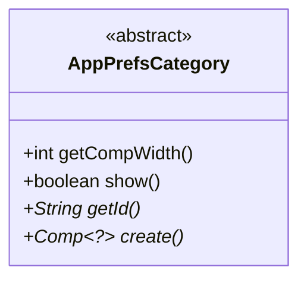
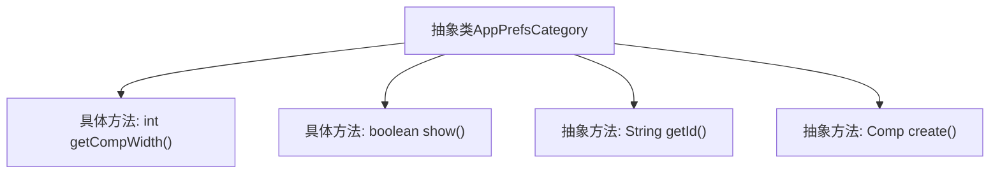

# 基础信息

|      |      |
|------|------|
| 名称 | AppPrefsCategory |
| 编码语言 | .java |
| 代码路径 | xpipe/app/src/main/java/io/xpipe/app/prefs/AppPrefsCategory.java |
| 包名 | io.xpipe.app.prefs |
| 依赖项 | ['io.xpipe.app.comp.Comp'] |
| 概述说明 | 抽象类AppPrefsCategory定义组件宽度600，默认显示，需实现获取ID和创建组件方法。 |

# 说明

这是一个名为AppPrefsCategory的抽象类，定义了应用程序偏好设置类别的通用结构。该类包含四个方法：getCompWidth返回固定宽度值600；show方法默认返回true表示显示；getId是抽象方法需子类实现以返回唯一标识符；create也是抽象方法要求子类创建并返回组件对象。该类为偏好设置类别提供了基础框架，强制子类必须实现关键功能。

# 类列表 Class Summary

| 名称   | 类型  | 说明 |
|-------|------|-------------|
| AppPrefsCategory | class | 抽象类AppPrefsCategory定义组件宽度600，默认显示，需实现getId和create方法。 |

## 类 AppPrefsCategory

|      |      |
|------|------|
| 访问范围 | public abstract |
| 类型 | class |
| 名称 | AppPrefsCategory |
| 说明 | 抽象类AppPrefsCategory定义组件宽度600，默认显示，需实现getId和create方法。 |

### UML类图

这段代码展示了一个抽象类AppPrefsCategory的设计，该类定义了应用偏好设置类别的通用结构和行为。作为抽象类，它包含两个具体方法（getCompWidth返回固定宽度600，show返回默认可见性true）和两个抽象方法（getId获取类别标识符，create创建泛型组件）。类图中使用<<abstract>>标记抽象类，抽象方法用*号标注，泛型类型用~?~表示。这个设计为具体偏好设置类别提供了基础模板，强制子类必须实现特定功能，同时提供了默认实现来简化开发。

### 内部方法调用关系图

这段流程图展示了抽象类AppPrefsCategory的结构，包含两个具体方法(getCompWidth返回固定宽度600，show返回默认true)和两个必须由子类实现的抽象方法(getId获取标识符，create创建组件)。类设计采用模板方法模式，通过抽象方法强制子类实现特定功能，同时提供基础方法复用。箭头表示类与方法间的从属关系，抽象方法用虚线框表示需子类实现。

### 字段列表 Field List

| 名称  | 类型  | 说明 |
|-------|-------|------|

### 方法列表 Method List

| 名称  | 类型  | 说明 |
|-------|-------|------|
| getCompWidth | int | 方法返回固定宽度600。 |
| show | boolean | 方法show始终返回true。 |
| getId | String | 抽象方法，返回字符串ID。 |
| create | Comp<?> | 创建受保护的抽象组件方法。 |

