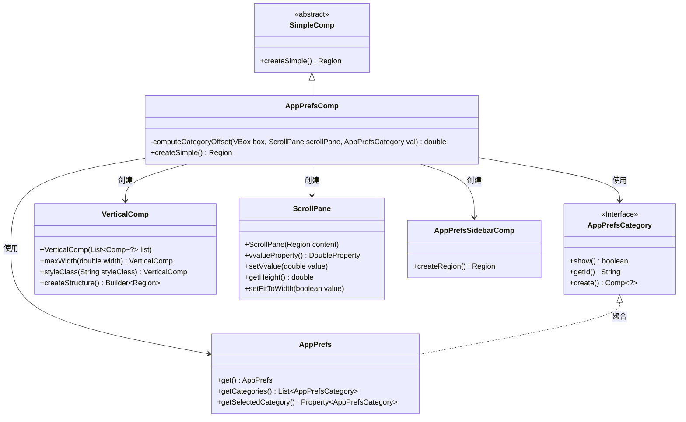
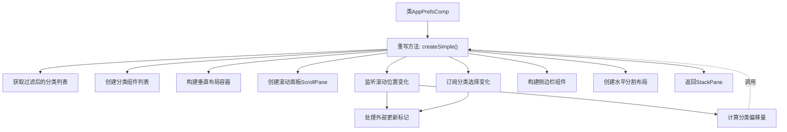
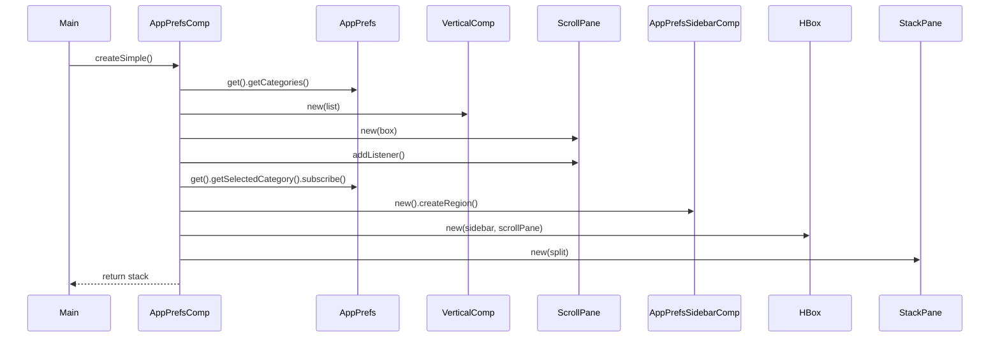

# 基础信息

|      |      |
|------|------|
| 名称 | AppPrefsComp |
| 编码语言 | .java |
| 代码路径 | xpipe/app/src/main/java/io/xpipe/app/prefs/AppPrefsComp.java |
| 包名 | io.xpipe.app.prefs |
| 依赖项 | ['io.xpipe.app.comp.Comp', 'io.xpipe.app.comp.SimpleComp', 'io.xpipe.app.comp.base.VerticalComp', 'io.xpipe.app.util.BooleanScope', 'io.xpipe.app.util.PlatformThread', 'javafx.beans.property.SimpleBooleanProperty', 'javafx.geometry.Insets', 'javafx.scene.control.ScrollPane', 'javafx.scene.layout', 'lombok.val'] |
| 概述说明 | 应用偏好设置组件，包含分类列表和滚动联动逻辑。 |

# 说明

该代码描述了一个应用偏好设置界面的实现。主要包含一个垂直布局的偏好设置分类列表，显示在可滚动面板中。界面分为左侧导航栏和右侧内容区域，支持滚动时自动更新当前选中分类，同时选中分类变化时也会自动滚动到对应位置。通过计算分类在滚动面板中的偏移量实现同步功能，确保用户操作与界面显示一致。界面元素设置了样式类和尺寸约束，整体采用水平分割布局。

# 类列表 Class Summary

| 名称   | 类型  | 说明 |
|-------|------|-------------|
| AppPrefsComp | class | AppPrefsComp类创建偏好设置界面，包含侧边栏和滚动面板，管理类别选择和滚动同步。 |

## 类 AppPrefsComp

|      |      |
|------|------|
| 访问范围 | public |
| 类型 | class |
| 名称 | AppPrefsComp |
| 说明 | AppPrefsComp类创建偏好设置界面，包含侧边栏和滚动面板，管理类别选择和滚动同步。 |

### UML类图

类图描述：该图展示了AppPrefsComp类继承自SimpleComp，并依赖多个核心类实现偏好设置界面功能。AppPrefsComp通过AppPrefs获取分类数据，使用VerticalComp和ScrollPane构建滚动布局，结合AppPrefsSidebarComp创建侧边栏。AppPrefsCategory接口定义了分类的通用行为，AppPrefs聚合了多个分类实例。整体结构体现了组合模式与观察者模式的应用。

### 内部方法调用关系图

这段代码实现了一个应用偏好设置界面的复合组件。主要功能包括：1) 从AppPrefs获取并过滤可显示的设置分类；2) 为每个分类创建对应的UI组件；3) 构建包含垂直滚动列表和固定侧边栏的布局；4) 实现滚动位置与当前选中分类的同步逻辑。通过监听滚动事件和分类选择变化，使用computeCategoryOffset方法精确计算滚动位置，确保UI交互的流畅性和一致性。最终返回一个包含所有元素的StackPane作为界面根节点。

### 字段列表 Field List

| 名称  | 类型  | 说明 |
|-------|-------|------|

### 方法列表 Method List

| 名称  | 类型  | 说明 |
|-------|-------|------|
| computeCategoryOffset | double | 计算类别偏移量：根据节点位置和滚动面板高度动态调整偏移值，无节点或高度为零时返回0。 |
| createSimple | Region | 创建偏好设置界面，包含分类侧边栏和滚动内容区，支持滚动同步选中分类。 |

